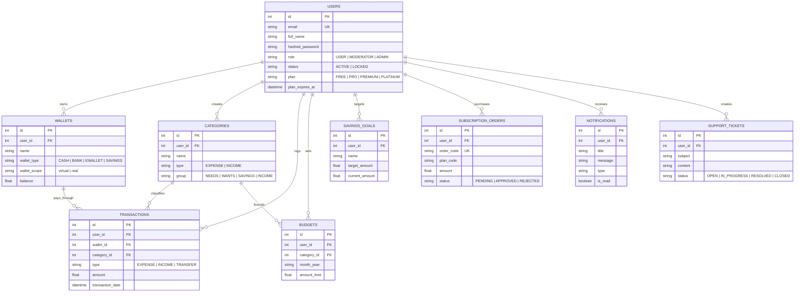

# 💎 FinTrack AI - Hệ Thống Quản Lý Chi Tiêu Cá Nhân Tích Hợp Trí Tuệ Nhân Tạo

> **Dự án / Học Phần Ứng Dụng Trí Tuệ Nhân Tạo**  
> **Đề tài:** Nghiên cứu và xây dựng Nền tảng Quản lý Tài chính Cá nhân Thông minh ứng dụng Generative AI & Kiến trúc Micro-Fintech 2 Tầng.  
> **Nhóm thực hiện:** Nhóm 03 

---

## 📌 BẢNG MỤC LỤC
1. [Giới Thiệu Dự Án & Điểm Nổi Bật](#-1-giới-thiệu-dự-án--điểm-nổi-bật)
2. [Kiến Trúc & Thiết Kế CSDL 9 Bảng (Chuẩn 3NF)](#-2-kiến-trúc--thiết-kế-csdl-9-bảng-chuẩn-3nf)
3. [Mô Hình Dịch Vụ & Cổng Thanh Toán VietQR MB Bank](#-3-mô-hình-dịch-vụ--cổng-thanh-toán-vietqr-mb-bank)
4. [Phân Hệ Quản Trị Hệ Thống (Admin & Moderator Console)](#-4-phân-hệ-quản-trị-hệ-thống-admin--moderator-console)
5. [Tài Khoản Mẫu Trải Nghiệm (Demo Credentials)](#-5-tài-khoản-mẫu-trải-nghiệm-demo-credentials)
6. [Hướng Dẫn Cài Đặt & Khởi Chạy Nhanh (Quickstart)](#-6-hướng-dẫn-cài-đặt--khởi-chạy-nhanh-quickstart)
7. [Kiểm Thử Phần Mềm (Automated Testing & Test Cases)](#-7-kiểm-thử-phần-mềm-automated-testing--test-cases)
8. [Phân Công Trách Nhiệm Thành Viên (Nhóm 03)](#-8-phân-công-trách-nhiệm-thành-viên-nhóm-03)

---

## 🌟 1. Giới Thiệu Dự Án & Điểm Nổi Bật

**FinTrack AI** là nền tảng quản lý tài chính cá nhân toàn diện, ứng dụng công nghệ **Generative AI (Google Gemini 1.5 Pro / Flash)** kết hợp với giao diện **Single Page Application (SPA)** chuẩn phong cách **Dark Cyber Glassmorphism**, mang lại trải nghiệm quản lý dòng tiền mượt mà, trực quan và bảo mật.

```
┌─────────────────────────────────────────────────────────────────────────┐
│                           FINTRACK AI PLATFORM                          │
├──────────────────────────┬──────────────────────────┬───────────────────┤
│  ⚡ SMART NLP ENGINE      │  🩺 50/30/20 ADVISOR     │  🎮 GAMIFICATION  │
│  Bóc tách giao dịch tự   │  Chẩn đoán sức khỏe dòng │  Streak kỷ luật,  │
│  nhiên tiếng Việt 1-click│  tiền & cảnh báo bội chi │  6 bậc level & XP │
├──────────────────────────┴──────────────────────────┴───────────────────┤
│  🛡️ 2-LAYER SECURITY: Zero-PII Sanitizer & Hard Lockout Enforcement     │
│  💳 2-SCOPE LEDGER: Tách biệt Ví Kế Toán Ảo (Sandbox) & Ví Tiền Thật   │
└─────────────────────────────────────────────────────────────────────────┘
```

### 🎯 Các Điểm Đột Phá Công Nghệ:

- [x] **Giao diện Single Page Application (SPA) Dark Cyber Modern**:
  - Tối ưu hóa UI/UX với hiệu ứng kính mờ (Glassmorphism), Sunset Glow Gradients, Responsive đa thiết bị từ Mobile đến Desktop 4K.
  - Tích hợp biểu đồ động **Chart.js** (Cashflow 6 tháng, Donut cơ cấu danh mục, thanh tiến trình ngân sách).

- [x] **Kiến trúc Đa Ví 2 Tầng Độc Lập (2-Scope Ledger Architecture)**:
  - `virtual` (*Ví Kế Toán Cá Nhân / Sandbox*): Theo dõi tiền mặt, ví thẻ, sổ kế toán thu - chi hàng ngày mà không phát sinh giao dịch tiền tệ thật.
  - `real` (*Ví Nạp Tiền / Thanh Toán Thực Tế*): Lưu trữ số dư thực tế nạp từ VietQR ngân hàng để nâng cấp các gói dịch vụ VIP.

- [x] **Trí Tuệ Nhân Tạo Google Gemini 1.5 Pro / Flash**:
  - **FinTrack AI Natural Language Parser**: Người dùng chỉ cần gõ/nói câu tiếng Việt tự nhiên (*"Ăn trưa bún bò 45k trả qua MoMo hôm qua"*), AI tự bóc tách chính xác: Loại giao dịch (`EXPENSE`), Số tiền (`45.000 đ`), Danh mục (`Ăn uống`), Ví (`Ví MoMo`), Thời gian (`Hôm qua`).
  - **Trợ lý Cố vấn Tài chính Thông minh (AI Financial Health Advisor)**: Phân tích cơ cấu dòng tiền theo quy tắc vàng **50/30/20** (50% Thiết yếu - 30% Mong muốn - 20% Tích lũy), phát hiện rủi ro và đề xuất 3 giải pháp tối ưu.
  - **Hỏi đáp Dữ liệu Tài chính 24/7 (Financial Q&A)**: Phản hồi tự nhiên mọi câu hỏi tài chính, lập kế hoạch phân bổ lương cụ thể theo con số thực tế.

- [x] **Hệ thống Gamification & Cấp Độ Thành Tích**:
  - Chuỗi ngày kỷ luật tài chính (**Discipline Streak**).
  - Hệ thống **6 Cấp bậc Cột mốc (Level Road Map)**: *Khởi Đầu (Lv.0)* $\rightarrow$ *Đồng (Lv.1-2)* $\rightarrow$ *Bạc (Lv.3-4)* $\rightarrow$ *Vàng (Lv.5-6)* $\rightarrow$ *Kim Cương (Lv.7-8)* $\rightarrow$ *Huyền Thoại (Lv.9-10 Max)*.
  - Bộ sưu tập **24 Huy hiệu Thành tích** mở khóa theo từng mốc tích lũy và kiểm soát ngân sách.

- [x] **Bảo Mật Zero-PII Leakage & Khóa Cứng 2 Tầng (Hard Lockout Enforcement)**:
  - Tự động khử dữ liệu nhạy cảm cá nhân (Masking STK, Email, SĐT) trước khi chuyển vào Context của LLM.
  - Cơ chế **Zero-PII Guardrail**: Bắt buộc AI từ chối 100% các yêu cầu truy vấn thông tin tài chính của người dùng khác.
  - Cơ chế **Hard Lockout 2 tầng**: Chặn đứng token tại FastAPI Backend Dependency (`HTTP 403`) và Frontend Client Interceptor tự động hủy session, điều hướng ra ngoài ngay lập tức nếu tài khoản bị khóa bởi Admin.

---

## 🗄️ 2. Kiến Trúc & Thiết Kế CSDL 9 Bảng (Chuẩn 3NF)

Cơ sở dữ liệu được thiết kế chuẩn hóa bậc 3 (**Third Normal Form - 3NF**), tối ưu hóa tính toàn vẹn dữ liệu và hỗ trợ Cascade Delete an toàn:



### 📋 Bảng Đặc Tả 9 Thực Thể Cơ Sở Dữ Liệu:

| STT | Tên Bảng (Table Name) | Mô Tả Chức Năng | Khóa Ngoại & Ràng Buộc Chính |
| :---: | :--- | :--- | :--- |
| **1** | `users` | Quản lý thông tin định danh, mật khẩu bcrypt, vai trò phân quyền, cấp độ gói VIP và trạng thái kích hoạt/khóa tài khoản. | Khóa chính `id`, Email Unique, Enum `status`, `role`, `plan`. |
| **2** | `wallets` | Quản lý danh sách ví tài sản, phân tách phạm vi ví (`virtual` sổ chi tiêu vs `real` nạp tiền thật). | `user_id` $\rightarrow$ `users.id` (Cascade). |
| **3** | `categories` | Phân loại danh mục chi tiêu/thu nhập, chuẩn hóa theo 4 nhóm 50/30/20 (`NEEDS`, `WANTS`, `SAVINGS`, `INCOME`). | `user_id` $\rightarrow$ `users.id` (Hỗ trợ danh mục mặc định toàn hệ thống). |
| **4** | `transactions` | Nhật ký ghi nhận các khoản thu - chi - chuyển ví, đính kèm hóa đơn, gắn cờ nhận diện tạo bởi AI (`created_by_ai`). | `user_id`, `wallet_id`, `category_id` (Tự động cập nhật số dư ví). |
| **5** | `budgets` | Thiết lập hạn mức ngân sách tháng cho từng danh mục, tự động tính toán tỷ lệ % và trạng thái (`NORMAL`, `WARNING`, `OVERSPENT`). | `user_id`, `category_id`, Unique cặp (`user_id`, `category_id`, `month_year`). |
| **6** | `savings_goals` | Theo dõi mục tiêu tích lũy tài chính (mua xe, mua nhà, quỹ khẩn cấp), số tiền mục tiêu và hạn chót. | `user_id` $\rightarrow$ `users.id`. |
| **7** | `subscription_orders` | Lưu trữ đơn hàng đăng ký / gia hạn các gói cước VIP, mã đơn định danh, phương thức thanh toán VietQR và trạng thái duyệt. | `user_id` $\rightarrow$ `users.id`, `order_code` Unique. |
| **8** | `notifications` | Hộp thư thông báo biến động số dư, cảnh báo vượt ngưỡng 80%/100% ngân sách, thông báo duyệt đơn VIP và thông báo hệ thống. | `user_id` $\rightarrow$ `users.id`. |
| **9** | `support_tickets` | Tiếp nhận và quản lý các yêu cầu khiếu nại, trợ giúp kỹ thuật và hỗ trợ thanh toán nạp gói của người dùng. | `user_id` $\rightarrow$ `users.id`. |

---

## 💳 3. Mô Hình Dịch Vụ & Cổng Thanh Toán VietQR MB Bank

FinTrack AI vận hành mô hình dịch vụ **Freemium & Subscription Tiering** chuyên nghiệp, đáp ứng từ nhu cầu cá nhân cơ bản đến quản trị tài chính nâng cao:

### 👑 Bảng So Sánh 4 Gói Dịch Vụ VIP:

| Tính Năng / Quyền Lợi | 🥉 GÓI FREE | 🥈 GÓI PRO | 🥇 GÓI PREMIUM | 💎 PLATINUM VIP |
| :--- | :---: | :---: | :---: | :---: |
| **Mức Phí Dịch Vụ** | **0 đ / tháng** | **49.000 đ / tháng** | **99.000 đ / tháng** | **199.000 đ / tháng** |
| **Số Lượng Ví Quản Lý** | Tối đa 2 Ví | Tối đa 5 Ví | Tối đa 15 Ví | **Không Giới Hạn** |
| **Hạn Mức AI Gọi / Ngày** | 10 lượt / ngày | 100 lượt / ngày | 300 lượt / ngày | **Không Giới Hạn (Unlimited)** |
| **Bóc Tách Giao Dịch AI** | Có (Cơ bản) | Có (Ưu tiên) | Có (Tốc độ cao) | **Cao Cấp Nhất** |
| **Chẩn Đoán 50/30/20** | Cơ bản | Chuyên sâu | Chuyên sâu | **Báo Cáo Toàn Diện** |
| **Xuất Dữ Liệu Excel / PDF**| ❌ Không | ✅ Excel + CSV | ✅ Excel + PDF + CSV | ✅ Đầy đủ + Định dạng VIP |
| **Liên Kết Open Banking** | ❌ Không | ❌ Không | ✅ Có | ✅ Có (Tự động) |
| **Huy Hiệu & Cấp Độ VIP** | Badge Cơ Bản | Badge Pro Cyan | Badge Premium Gold | **Badge Platinum Kim Cương** |
| **Hỗ Trợ Kỹ Thuật** | Cộng đồng | 24/48h | Ưu tiên 12h | **Ưu Tiên 24/7 Riêng Biệt** |

### 🏧 Tích Hợp Cổng Thanh Toán Động VietQR Ngân Hàng MB Bank:
- **Tên Ngân Hàng Tiếp Nhận**: Ngân hàng TMCP Quân Đội (**MB Bank**)
- **Số Tài Khoản Tiếp Nhận**: `0374617569`
- **Chủ Tài Khoản**: **DANG QUYET THANG**
- **Cơ chế thanh toán**:
  1. Người dùng chọn gói cước (1 tháng, 3 tháng, 6 tháng, 12 tháng).
  2. Hệ thống khởi tạo `SubscriptionOrder` với mã đơn duy nhất (ví dụ: `FT-948210`).
  3. Tự động sinh mã **VietQR chuẩn NAPAS 247** kèm số tiền và cú pháp chuyển tiền chuẩn: `VIP <MA_DON_HANG>` (ví dụ: `VIP FT-948210`).
  4. Người dùng quét mã trên app ngân hàng $\rightarrow$ Admin phê duyệt đơn 1-Click tại Portal $\rightarrow$ Hệ thống tự động kích hoạt hạn sử dụng VIP và gửi thông báo chúc mừng vào hộp thư.

---

## 🛡️ 4. Phân Hệ Quản Trị Hệ Thống (Admin & Moderator Console)

FinTrack AI trang bị Trung tâm Kiểm soát Quản trị (**Control Center**) dành riêng cho Ban Quản trị:

```
┌─────────────────────────────────────────────────────────────────────────┐
│                    ADMIN CONTROL CENTER (PORTAL)                        │
├─────────────────────────────────────────────────────────────────────────┤
│ [📊 Analytics] : DAU/MAU, Doanh Thu, Chuyển Đổi VIP, Server Health      │
│ [👥 User Mgmt] : Phân Quyền Root/Mod, Khóa Cứng (Hard Lockout), Reset PW │
│ [💳 VIP Orders]: Duyệt Nạp 1-Click, Đối Soát VietQR MB Bank, Xuất CSV   │
│ [🤖 AI Console]: Tinh Chỉnh System Prompt, Model Switching, Quotas/Day   │
│ [🔒 Security]  : Audit Logs Hoạt Động, Broadcast Thông Báo Toàn Server  │
└─────────────────────────────────────────────────────────────────────────┘
```

- **Dashboard Giám Sát Thời Gian Thực**:
  - Theo dõi người dùng hoạt động ngày/tháng (DAU/MAU), tổng doanh thu nạp VIP.
  - **Server Health Check**: Trạng thái FastAPI Server, SQLite WAL Mode, Độ trễ Gemini API Latency.
  - **AI Token Monitor**: Giám sát lưu lượng tiêu thụ token và số lượng request AI toàn hệ thống.
- **Quản Lý Người Dùng & Phân Quyền Phân Tầng**:
  - Phân quyền 3 cấp độ: `USER`, `MODERATOR` (Quản trị viên duyệt đơn), `ADMIN` (Root Admin tối cao).
  - Cơ chế khóa cứng tài khoản vi phạm (ngăn chặn đăng nhập & chặn request tại chỗ).
- **Quản Trị AI Động (AI Management Console)**:
  - Tùy chỉnh trực tiếp **System Prompt** cho bộ bóc tách giao dịch (Parser) và Cố vấn tài chính (Advisor) mà không cần restart server.
  - Chuyển đổi linh hoạt giữa các model: `gemini-1.5-flash`, `gemini-1.5-pro`, `gemini-2.0-flash`, `gpt-4o`.
- **Hệ Thống Nhật Ký An Ninh (Audit Logs) & Export CSV**:
  - Ghi nhận mọi thao tác nhạy cảm (Khóa user, đổi quyền, duyệt tiền, sửa prompt).
  - Xuất dữ liệu kế toán 1-Click sang file CSV chuẩn UTF-8 BOM.

---

## 👥 5. Tài Khoản Mẫu Trải Nghiệm (Demo Credentials)

Hệ thống đã nạp sẵn bộ dữ liệu mẫu thực tế hỗ trợ chấm điểm và nghiệm thu đồ án:

| STT | Vai Trò (Role) | Email Đăng Nhập | Mật Khẩu | Quyền Hạn & Dữ Liệu Khởi Tạo Sẵn |
| :---: | :--- | :--- | :--- | :--- |
| **1** | **Root Admin** | `admin@fintrack.ai` | `Admin@123456` | Toàn quyền Quản trị Tối cao: Quản lý người dùng, duyệt nạp VIP, tinh chỉnh AI Prompt, xem Audit Logs. |
| **2** | **Moderator** | `mod@fintrack.ai` | `Mod@123456` | Quản trị viên phụ: Hỗ trợ duyệt đơn VIP, quản lý Ticket hỗ trợ người dùng. |
| **3** | **Demo User** | `user@fintrack.ai` | `User@123456` | Người dùng thực tế: Đặng Quyết Thắng (**Gói Platinum VIP**, 4 Ví tài sản, 18 Danh mục, 30+ Giao dịch 3 tháng, Ngân sách và Mục tiêu tiết kiệm). |

*(Giao diện Đăng nhập hỗ trợ nút bấm 1-Click "Demo User" và "Demo Admin" để đăng nhập tức thì không cần gõ phím).*

---

## 🚀 6. Hướng Dẫn Cài Đặt & Khởi Chạy Nhanh (Quickstart)

### 📋 Yêu Cầu Môi Trường:
- **Hệ điều hành**: Windows 10/11, macOS, Linux (Ubuntu/Debian).
- **Python**: Phiên bản `3.10` trở lên (Khuyến nghị `Python 3.12`).
- **Trình duyệt**: Google Chrome, Microsoft Edge, Brave, Safari (Hỗ trợ ES6 Modules).

### ⚙️ Các Bước Cài Đặt Chi Tiết:

#### Bước 1: Clone hoặc mở thư mục dự án
```bash
cd "D:\Visua Studio Code\HeThongChiTieuCaNhan1.0"
```

#### Bước 2: Tạo và kích hoạt môi trường ảo Python (Virtual Environment)
```bash
# Trên Windows PowerShell:
python -m venv venv
.\venv\Scripts\Activate.ps1

# Trên Linux / macOS:
python3 -m venv venv
source venv/bin/activate
```

#### Bước 3: Cài đặt các gói thư viện phụ thuộc
```bash
pip install -r requirements.txt
```

#### Bước 4: Cấu hình biến môi trường (`.env`)
Tạo file `.env` tại thư mục gốc (hoặc chỉnh sửa file `.env` có sẵn):
```ini
PROJECT_NAME="FinTrack AI"
API_V1_STR="/api/v1"
SECRET_KEY="fintrack-ai-super-secret-jwt-key-change-in-production-2026"
ACCESS_TOKEN_EXPIRE_MINUTES=10080
ALGORITHM="HS256"

# Database SQLite WAL
DATABASE_URL="sqlite:///./fintrack.db"

# AI Configuration
AI_PROVIDER="gemini"
GEMINI_API_KEY="YOUR_GOOGLE_GEMINI_API_KEY_HERE"
GEMINI_MODEL="gemini-1.5-flash"
```

#### Bước 5: Khởi chạy Server ứng dụng
```bash
# Cách 1: Sử dụng script runner
python run.py

# Cách 2: Chạy trực tiếp qua Uvicorn
uvicorn backend.app.main:app --reload --host 127.0.0.1 --port 8000
```

#### Bước 6: Truy cập ứng dụng
- 🌐 **Giao diện Ứng Dụng (Frontend SPA)**: [http://127.0.0.1:8000](http://127.0.0.1:8000)
- 📚 **Tài liệu API Tương Tác (Swagger UI)**: [http://127.0.0.1:8000/docs](http://127.0.0.1:8000/docs)
- 📖 **Tài liệu ReDoc Alternative**: [http://127.0.0.1:8000/redoc](http://127.0.0.1:8000/redoc)

---

## 🧪 7. Kiểm Thử Phần Mềm (Automated Testing & Test Cases)

Hệ thống được kiểm thử tự động toàn diện thông qua framework `pytest` và `httpx`:

```bash
# Chạy toàn bộ 46 kịch bản kiểm thử tự động
.\venv\Scripts\pytest.exe -v
```

### 📊 Kết Quả Kiểm Thử:
```
============================= test session starts =============================
platform win32 -- Python 3.12.4, pytest-9.1.1, pluggy-1.6.0
collected 46 items

backend/tests/test_admin.py ........                                     [ 17%]
backend/tests/test_ai.py ......                                          [ 30%]
backend/tests/test_auth.py ..........                                    [ 52%]
backend/tests/test_badges.py .                                           [ 54%]
backend/tests/test_budgets.py .                                          [ 56%]
backend/tests/test_notifications.py .....                                [ 67%]
backend/tests/test_transactions.py ....                                  [ 76%]
backend/tests/test_vip_and_support.py ...                                [ 82%]
backend/tests/test_wallets.py ...........                                [100%]

============================== 46 passed in 18.32s =============================
```

- **Tỷ lệ Pass**: **46/46 Test Cases (100% Passed)**.
- **Phạm vi kiểm thử**:
  - Xác thực JWT Token, phân quyền Role-based Access Control (RBAC).
  - Cơ chế khóa cứng tài khoản (Account Lockout Enforcement).
  - Nghiệp vụ giao dịch, chuyển tiền, hoàn tiền ví tài khoản.
  - Ngân sách cảnh báo ngưỡng 80% (Warning) & 100% (Overspent).
  - Bộ bóc tách câu tự nhiên AI & Khử dữ liệu nhạy cảm Zero-PII.
  - Luồng duyệt đơn nạp VIP và đối soát VietQR MB Bank.

---

## 👥 8. Phân Công Trách Nhiệm Thành Viên (Nhóm 03)

| STT | Họ và Tên | Vai Trò | Nhiệm Vụ & Đóng Góp Chính Trong Dự Án |
| :---: | :--- | :---: | :--- |
| **1** | **Đặng Quyết Thắng** | **Trưởng nhóm** | • Quản lý tiến độ tổng thể, phân tích nghiệp vụ tài chính và quy tắc phân bổ 50/30/20.<br>• Thiết kế cấu trúc bảng giá 4 gói cước VIP và luồng đối soát thanh toán VietQR MB Bank.<br>• Trực tiếp biên soạn toàn bộ tài liệu báo cáo Word, mục lục, bảng biểu và Slide thuyết trình đồ án.<br>• Lập trình toàn bộ giao diện Frontend SPA (Client Dashboard, Admin Control Center, Gamification).<br>• Tích hợp Google Gemini API, xây dựng module bảo mật Zero-PII Leakage và Prompt AI.<br>• Thiết kế và thực hiện toàn diện 15 kịch bản kiểm thử (Test Cases). |
| **2** | **Nguyễn Văn Tiến** | **Thành viên** | • Phân tích yêu cầu chức năng / phi chức năng và xây dựng bảng đặc tả Use Cases.<br>• Thiết kế mô hình dữ liệu quan hệ 9 bảng thực thể chuẩn 3NF và vẽ sơ đồ ERD chuẩn.<br>• Tham gia rà soát logic nghiệp vụ và hỗ trợ tài liệu báo cáo kỹ thuật. |
| **3** | **Quách Minh Hiếu** | **Thành viên** | • Thiết kế và thực hiện toàn diện 15 kịch bản kiểm thử (Test Cases) hệ thống.<br>• Phối hợp tối ưu hóa các endpoint API Backend và kết nối truyền nhận dữ liệu với Frontend.<br>• Kiểm thử tính tương thích giao diện trên các kích thước màn hình. |

---

<div align="center">
  <sub>Dự án được xây dựng và hoàn thiện bởi <b>Nhóm 03 - Sinh viên Công nghệ Thông tin ICTU</b> © 2026.</sub>
</div>
