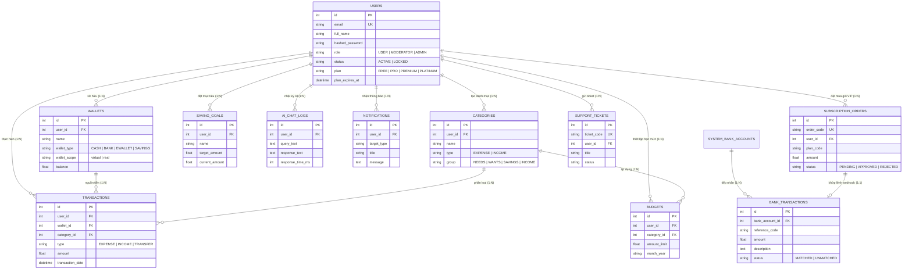

# 💎 FinTrack AI - Hệ Thống Quản Lý Chi Tiêu Cá Nhân Tích Hợp Trí Tuệ Nhân Tạo

> **Dự án / Học Phần Ứng Dụng Trí Tuệ Nhân Tạo**  
> **Đề tài:** Nghiên cứu và xây dựng Nền tảng Quản lý Tài chính Cá nhân Thông minh ứng dụng Generative AI & Kiến trúc Micro-Fintech 2 Tầng.  
> **Nhóm thực hiện:** Nhóm 03 (Đặng Quyết Thắng, Nguyễn Văn Tiến, Quách Minh Hiếu)  
> **Giảng viên hướng dẫn:** ThS. Hà Thị Thanh  
> **Đơn vị:** Khoa CNTT - Trường Đại học CNTT & Truyền thông (ICTU) - 2026

---

## 📌 BẢNG MỤC LỤC
1. [Giới Thiệu Dự Án & Điểm Nổi Bật](#-1-giới-thiệu-dự-án--điểm-nổi-bật)
2. [Tech Stack Đầy Đủ (Công Nghệ Cài Đặt)](#-2-tech-stack-đầy-đủ-công-nghệ-cài-đặt)
3. [Đặc Tả Kiến Trúc & Thiết Kế Đột Phá](#-3-đặc-tả-kiến-trúc--thiết-kế-đột-phá)
4. [Mô Hình CSDL 11 Bảng Thực Thể Chuẩn 3NF](#-4-mô-hình-csdl-11-bảng-thực-thể-chuẩn-3nf)
5. [Cổng Thanh Toán VietQR & Webhook SePay Tự Động](#-5-cổng-thanh-toán-vietqr--webhook-sepay-tự-động)
6. [Phân Hệ Quản Trị Hệ Thống (Admin Control Center)](#-6-phân-hệ-quản-trị-hệ-thống-admin-control-center)
7. [Tài Khoản Mẫu Trải Nghiệm (Demo Credentials)](#-7-tài-khoản-mẫu-trải-nghiệm-demo-credentials)
8. [Hướng Dẫn Cài Đặt & Khởi Chạy Nhanh (Quickstart)](#-8-hướng-dẫn-cài-đặt--khởi-chạy-nhanh-quickstart)
9. [Kiểm Thử Phần Mềm (Automated Testing & Test Cases)](#-9-kiểm-thử-phần-mềm-automated-testing--test-cases)
10. [Phân Công Trách Nhiệm Thành Viên (Nhóm 03)](#-10-phân-công-trách-nhiệm-thành-viên-nhóm-03)

---

## 🌟 1. Giới Thiệu Dự Án & Điểm Nổi Bật

**FinTrack AI** là nền tảng quản lý tài chính cá nhân toàn diện, kết hợp công nghệ **Generative AI (Google Gemini 1.5 Pro / 3.7 Flash)** với giao diện **Single Page Application (SPA)** phong cách **Neo-Futuristic Glassmorphism**, mang lại trải nghiệm ghi chép mượt mà, phân tích dòng tiền chuyên sâu và bảo mật dữ liệu tuyệt đối.

```
┌─────────────────────────────────────────────────────────────────────────┐
│                           FINTRACK AI PLATFORM                          │
├──────────────────────────┬──────────────────────────┬───────────────────┤
│  ⚡ SMART NLP ENGINE      │  🩺 50/30/20 ADVISOR     │  🎮 GAMIFICATION  │
│  Bóc tách giao dịch tự   │  Chẩn đoán sức khỏe dòng │  Streak kỷ luật,  │
│  nhiên tiếng Việt 1-click│  tiền & cảnh báo bội chi │  6 bậc level & XP │
├──────────────────────────┴──────────────────────────┴───────────────────┤
│  🛡️ 2-LAYER SECURITY: Zero-PII Leakage Engine & Hard Lockout 2 Tầng      │
│  💳 2-SCOPE LEDGER: Ví Ảo Kế Toán (Sandbox) & Ví Thật Nạp Tiền (Real)   │
│  🏦 AUTO WEBHOOK: Tích hợp SePay / Casso qua Cloudflare Tunnel          │
└─────────────────────────────────────────────────────────────────────────┘
```

---

## 🛠️ 2. Tech Stack Đầy Đủ (Công Nghệ Cài Đặt)

| Thành Phần | Công Nghệ & Thư Viện | Phiên Bản | Vai Trò & Chức Năng Chính |
| :--- | :--- | :---: | :--- |
| **Backend Framework** | **FastAPI** | `0.109.0+` | Web framework RESTful API bất đồng bộ hiệu năng cao, Dependency Injection, Swagger OpenAPI docs. |
| **Runtime & Language** | **Python** | `3.10+` (Khuyến nghị 3.12) | Môi trường thực thi mã nguồn xử lý logic và tính toán tài chính. |
| **ASGI Web Server** | **Uvicorn** | `0.27.0+` | Server web chuẩn ASGI, hỗ trợ Hot-reload và đa luồng. |
| **Database & ORM** | **SQLite 3NF + SQLAlchemy** | `2.0.25+` | CSDL quan hệ chuẩn hóa bậc 3 (**3NF**), tối ưu hóa chế độ Write-Ahead Logging (**WAL Mode**). |
| **Frontend Architecture**| **Single Page App (SPA)** | ES6+ Modules | Điều hướng component mượt mà không tải lại trang (`switchTab`), Event-driven State Management. |
| **UI Design System** | **Tailwind CSS + Custom CSS** | `3.4+` | Neo-Futuristic Glassmorphism, GPU-Accelerated Glowing Neon Border (@property 120fps), Ambient Glow Shadow. |
| **Data Visualization** | **Chart.js** | `4.4.1` | Biểu đồ Doughnut cơ cấu chi tiêu với tâm rỗng (Cutout 74%), Biểu đồ Cột - Đường xu hướng dòng tiền. |
| **AI LLM Provider** | **Google Gemini API** | `1.5 Pro / 3.7 Flash` | Bóc tách ngôn ngữ tự nhiên tiếng Việt (**FinTrack AI Parser**) và Cố vấn sức khỏe tài chính (**AI Advisor**). |
| **Payment Gateway** | **SePay Webhook & VietQR** | MB Bank Napas 247 | Tiếp nhận Webhook biến động số dư, tự động khớp đơn hàng nạp VIP và cộng tiền ví 100% tự động. |
| **Tunnel Proxy** | **Cloudflare Tunnel (cloudflared)** | Latest | Mở cổng an toàn từ Localhost ra Internet công khai phục vụ nhận Webhook từ SePay / Casso. |
| **Security & Auth** | **PyJWT + Passlib (Bcrypt)** | `2.8.0` / `1.7.4` | Mã hóa mật khẩu một chiều có Salt, cấp và xác thực JSON Web Token thời hạn 24 giờ. |
| **Testing Framework** | **Pytest + HTTPX** | `8.0.0+` / `0.26.0` | Kiểm thử đơn vị (Unit Test) và kiểm thử tích hợp (Integration Test) toàn bộ API endpoints. |

---

## 🏛️ 3. Đặc Tả Kiến Trúc & Thiết Kế Đột Phá

### 🌟 3.1. Giao Diện Neo-Futuristic Glassmorphism
- **Master Floating Glass Container (`#main-glass-wrapper` / `#master-glass-wrapper`)**: Khung chứa ứng dụng độc lập lơ lửng, bo góc lớn `28px`, phủ lớp kính mờ tối trong suốt `background: rgba(11, 15, 25, 0.82)`, `backdrop-filter: blur(24px)`.
- **GPU-Accelerated Glowing Neon Border (120fps Ultra-Smooth)**: Lớp viền 1.5px xoay góc thuần túy chu kỳ 16s sang trọng bằng kỹ thuật CSS `@property --neon-angle` trên GPU Compositor (`contain: paint`, `isolation: isolate`, `will-change: --neon-angle`, `transform: translateZ(0)`), không bao giờ trigger repaint lên nội dung bên trong, kèm fallback `prefers-reduced-motion` tự động chuyển sang gradient tĩnh cho máy yếu / tiết kiệm pin.

### 🍩 3.2. Widget "Cơ Cấu Chi Tiêu" (Doughnut Chart)
- **Kiến trúc Chart.js Doughnut**: Tỷ lệ tâm rỗng `cutout: 74%`, tích hợp Custom Canvas Center Plugin hiển thị trực tiếp nhãn *"Tổng chi"* và con số lũy kế tháng (ví dụ: `18.45M ₫`).
- **Bộ màu Neon 6 Danh Mục Chuẩn**:
  1. 🟣 **Nhà ở & Chi phí cố định**: `#B026FF` (Cyber Purple)
  2. 🟢 **Ăn uống & Thực phẩm**: `#00FFAA` (Aura Green)
  3. 🔵 **Mua sắm & Công nghệ**: `#00E5FF` (Nebula Cyan)
  4. 🌸 **Cà phê & Giải trí**: `#FF007A` (Neon Rose)
  5. 🟠 **Đi lại & Xăng xe**: `#FFAA00` (Amber Glow)
  6. 🔷 **Sức khỏe & Thể thao / Y tế**: `#3B82F6` (Electric Blue)

### 💳 3.3. Kiến Trúc Ví 2 Tầng Độc Lập (2-Scope Ledger Architecture)
Hệ thống phân tách rạch ròi 2 phạm vi ví để đảm bảo an toàn kế toán:
1. **`virtual` (Ví ảo Sandbox Ledger)**: Sử dụng ghi chép thu - chi cá nhân hàng ngày (Tiền mặt, MB Bank cá nhân, Ví MoMo, Sổ tiết kiệm). Mọi số dư là số liệu giả lập phục vụ thống kê cá nhân.
2. **`real` (Ví thật Real Payment Wallet)**: Đại diện cho tài khoản nạp tiền dịch vụ của người dùng (`Ví Dịch Vụ & VIP FinTrack`), ghi nhận biến động khi nạp tiền thật qua cổng VietQR ngân hàng để nâng cấp gói VIP.

### 🛡️ 3.4. Cơ Chế Bảo Mật Zero-PII Leakage & Hard Lockout 2 Tầng
- **Zero-PII Leakage Engine**: Toàn bộ dữ liệu định danh (Họ tên, Email, Số điện thoại, Số tài khoản ngân hàng) được bóc tách và khử sạch bằng Regex Masking tại Backend trước khi đóng gói context chuyển sang Google Gemini API.
- **Hard Lockout 2 Tầng**:
  - *Tầng 1 (Backend FastAPI Dependency)*: Chặn đứng token tại mọi Endpoint trả về ngay lập tức `HTTP 403 Forbidden` kèm mã `ACCOUNT_LOCKED`.
  - *Tầng 2 (Frontend Client Interceptor)*: Lớp `api.js` tự động hủy toàn bộ session trong `localStorage`, hiển thị cảnh báo và cưỡng chế điều hướng ra màn hình đăng nhập.

### 🎛️ 3.5. Admin Control Center với 5 Tab Chức Năng Cốt Lõi
Trong phân hệ Cài Đặt Hệ Thống (`admin_settings`), Admin được trang bị 5 tab chuyên sâu:
1. 💳 **Cổng VietQR Admin (Live Preview)**: Cấu hình số tài khoản thụ hưởng của sàn, chọn ngân hàng (MB, VCB, TCB...), xem trước mã VietQR động theo thời gian thực.
2. 📢 **Broadcast Thông Báo**: Soạn thảo tiêu đề, nội dung, phân loại (Info, Warning, Promotion) và phát thông báo tức thì tới toàn sàn hoặc từng nhóm gói cước.
3. 📧 **SMTP Mail Server**: Cấu hình máy chủ gửi email (SMTP Host, Port, Sender, SSL/TLS).
4. 💾 **Sao Lưu / Khôi Phục Database**: Tạo bản Snapshot CSDL toàn sàn dưới dạng JSON/DB và phục hồi dữ liệu an toàn khi gặp sự cố.
5. 🔐 **Khóa API & Bảo Mật**: Quản lý khóa SePay Webhook Secret, Google Gemini API Key, thời hạn JWT và chính sách bảo mật.

---

## 🗄️ 4. Mô Hình CSDL 11 Bảng Thực Thể Chuẩn 3NF

Cơ sở dữ liệu FinTrack AI được chuẩn hóa bậc 3 (**3NF**), liên kết toàn vẹn qua các khóa ngoại:



### 📋 Danh Mục 11 Bảng Cơ Sở Dữ Liệu:
1. `users`: Tài khoản định danh, phân quyền RBAC (`USER`, `MODERATOR`, `ADMIN`), gói VIP và trạng thái khóa.
2. `wallets`: Quản lý ví 2 tầng (`virtual` kế toán cá nhân vs `real` nạp tiền thật).
3. `categories`: Cây danh mục thu/chi phân bổ chuẩn theo 4 nhóm quy tắc 50/30/20.
4. `transactions`: Nhật ký bút toán thu - chi - chuyển ví, đính kèm ảnh bill và cờ `created_by_ai`.
5. `budgets`: Hạn mức chi tiêu theo tháng, cờ cảnh báo 80% (`alert_80_sent`) và 100% (`alert_100_sent`).
6. `saving_goals`: Mục tiêu tích lũy tài chính, tiến độ hoàn thành và hạn chót.
7. `ai_chat_logs`: Nhật ký truy vấn AI đã qua bóc tách Zero-PII, đo lường độ trễ response time.
8. `notifications`: Hộp thư thông báo cá nhân và thông báo Broadcast toàn sàn.
9. `subscription_orders`: Đơn hàng thanh toán gói cước VIP với mã đơn duy nhất (`FT-xxxxxx`).
10. `support_tickets`: Yêu cầu khiếu nại, phản ánh chất lượng dịch vụ của người dùng.
11. `bank_transactions`: Lịch sử biến động số dư tài khoản ngân hàng sàn tiếp nhận từ Webhook SePay/Casso.

---

## 💳 5. Cổng Thanh Toán VietQR & Webhook SePay Tự Động

### 👑 Bảng So Sánh 4 Gói Cước Dịch Vụ:

| Quyền Lợi / Tính Năng | 🥉 GÓI FREE | 🥈 GÓI PRO | 🥇 GÓI PREMIUM | 💎 PLATINUM VIP |
| :--- | :---: | :---: | :---: | :---: |
| **Giá Cước Dịch Vụ** | **0 đ / tháng** | **49.000 đ / tháng** | **99.000 đ / tháng** | **199.000 đ / tháng** |
| **Số Lượng Ví Quản Lý** | Tối đa 2 Ví | Tối đa 5 Ví | Tối đa 15 Ví | **Không Giới Hạn** |
| **Hạn Mức AI Gọi / Ngày** | 10 lượt / ngày | 100 lượt / ngày | 300 lượt / ngày | **Không Giới Hạn (Unlimited)** |
| **Bóc Tách Giao Dịch AI** | Tiêu chuẩn | Ưu tiên cao | Tốc độ cao | **Cao Cấp Nhất (Realtime)** |
| **Cố Vấn Tài Chính 50/30/20** | Cơ bản | Chuyên sâu | Toàn diện | **Bác Sĩ Tài Chính VIP** |
| **Xuất File Báo Cáo** | ❌ Không | ✅ Excel + CSV | ✅ Excel + PDF + CSV | ✅ Đầy đủ + Giao diện VIP |
| **Liên Kết Open Banking** | ❌ Không | ❌ Không | ✅ Có | ✅ Tự Động Đồng Bộ |
| **Huy Hiệu & Cấp Độ VIP** | Badge Member | Badge Pro Cyan | Badge Premium Gold | **Badge Diamond VIP** |

### 🏧 Luồng Khớp Lệnh Thanh Toán Tự Động Qua SePay Webhook & Cloudflare Tunnel:
1. Khách hàng bấm nâng cấp gói VIP $\rightarrow$ Hệ thống tạo `SubscriptionOrder` với mã đơn `FT-849202`.
2. Hệ thống sinh mã **VietQR Napas 247** động kèm nội dung chuyển khoản chuẩn: `NAP VIP FT849202`.
3. Khách hàng chuyển khoản $\rightarrow$ MB Bank ghi nhận biến động $\rightarrow$ **SePay** bắn Webhook payload tới endpoint công khai qua **Cloudflare Tunnel**.
4. FastAPI Backend bóc tách Regex tìm mã đơn `FT-849202` $\rightarrow$ Khớp số tiền $\rightarrow$ Tự động chuyển trạng thái `APPROVED`, kích hoạt gói VIP và gửi thông báo chúc mừng tới người dùng trong vòng **< 1 giây**.

---

## 🛡️ 6. Phân Hệ Quản Trị Hệ Thống (Admin Control Center)

```
┌─────────────────────────────────────────────────────────────────────────┐
│                    ADMIN CONTROL CENTER (PORTAL)                        │
├─────────────────────────────────────────────────────────────────────────┤
│ [📊 Analytics]    : DAU/MAU, Doanh Thu, Chuyển Đổi VIP, Server Health   │
│ [👥 User Mgmt]    : Phân Quyền Root/Mod, Khóa Cứng 2 Tầng, Reset Pass   │
│ [💳 VIP Orders]   : Duyệt Nạp 1-Click, Đối Soát Webhook SePay, Xuất CSV │
│ [🤖 AI Console]   : Tinh Chỉnh System Prompt, Model Switch, Token Limit │
│ [🏛️ Master Data]  : Thiết Lập Danh Mục Mẫu 50/30/20 Cho Toàn Sàn        │
│ [🔒 Audit Logs]   : Truy Vết Hành Động An Ninh, Export Kế Toán CSV      │
│ [⚙️ Settings]     : Cổng VietQR, Broadcast, SMTP Server, Backup DB      │
└─────────────────────────────────────────────────────────────────────────┘
```

---

## 👥 7. Tài Khoản Mẫu Trải Nghiệm (Demo Credentials)

Hệ thống đã nạp sẵn dữ liệu chuẩn phục vụ hội đồng nghiệm thu:

| STT | Vai Trò (Role) | Email Đăng Nhập | Mật Khẩu | Quyền Hạn & Dữ Liệu Sẵn Có |
| :---: | :--- | :--- | :--- | :--- |
| **1** | **Root Admin** | `admin@fintrack.ai` | `Admin@123456` | Toàn quyền Quản trị Tối cao: Control Center, Cổng VietQR, AI Prompts, Token Quota, Audit Logs, Backup DB. |
| **2** | **Moderator** | `mod@fintrack.ai` | `Mod@123456` | Quản trị viên phụ: Quản lý người dùng, duyệt đơn VIP, quản lý Ticket hỗ trợ, gửi thông báo. |
| **3** | **Demo User** | `user@fintrack.ai` | `User@123456` | Người dùng thực tế: Đặng Quyết Thắng (**Gói Platinum VIP**, 5 Ví tài sản, 18 Danh mục, 30+ Giao dịch 3 tháng, Ngân sách và Mục tiêu). |

*(Giao diện Đăng nhập hỗ trợ nút bấm 1-Click "Demo User" và "Demo Admin" để truy cập tức thì).*

---

## 🚀 8. Hướng Dẫn Cài Đặt & Khởi Chạy Nhanh (Quickstart)

### 📋 Yêu Cầu Môi Trường:
- **Hệ điều hành**: Windows 10/11, macOS, Linux (Ubuntu/Debian).
- **Python**: Phiên bản `3.10` trở lên (Khuyến nghị `Python 3.12`).
- **Trình duyệt**: Chrome, Edge, Brave, Safari.

### ⚙️ Các Bước Cài Đặt & Khởi Chạy:

#### Bước 1: Mở thư mục dự án
```bash
cd "D:\Visua Studio Code\HeThongChiTieuCaNhan1.0"
```

#### Bước 2: Tạo và kích hoạt môi trường ảo Python
```bash
# Trên Windows PowerShell:
python -m venv venv
.\venv\Scripts\Activate.ps1

# Trên Linux / macOS:
python3 -m venv venv
source venv/bin/activate
```

#### Bước 3: Cài đặt các gói phụ thuộc
```bash
pip install -r requirements.txt
```

#### Bước 4: Cấu hình biến môi trường (`.env`)
Tạo file `.env` tại thư mục gốc với các tham số chuẩn:
```ini
PROJECT_NAME="FinTrack AI"
API_V1_STR="/api/v1"
SECRET_KEY="fintrack-ai-super-secret-jwt-key-change-in-production-2026"
ACCESS_TOKEN_EXPIRE_MINUTES=10080
ALGORITHM="HS256"

# Database SQLite WAL Mode
DATABASE_URL="sqlite:///./fintrack.db"

# AI Configuration (Google Gemini)
AI_PROVIDER="gemini"
GEMINI_API_KEY="YOUR_GOOGLE_GEMINI_API_KEY_HERE"
GEMINI_MODEL="gemini-1.5-flash"

# SePay Webhook Configuration
SEPAY_API_TOKEN="YOUR_SEPAY_API_TOKEN_HERE"
SEPAY_WEBHOOK_SECRET="YOUR_SEPAY_WEBHOOK_SECRET_HERE"
```

#### Bước 5: Các Script Tiện Ích Khởi Chạy & Chuẩn Hóa Dữ Liệu
Hệ thống cung cấp sẵn các script tiện ích tối ưu:

| File Script | Công Dụng & Cách Thực Thi |
| :--- | :--- |
| **`run.py`** | Script Python Runner thông minh: Tự động kiểm tra venv, tự giải phóng port 8000 bị kẹt, tự bật trình duyệt khi server sẵn sàng.<br>`python run.py` |
| **`run.bat`** / **`run.ps1`** | Script khởi chạy 1-Click trên Windows Command Prompt hoặc PowerShell.<br>`.\run.bat` hoặc `.\run.ps1` |
| **`Khoi_Chay_FinTrack_AI.bat`** | File batch khởi chạy nhanh với giao diện console hiển thị UTF-8 tiếng Việt chuẩn. |
| **`seed_admin_finance.py`** | Chuẩn hóa toàn bộ số liệu 5 ví, 30+ giao dịch mẫu, ngân sách và mục tiêu cho tài khoản Admin.<br>`python seed_admin_finance.py` |
| **`reset_user_data.py`** | Đưa toàn bộ số dư ví và dữ liệu tài khoản `user@fintrack.ai` về trạng thái ban đầu (0 VNĐ).<br>`python reset_user_data.py` |
| **`clean_db.py`** | Dọn sạch dữ liệu giao dịch rác, đưa số dư toàn bộ hệ thống về 0đ khởi tạo.<br>`python clean_db.py` |

#### Bước 6: Truy cập ứng dụng
- 🌐 **Giao diện Ứng Dụng (Frontend SPA)**: [http://127.0.0.1:8000](http://127.0.0.1:8000)
- 📚 **Tài liệu API Tương Tác (Swagger UI)**: [http://127.0.0.1:8000/docs](http://127.0.0.1:8000/docs)
- 📖 **Tài liệu ReDoc Alternative**: [http://127.0.0.1:8000/redoc](http://127.0.0.1:8000/redoc)

---

## 🧪 9. Kiểm Thử Phần Mềm (Automated Testing & Test Cases)

Hệ thống được kiểm thử tự động toàn diện qua framework `pytest`:

```bash
.\venv\Scripts\pytest.exe -v
```

### 📊 Kết Quả Kiểm Thử Thực Tế:
- **Tổng số ca kiểm thử**: **55 Test Cases**.
- **Trạng thái**: **55/55 Passed (100%)**.
- **Phạm vi kiểm thử bao phủ**:
  - Xác thực JWT, Demo Access và phân quyền RBAC (`USER`, `MODERATOR`, `ADMIN`).
  - Cơ chế khóa cứng tài khoản vi phạm (Hard Lockout 2 tầng).
  - Nghiệp vụ đa ví 2 tầng, chuyển tiền nội bộ Double-Entry.
  - Ngân sách cảnh báo ngưỡng 80% (Warning) và bội chi 100% (Overspent).
  - Trình phân tích câu tự nhiên tiếng Việt (**AI Parser**) và khử dữ liệu nhạy cảm **Zero-PII**.
  - Luồng tạo đơn VIP, cổng động VietQR và Webhook SePay tự động đối soát.

---

## 👥 10. Phân Công Trách Nhiệm Thành Viên (Nhóm 03)

| STT | Họ và Tên | Vai Trò | Nhiệm Vụ & Đóng Góp Chính Trong Dự Án |
| :---: | :--- | :---: | :--- |
| **1** | **Đặng Quyết Thắng** | **Trưởng nhóm** | • Quản lý tiến độ tổng thể, phân tích nghiệp vụ tài chính và quy tắc 50/30/20.<br>• Thiết kế kiến trúc ví 2 tầng, bảng giá 4 gói cước VIP và cổng thanh toán VietQR MB Bank tích hợp SePay Webhook.<br>• Lập trình toàn bộ giao diện Frontend SPA (Client Dashboard, Neo-Futuristic Glassmorphism, Admin Control Center, Gamification).<br>• Tích hợp Google Gemini API, xây dựng module bảo mật Zero-PII Leakage và Prompt AI.<br>• Trực tiếp biên soạn toàn bộ tài liệu báo cáo kỹ thuật và Slide thuyết trình. |
| **2** | **Nguyễn Văn Tiến** | **Thành viên** | • Phân tích yêu cầu hệ thống và đặc tả chi tiết 19 Use Cases.<br>• Thiết kế mô hình CSDL quan hệ 11 bảng thực thể chuẩn 3NF và vẽ sơ đồ ERD chuẩn Mermaid.<br>• Tham gia xây dựng các endpoint API Backend và kết nối CSDL SQLAlchemy. |
| **3** | **Quách Minh Hiếu** | **Thành viên** | • Xây dựng bộ kịch bản 16 Test Cases và thực thi 55 bài kiểm thử tự động với Pytest.<br>• Lập trình logic kiểm soát Hard Lockout 2 tầng và xử lý bảo mật mật khẩu Bcrypt.<br>• Phối hợp tối ưu hóa hiệu năng API và kiểm thử tương thích giao diện trên thiết bị di động. |

---

<div align="center">
  <sub>Dự án được xây dựng và hoàn thiện bởi <b>Nhóm 03 - Sinh viên Công nghệ Thông tin ICTU</b> © 2026.</sub>
</div>
