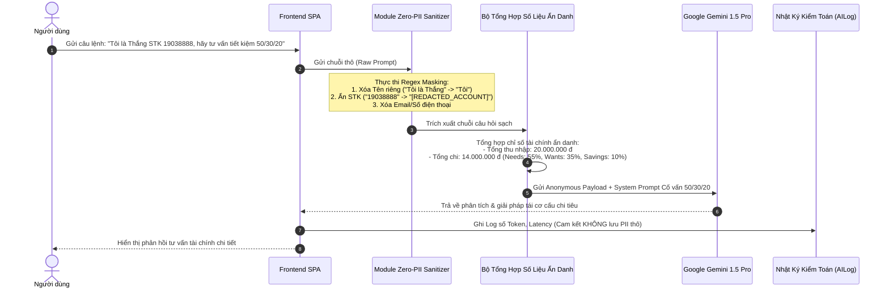
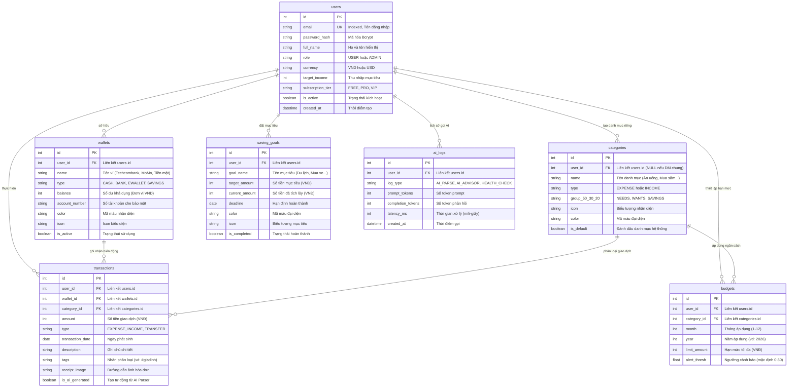
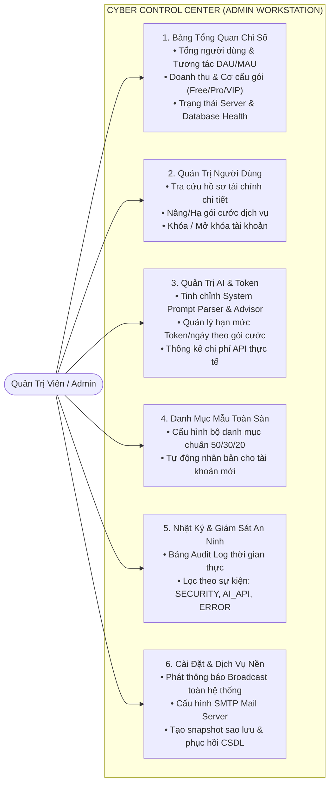
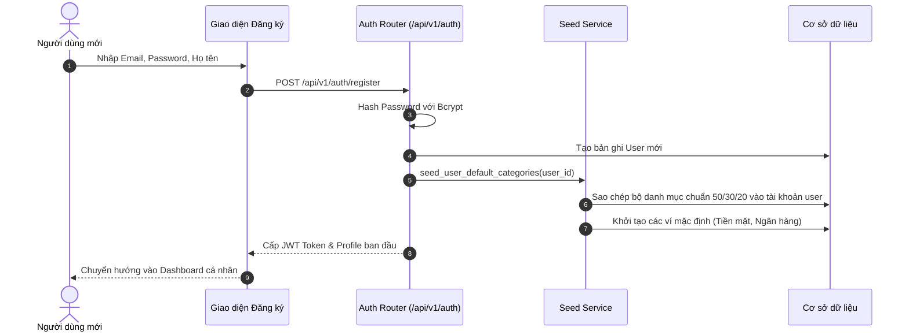
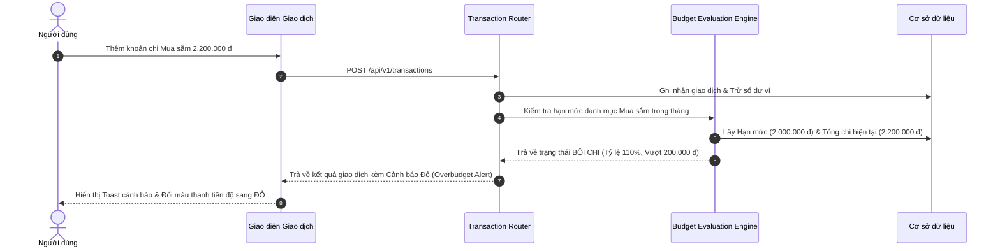

# TÀI LIỆU THIẾT KẾ KIẾN TRÚC HỆ THỐNG (SYSTEM ARCHITECTURE DOCUMENT)
## FINTRACK AI - HỆ THỐNG QUẢN LÝ CHI TIÊU CÁ NHÂN TÍCH HỢP AI

> **Dự án**: FinTrack AI  
> **Nhóm thực hiện**: Nhóm 03 (Đặng Quyết Thắng, Nguyễn Văn Tiến, Quách Minh Hiếu)  
> **Giảng viên hướng dẫn**: ThS. Hà Thị Thanh  
> **Đơn vị**: Khoa CNTT - Trường Đại học CNTT & Truyền thông (ICTU) - 2026

---

## 1. Tổng quan Kiến trúc Hệ thống (System Architecture Overview)

Hệ thống **FinTrack AI** được thiết kế theo mô hình kiến trúc phân tầng độc lập (**Layered & Modular Decoupled Architecture**), phân tách rõ ràng giữa tầng giao diện người dùng, tầng xử lý API & dịch vụ nghiệp vụ, phân hệ Trí tuệ Nhân tạo đám mây và tầng lưu trữ dữ liệu quan hệ chuẩn hóa **3NF**.

```mermaid
flowchart TB
    subgraph Client_Layer ["1. TẦNG GIAO DIỆN NGƯỜI DÙNG (PRESENTATION LAYER)"]
        UI_Web["Single Page Application (SPA)<br/>• Vanilla JS (ES6+) Modular Architecture<br/>• Glassmorphic Modern Dark Cyber Theme<br/>• Responsive UI (Desktop & Mobile)"]
        Chart_Engine["Thư viện Trực quan hóa<br/>• Chart.js (Donut & Bar Charts)<br/>• FontAwesome 6 Icons & CSS3 Glow"]
    end

    subgraph API_Gateway ["2. TẦNG ĐIỀU KHIỂN & API GATEWAY (FASTAPI)"]
        FastAPI_Core["FastAPI Framework (Python 3.10+)<br/>• Asynchronous Request Pipeline<br/>• CORS & Rate Limiting Middleware<br/>• Pydantic V2 Request/Response Validation"]
        Auth_Guard["Xác thực & Phân quyền (RBAC)<br/>• JWT Bearer Token Validation<br/>• Role Guard: USER / ADMIN<br/>• Password Hashing: Bcrypt"]
        Routers["13 RESTful API Routers<br/>• /auth, /wallets, /categories, /transactions<br/>• /budgets, /savings, /analytics, /ai<br/>• /badges, /admin, /backup, /exports"]
    end

    subgraph Domain_Services ["3. TẦNG DỊCH VỤ NGHIỆP VỤ (DOMAIN SERVICES)"]
        Budget_Engine["Động cơ Ngân sách 50/30/20<br/>• Hạn mức chi tiêu tháng<br/>• Cảnh báo đa cấp: Xanh, Vàng, Đỏ"]
        Wallet_Engine["Động cơ Quản lý Đa Ví<br/>• Cân đối tài sản ròng<br/>• Chuyển tiền Double-Entry nguyên tử"]
        Gamification_Engine["Động cơ Gamification<br/>• Tính chuỗi Streak liên tục<br/>• Cấp độ Level & Điểm XP<br/>• Mở khóa 24 Huy hiệu Thành tích"]
        Report_Engine["Động cơ Báo cáo & Trích xuất<br/>• OpenPyXL (Excel .xlsx)<br/>• ReportLab (PDF) / CSV"]
    end

    subgraph AI_Subsystem ["4. PHÂN HỆ AI & BẢO MẬT ZERO-PII (AI PIPELINE)"]
        PII_Sanitizer["Zero-PII Sanitizer & Data Masking<br/>• Loại bỏ Tên, Email, Số điện thoại, STK thô<br/>• Ẩn danh hóa số liệu tài chính"]
        Prompt_Engine["Dynamic Prompt Manager<br/>• System Prompt Natural Language Parser<br/>• System Prompt Financial Health Advisor"]
        LLM_Cloud["Mô hình AI Đám mây (LLM)<br/>• Google Gemini 1.5 Pro API<br/>• JSON Structured Output / Chat Streaming"]
    end

    subgraph Data_Layer ["5. TẦNG DỮ LIỆU & LƯU TRỮ (DATA LAYER - 3NF)"]
        ORM["SQLAlchemy ORM Engine<br/>• SessionLocal & Dependency Injection<br/>• Atomic Transactions & Rollback"]
        RDBMS[("CSDL Quan hệ Chuẩn 3NF<br/>• SQLite / PostgreSQL<br/>• 7 Thực thể & Ràng buộc Khóa ngoại")]
        File_Store["Lưu trữ Tệp Cục bộ<br/>• Thư mục /uploads (Hóa đơn, Bill)"]
    end

    Client_Layer <==>|HTTP / RESTful API (JSON)| API_Gateway
    API_Gateway --> Domain_Services
    Domain_Services --> Data_Layer
    Domain_Services <--> AI_Subsystem
```

---

## 2. Phân Tầng Chi Tiết Hệ Thống

### 2.1. Tầng Giao diện (Presentation Layer)
- **Kiến trúc SPA (Single Page Application)**: Giao diện web tải một lần duy nhất, điều hướng giữa các tab thông qua cơ chế chuyển đổi Component (`switchTab`) không gây giật lag hoặc tải lại trang.
- **Phong cách Glassmorphic Cyber Dark**: Sử dụng hiệu ứng nền mờ gương (`backdrop-filter: blur()`), viền neon phát sáng, hỗ trợ tối ưu hiển thị số liệu tài chính trong môi trường thiếu sáng.
- **Tối ưu hóa Chart.js**: Áp dụng quy tắc hủy thể hiện biểu đồ (`chartInstance.destroy()`) trước khi vẽ lại trên canvas để triệt tiêu hiện tượng nhấp nháy (jitter) và rò rỉ bộ nhớ (memory leaks).

### 2.2. Tầng Điều khiển & Cổng API (API Layer - FastAPI)
- **Phiên bản & Tiền tố**: Chuẩn hóa toàn bộ RESTful API dưới tiền tố `/api/v1/`.
- **Kiểm thực dữ liệu (Validation)**: Sử dụng **Pydantic V2** định nghĩa các lược đồ `In`, `Out`, `Update`, đảm bảo dữ liệu đầu vào luôn đúng kiểu, đúng ràng buộc nghiệp vụ.
- **Xác thực và Phân quyền (RBAC)**:
  - Sử dụng chuẩn `OAuth2PasswordBearer` kết hợp `JWT Token`.
  - Phân quyền 2 cấp độ: **USER** (Quản lý tài chính cá nhân) và **ADMIN** (Toàn quyền quản trị hệ thống, token, người dùng và prompt).

### 2.3. Tầng Dịch vụ Nghiệp vụ (Business Domain Layer)
- **Quy tắc Phân bổ Ngân sách 50/30/20**:
  - **50% Nhu cầu thiết yếu (Needs)**: Tiền thuê nhà, điện nước, ăn uống, y tế, xăng xe.
  - **30% Mong muốn & Hưởng thụ (Wants)**: Mua sắm, cà phê, du lịch, giải trí.
  - **20% Tiết kiệm & Tích lũy (Savings)**: Quỹ khẩn cấp, sổ tiết kiệm, đầu tư.
- **Động cơ Cảnh báo Hạn mức Đa tầng (3-Tier Alerting)**:
  - *Mức 1 (An toàn - Xanh)*: Chi tiêu $< 80\%$ hạn mức.
  - *Mức 2 (Cảnh báo - Vàng)*: Chi tiêu từ $80\%$ đến $99\%$ hạn mức.
  - *Mức 3 (Bội chi - Đỏ)*: Chi tiêu $\ge 100\%$ hạn mức, hiển thị rõ số tiền thâm hụt.
- **Động cơ Chuyển tiền Double-Entry**: Đảm bảo trừ tiền ví nguồn và cộng tiền ví đích diễn ra đồng thời trong một giao dịch nguyên tử, tổng tài sản ròng toàn hệ thống luôn bảo toàn.
- **Hệ thống Gamification 24 Huy hiệu**: Quản lý chuỗi ngày kỷ luật (Streak), điểm kinh nghiệm (XP), cấp độ (Level) và 24 huy hiệu mở khóa theo 4 cấp hạng.

---

## 3. Kiến trúc Phân hệ AI & Đường Ống Bảo Mật Zero-PII

Nhằm giải quyết triệt để rủi ro rò rỉ thông tin cá nhân và số tài khoản ngân hàng khi tương tác với các mô hình ngôn ngữ lớn (LLM), FinTrack AI thiết lập đường ống xử lý bảo mật nghiêm ngặt **Zero-PII Leakage Pipeline**:



### Nguyên tắc Vàng của Zero-PII Sanitizer:
1. **Không bao giờ gửi PII thô**: Các trường `full_name`, `email`, `user_id`, số tài khoản ngân hàng thực tế, số điện thoại đều được khử định danh ở cấp độ Backend trước khi đóng gói payload API.
2. **Ẩn danh hóa số liệu (Anonymous Metrics)**: Mô hình AI chỉ nhận được các số liệu tài chính trừu tượng dạng số tổng hợp và tỷ lệ phần trăm phân bổ.
3. **Kiểm toán an ninh AI**: Mọi lượt gọi LLM được ghi nhận trong bảng `ai_logs` để theo dõi Token tiêu thụ và độ trễ phản hồi (`latency_ms`) mà không lưu trữ dữ liệu nhạy cảm của người dùng.

---

## 4. Thiết kế Cơ sở Dữ liệu Quan hệ Chuẩn 3NF (Database ERD)

Hệ thống sử dụng cơ sở dữ liệu quan hệ gồm 7 bảng thực thể chuẩn hóa theo dạng chuẩn 3 (**Third Normal Form - 3NF**), loại bỏ trùng lặp và đảm bảo tính toàn vẹn tham chiếu.



---

## 5. Kiến trúc Phân hệ Quản trị (Admin Cyber Control Center)

Phân hệ Quản trị đóng vai trò trung tâm điều phối và giám sát toàn bộ hoạt động của hệ thống FinTrack AI:



---

## 6. Sơ đồ Tuần tự Các Ca Nghiệp Vụ Cốt Lõi

### 6.1. Luồng Xác thực & Khởi tạo Danh mục Mặc định


### 6.2. Luồng Cảnh báo Ngân sách Bội chi khi Ghi nhận Chi tiêu


---

## 7. Kiến trúc Bảo mật và An toàn Dữ liệu

| Lớp Bảo mật | Cơ chế Thực thi | Mục đích / Cam kết |
|---|---|---|
| **Xác thực** | JWT (JSON Web Tokens) với thuật toán HMAC-SHA256, thời hạn 24 giờ | Ngăn chặn giả mạo phiên làm việc |
| **Mã hóa Mật khẩu** | Thuật toán `Bcrypt` với Salt tự sinh ngẫu nhiên | Chống tấn công Rainbow table và rò rỉ dữ liệu |
| **Phân quyền (RBAC)** | Dependency Injection `get_current_admin_user` kiểm soát `role == 'ADMIN'` | Bảo vệ tuyệt đối các chức năng quản trị toàn sàn |
| **Chống SQL Injection** | Sử dụng SQLAlchemy ORM Parameterized Queries | Loại trừ 100% rủi ro chèn mã độc vào truy vấn SQL |
| **Chống XSS & CORS** | Sanitize dữ liệu đầu vào HTML và cấu hình CORS Middleware chặt chẽ | Ngăn chặn tấn công Cross-Site Scripting |
| **Bảo mật Riêng tư AI** | Zero-PII Leakage Sanitizer khử sạch tên, email, STK trước khi gọi API LLM | Bảo đảm quyền riêng tư tài chính tuyệt đối cho người dùng |
| **Sao lưu Dữ liệu** | Cơ chế Database Snapshot định dạng JSON có mã hóa kiểm toán | Đảm bảo khả năng phục hồi dữ liệu khi có sự cố thảm họa |
