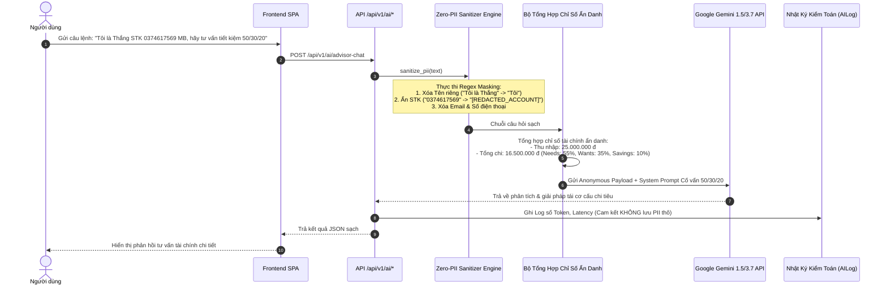
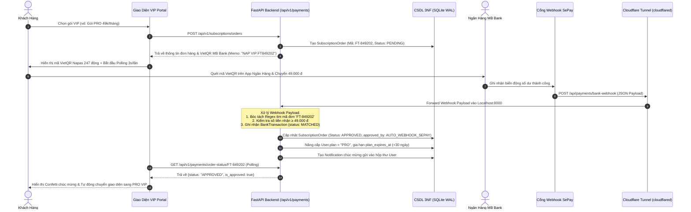
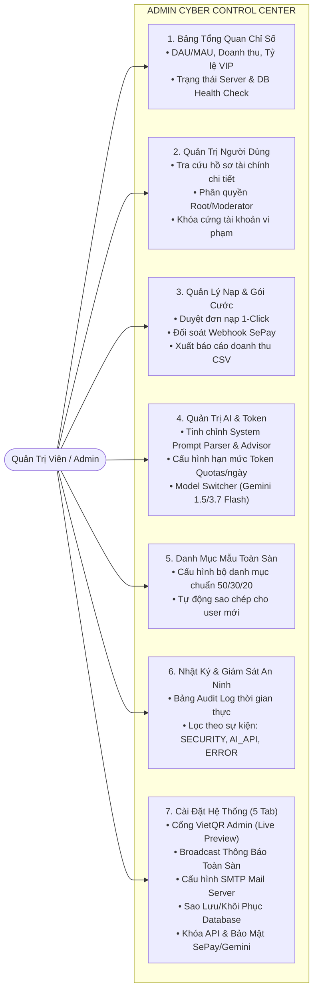

# TÀI LIỆU THIẾT KẾ KIẾN TRÚC HỆ THỐNG (SYSTEM ARCHITECTURE DOCUMENT)
## FINTRACK AI - HỆ THỐNG QUẢN LÝ CHI TIÊU CÁ NHÂN TÍCH HỢP AI

> **Dự án**: FinTrack AI  
> **Nhóm thực hiện**: Nhóm 03 (Đặng Quyết Thắng, Nguyễn Văn Tiến, Quách Minh Hiếu)  
> **Giảng viên hướng dẫn**: ThS. Hà Thị Thanh  
> **Đơn vị**: Khoa CNTT - Trường Đại học CNTT & Truyền thông (ICTU) - 2026

---

## 1. Tổng Quan Kiến Trúc Hệ Thống (System Architecture Overview)

Hệ thống **FinTrack AI** được thiết kế theo mô hình kiến trúc phân tầng độc lập (**Layered & Modular Decoupled Architecture**), phân tách rõ ràng giữa tầng giao diện người dùng, tầng xử lý API & dịch vụ nghiệp vụ, phân hệ Trí tuệ Nhân tạo đám mây, cổng thanh toán Webhook và tầng lưu trữ dữ liệu quan hệ chuẩn hóa **3NF**.

```mermaid
flowchart TB
    subgraph Client_Layer ["1. TẦNG GIAO DIỆN NGƯỜI DÙNG (PRESENTATION LAYER - SPA)"]
        UI_Web["Single Page Application (SPA)<br/>• Vanilla JS (ES6+) Modular Architecture<br/>• Neo-Futuristic Glassmorphism Theme<br/>• Master Floating Glass Container (blur 24px)<br/>• GPU-Accelerated Glowing Neon Border (@property 120fps 16s)"]
        Chart_Engine["Thư viện Trực quan hóa<br/>• Chart.js (Doughnut 6 màu neon & Area Trends)<br/>• FontAwesome 6 Icons & Canvas Confetti"]
    end

    subgraph API_Gateway ["2. TẦNG ĐIỀU KHIỂN & API GATEWAY (FASTAPI)"]
        FastAPI_Core["FastAPI Framework (Python 3.10+)<br/>• Asynchronous Request Pipeline<br/>• CORS & Rate Limiting Middleware<br/>• Pydantic V2 Request/Response Validation"]
        Auth_Guard["Xác thực & Bảo Mật 2 Tầng<br/>• JWT Bearer Token Validation<br/>• Role Guard: USER / MODERATOR / ADMIN<br/>• Password Hashing: Bcrypt<br/>• Hard Lockout 2-Layer Enforcement"]
        Routers["14 RESTful API Routers<br/>• /auth, /wallets, /categories, /transactions<br/>• /budgets, /savings, /analytics, /ai, /badges<br/>• /notifications, /subscriptions, /payments, /support, /admin"]
    end

    subgraph Payment_Gateway ["3. CỔNG THANH TOÁN TỰ ĐỘNG & WEBHOOK"]
        SePay_Service["SePay / Casso Payment Webhook<br/>• Tiếp nhận biến động số dư VietQR MB Bank<br/>• Đối soát mã đơn hàng tự động (FT-xxxxxx)"]
        Tunnel_Proxy["Cloudflare Tunnel (cloudflared)<br/>• Secure Ingress Tunnel từ Internet vào Localhost<br/>• Tự động Forward Webhook Payload vào FastAPI"]
    end

    subgraph Domain_Services ["4. TẦNG DỊCH VỤ NGHIỆP VỤ (DOMAIN SERVICES)"]
        Budget_Engine["Động cơ Ngân sách 50/30/20<br/>• Hạn mức chi tiêu tháng<br/>• Cảnh báo đa cấp: Xanh (<80%), Vàng (80-99%), Đỏ (≥100%)"]
        Wallet_Engine["Động cơ Quản lý Ví 2 Tầng (2-Scope)<br/>• Ví ảo kế toán (Sandbox) vs Ví thật thanh toán (Real)<br/>• Chuyển tiền Double-Entry nguyên tử"]
        Gamification_Engine["Động cơ Gamification<br/>• Tính chuỗi Streak liên tục<br/>• Cấp độ Level (1-6) & Điểm XP<br/>• Mở khóa 24 Huy hiệu Thành tích"]
        Report_Engine["Động cơ Báo cáo & Trích xuất<br/>• OpenPyXL (Excel .xlsx)<br/>• ReportLab (PDF) / CSV UTF-8 BOM"]
    end

    subgraph AI_Subsystem ["5. PHÂN HỆ AI & BẢO MẬT ZERO-PII (AI PIPELINE)"]
        PII_Sanitizer["Zero-PII Sanitizer & Data Masking<br/>• Khử sạch Tên riêng, Email, SĐT, STK ngân hàng<br/>• Ẩn danh hóa số liệu tài chính trước khi gọi API"]
        Prompt_Engine["Dynamic Prompt Manager<br/>• System Prompt Natural Language Parser<br/>• System Prompt Financial Health Advisor"]
        LLM_Cloud["Mô hình AI Đám mây (LLM)<br/>• Google Gemini 1.5 Pro / 3.7 Flash API<br/>• JSON Structured Output / 24/7 Advisor Chat"]
    end

    subgraph Data_Layer ["6. TẦNG DỮ LIỆU & LƯU TRỮ (DATA LAYER - 11 BẢNG 3NF)"]
        ORM["SQLAlchemy ORM Engine<br/>• SessionLocal & Dependency Injection<br/>• Atomic Commit & Rollback"]
        RDBMS[("CSDL Quan hệ Chuẩn 3NF (SQLite WAL Mode)<br/>• 11 Thực thể Dữ liệu Ràng buộc Khóa ngoại")]
        File_Store["Lưu trữ Tệp Cục bộ<br/>• Thư mục /uploads (Ảnh hóa đơn, chứng từ)"]
    end

    Client_Layer <==>|HTTP / RESTful API (JSON)| API_Gateway
    Payment_Gateway ==>|Webhook Payload POST| API_Gateway
    API_Gateway --> Domain_Services
    Domain_Services --> Data_Layer
    Domain_Services <--> AI_Subsystem
```

---

## 2. Phân Tầng Chi Tiết Hệ Thống

### 2.1. Tầng Giao Diện (Presentation Layer)
- **Kiến trúc SPA (Single Page Application)**: Giao diện web tải một lần duy nhất, điều hướng giữa các tab thông qua cơ chế chuyển đổi Component (`switchTab`) không gây giật lag hoặc tải lại trang.
- **Phong cách Neo-Futuristic Glassmorphism**:
  - **Master Floating Glass Container (`#main-glass-wrapper` / `#master-glass-wrapper`)**: Khung chứa ứng dụng độc lập, bo góc `28px`, nền kính mờ tối trong suốt `background: rgba(11, 15, 25, 0.82)`, `backdrop-filter: blur(24px)`.
  - **GPU-Accelerated Glowing Neon Border (120fps Ultra-Smooth)**: Lớp viền 1.5px xoay góc thuần túy chu kỳ 16s sang trọng bằng kỹ thuật CSS `@property --neon-angle` trên GPU Compositor (`contain: paint`, `isolation: isolate`, `will-change: --neon-angle`, `transform: translateZ(0)`), không bao giờ trigger repaint lên nội dung bên trong, kèm fallback `prefers-reduced-motion` tự động chuyển sang gradient tĩnh cho máy yếu / tiết kiệm pin.
- **Widget "Cơ Cấu Chi Tiêu" (Chart.js Doughnut)**:
  - Tỷ lệ tâm rỗng `cutout: 74%`, tích hợp Custom Canvas Center Plugin hiển thị trực tiếp nhãn *"Tổng chi"* và con số lũy kế tháng (ví dụ: `18.45M ₫`).
  - Phân bổ 6 mã màu Neon chuẩn cho các danh mục chính:
    1. 🟣 Nhà ở & Chi phí cố định (`#B026FF`)
    2. 🟢 Ăn uống & Thực phẩm (`#00FFAA`)
    3. 🔵 Mua sắm & Công nghệ (`#00E5FF`)
    4. 🌸 Cà phê & Giải trí (`#FF007A`)
    5. 🟠 Đi lại & Xăng xe (`#FFAA00`)
    6. 🔷 Sức khỏe & Thể thao / Y tế (`#3B82F6`)

### 2.2. Tầng Điều Khiển & Cổng API (API Layer - FastAPI)
- **Chuẩn hóa RESTful API**: Toàn bộ endpoint được định tuyến dưới tiền tố chuẩn `/api/v1/*` và `/api/*`.
- **Kiểm thực dữ liệu (Pydantic V2 Validation)**: Định nghĩa các schema `In`, `Out`, `Update`, đảm bảo dữ liệu đầu vào luôn đúng kiểu và ràng buộc nghiệp vụ.
- **Xác thực và Phân quyền (RBAC)**:
  - Sử dụng chuẩn `OAuth2PasswordBearer` kết hợp `JWT Token` (HMAC-SHA256).
  - Phân quyền 3 cấp độ: **USER** (Người dùng cá nhân), **MODERATOR** (Quản trị viên phụ duyệt đơn/ticket), **ADMIN** (Root Admin tối cao).

### 2.3. Tầng Dịch Vụ Nghiệp Vụ (Business Domain Layer)
- **Kiến trúc Ví 2 Tầng (2-Scope Ledger)**:
  - `virtual` (Ví ảo Sandbox Ledger): Ghi chép thu chi cá nhân hàng ngày (Tiền mặt, MB Bank, MoMo, Sổ tiết kiệm).
  - `real` (Ví thật Real Payment Wallet): Ví nạp tiền thật thanh toán dịch vụ và nâng cấp các gói VIP (`Ví Dịch Vụ & VIP FinTrack`).
- **Quy tắc Phân bổ Ngân sách 50/30/20**:
  - **50% Nhu cầu thiết yếu (Needs)**: Tiền nhà, điện nước, ăn uống, y tế, xăng xe.
  - **30% Mong muốn & Hưởng thụ (Wants)**: Mua sắm, cà phê, du lịch, giải trí.
  - **20% Tiết kiệm & Tích lũy (Savings)**: Quỹ khẩn cấp, sổ tiết kiệm, đầu tư.
- **Động cơ Cảnh báo Hạn mức Đa tầng (3-Tier Alerting)**:
  - *Mức 1 (An toàn - Xanh)*: Chi tiêu $< 80\%$ hạn mức.
  - *Mức 2 (Cảnh báo - Vàng)*: Chi tiêu từ $80\%$ đến $99\%$ hạn mức.
  - *Mức 3 (Bội chi - Đỏ)*: Chi tiêu $\ge 100\%$ hạn mức, hiển thị rõ số tiền thâm hụt.
- **Động cơ Chuyển tiền Double-Entry**: Đảm bảo trừ tiền ví nguồn và cộng tiền ví đích diễn ra đồng thời trong một giao dịch nguyên tử, tổng tài sản ròng toàn hệ thống luôn bảo toàn.
- **Hệ thống Gamification**: Quản lý chuỗi ngày kỷ luật (Streak), điểm kinh nghiệm (XP), 6 cấp bậc Level và 24 huy hiệu mở khóa theo 4 cấp hạng.

---

## 3. Kiến Trúc Phân Hệ AI & Đường Ống Bảo Mật Zero-PII

Nhằm triệt tiêu 100% rủi ro rò rỉ thông tin định danh cá nhân và số tài khoản ngân hàng khi tương tác với các mô hình ngôn ngữ lớn (LLM), FinTrack AI thiết lập đường ống xử lý bảo mật nghiêm ngặt **Zero-PII Leakage Pipeline**:



### Nguyên Tắc Cốt Lõi Của Zero-PII Leakage Engine:
1. **Khử PII Cục Bộ Tại Backend**: Toàn bộ các trường `full_name`, `email`, `user_id`, số tài khoản ngân hàng, số điện thoại đều được khử định danh bằng biểu thức chính quy trước khi gửi sang Google Gemini API.
2. **Ẩn Danh Hóa Chỉ Số (Anonymous Metrics Context)**: Mô hình AI chỉ nhận các con số tài chính tổng hợp trừu tượng và tỷ lệ phần trăm phân bổ.
3. **Kiểm Toán An Ninh (Zero-PII Audit Logging)**: Bảng `ai_chat_logs` chỉ lưu trữ số token tiêu thụ và thời gian xử lý (`latency_ms`), loại trừ toàn bộ dữ liệu nhạy cảm.

---

## 4. Luồng Tích Hợp Webhook SePay Qua Cloudflare Tunnel

Để tự động hóa quy trình nạp tiền và kích hoạt gói VIP từ tài khoản ngân hàng MB Bank mà không cần can thiệp thủ công, FinTrack AI tích hợp Webhook SePay thông qua đường hầm **Cloudflare Tunnel**:



---

## 5. Thiết Kế Cơ Sở Dữ Liệu Quan Hệ Chuẩn 3NF (11 Bảng Thực Thể)

Hệ thống sử dụng cơ sở dữ liệu quan hệ gồm **11 bảng thực thể** chuẩn hóa theo dạng chuẩn 3 (**Third Normal Form - 3NF**):

```mermaid
erDiagram
    users ||--o{ wallets : "sở hữu (1:N)"
    users ||--o{ categories : "tạo danh mục (1:N)"
    users ||--o{ transactions : "thực hiện bút toán (1:N)"
    users ||--o{ budgets : "thiết lập hạn mức (1:N)"
    users ||--o{ saving_goals : "đặt mục tiêu tích lũy (1:N)"
    users ||--o{ ai_chat_logs : "lưu nhật ký AI (1:N)"
    users ||--o{ notifications : "nhận thông báo (1:N)"
    users ||--o{ subscription_orders : "đặt mua gói VIP (1:N)"
    users ||--o{ support_tickets : "gửi yêu cầu hỗ trợ (1:N)"

    wallets ||--o{ transactions : "nguồn tiền thanh toán (1:N)"
    categories ||--o{ transactions : "phân loại thu chi (1:N)"
    categories ||--o{ budgets : "áp dụng hạn mức (1:N)"

    system_bank_accounts ||--o{ bank_transactions : "tiếp nhận dòng tiền (1:N)"
    subscription_orders ||--o| bank_transactions : "đối soát khớp lệnh webhook (1:1)"

    users {
        int id PK
        string email UK "Indexed"
        string full_name
        string hashed_password
        string role "USER | MODERATOR | ADMIN"
        string status "ACTIVE | LOCKED"
        string plan "FREE | PRO | PREMIUM | PLATINUM"
        datetime plan_expires_at
        string currency
        datetime created_at
    }

    wallets {
        int id PK
        int user_id FK "Cascade"
        string name
        string wallet_type "CASH | BANK | EWALLET | SAVINGS"
        string wallet_scope "virtual | real"
        float balance
        string account_number_masked
        string color
        string icon
        boolean is_active
    }

    categories {
        int id PK
        int user_id FK "Nullable cho DM chung"
        string name
        string type "EXPENSE | INCOME"
        string group "NEEDS | WANTS | SAVINGS | INCOME"
        string icon
        string color
        boolean is_default
    }

    transactions {
        int id PK
        int user_id FK "Cascade"
        int wallet_id FK "Restrict"
        int category_id FK "Restrict"
        int to_wallet_id FK "Cho Transfer"
        string type "EXPENSE | INCOME | TRANSFER"
        float amount
        datetime transaction_date
        text note
        string receipt_url
        string created_by_ai "AI_PARSED | MANUAL"
    }

    budgets {
        int id PK
        int user_id FK "Cascade"
        int category_id FK "Cascade"
        float amount_limit
        string period "MONTHLY"
        string month_year "YYYY-MM"
        boolean alert_80_sent
        boolean alert_100_sent
    }

    saving_goals {
        int id PK
        int user_id FK "Cascade"
        string name
        float target_amount
        float current_amount
        date target_date
        string status "ACTIVE | COMPLETED"
        string icon
        string color
    }

    ai_chat_logs {
        int id PK
        int user_id FK "Cascade"
        text query_text
        text response_text
        string prompt_template_used
        int response_time_ms
        datetime created_at
    }

    notifications {
        int id PK
        int user_id FK "Cascade (Null cho Broadcast)"
        string target_type "ALL | FREE | PRO | PREMIUM | USER"
        string title
        text message
        string type "INFO | SUCCESS | WARNING | PROMOTION"
        boolean is_read
        boolean is_pinned
        datetime created_at
    }

    subscription_orders {
        int id PK
        string order_code UK "FT-xxxxxx"
        int user_id FK "Cascade"
        string plan_code "PRO | PREMIUM | PLATINUM"
        int plan_duration_days
        float amount
        string payment_method "MB_VIETQR"
        string transfer_memo
        string status "PENDING | APPROVED | REJECTED"
        string approved_by
        datetime created_at
    }

    support_tickets {
        int id PK
        string ticket_code UK "TK-xxxxxx"
        int user_id FK "Cascade"
        string title
        string category "BILLING | TECHNICAL | ACCOUNT"
        string priority "LOW | MEDIUM | HIGH | URGENT"
        string status "OPEN | IN_PROGRESS | RESOLVED | CLOSED"
        text message
        text admin_reply
        datetime created_at
    }

    bank_transactions {
        int id PK
        int bank_account_id FK "Set Null"
        string bank_code "MB"
        string account_number
        string reference_code "SePay TID"
        float amount
        text description
        datetime transaction_date
        string status "MATCHED | UNMATCHED"
        string matched_order_code
        int matched_user_id
        datetime created_at
    }
```



---

## 6. Kiến Trúc Phân Hệ Quản Trị (Admin Cyber Control Center)



---

## 7. Kiến Trúc Bảo Mật & Phòng Thủ Đa Tầng

| Lớp Bảo Mật | Cơ Chế Thực Thi | Mục Đích & Cam Kết |
| :--- | :--- | :--- |
| **Xác thực Phiên** | JWT (JSON Web Tokens) thuật toán HMAC-SHA256, thời hạn 7 ngày | Chống giả mạo phiên làm việc và bảo vệ danh tính. |
| **Mã Hóa Mật Khẩu** | Thuật toán `Bcrypt` với Salt tự sinh ngẫu nhiên | Chống tấn công dò mật khẩu và rò rỉ cơ sở dữ liệu. |
| **Hard Lockout 2 Tầng** | Backend FastAPI Dependency chặn `HTTP 403` + Frontend Client Interceptor xóa session | Khóa tức thì tài khoản vi phạm, vô hiệu hóa ngay lập tức. |
| **Phân Quyền RBAC** | Role Guard `USER`, `MODERATOR`, `ADMIN` phân tầng chặt chẽ | Bảo vệ các API quản trị toàn sàn và cấu hình nhạy cảm. |
| **Chống SQL Injection** | Sử dụng SQLAlchemy ORM Parameterized Queries | Loại trừ 100% rủi ro tiêm mã độc vào câu truy vấn CSDL. |
| **Bảo Mật Zero-PII AI** | Regex Sanitizer khử sạch tên, email, SĐT, STK trước khi gửi sang LLM | Đảm bảo quyền riêng tư và tuân thủ an toàn dữ liệu cá nhân. |
| **Sao Lưu Phục Hồi** | Cơ chế Snapshot Database JSON/DB mã hóa | Đảm bảo khả năng khôi phục hệ thống khi có sự cố kỹ thuật. |
