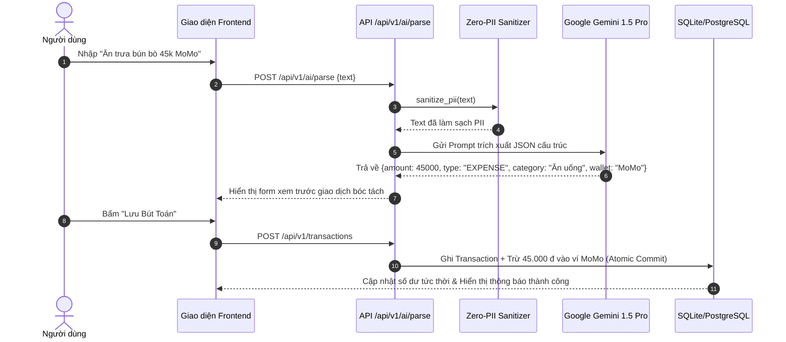
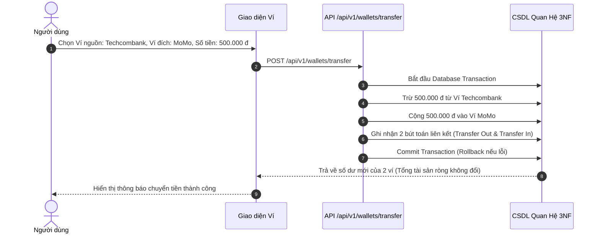

# BẢN ĐỒ CƠ SỞ MÃ NGUỒN (CODEBASE MAP) - FINTRACK AI

> **Dự án**: FinTrack AI - Hệ thống Quản lý Chi tiêu Cá nhân tích hợp AI  
> **Nhóm thực hiện**: Nhóm 03 (Đặng Quyết Thắng, Nguyễn Văn Tiến, Quách Minh Hiếu)  
> **Khoa CNTT - Trường Đại học CNTT & Truyền thông (ICTU) - 2026**

---

## 1. Tổng quan Kiến trúc Thư mục

Toàn bộ mã nguồn dự án được tổ chức theo cấu trúc phân tầng rõ rệt:

```
HeThongChiTieuCaNhan1.0/
├── backend/                          # Tầng xử lý nghiệp vụ Backend & RESTful API
│   ├── app/
│   │   ├── config.py                 # Cấu hình biến môi trường & Pydantic Settings
│   │   ├── database.py               # Kết nối CSDL SQLAlchemy, SessionLocal & Engine
│   │   ├── main.py                   # Điểm khởi tạo FastAPI App, CORS & gắn kết Router
│   │   ├── models/                   # ORM Models (Thực thể CSDL quan hệ chuẩn 3NF)
│   │   │   ├── user.py               # Model User & Phân quyền RBAC (ADMIN, USER)
│   │   │   ├── wallet.py             # Model Wallet (Ví tiền mặt, Ngân hàng, MoMo, Tiết kiệm)
│   │   │   ├── category.py           # Model Category (Danh mục chi tiêu theo 50/30/20)
│   │   │   ├── transaction.py        # Model Transaction (Bút toán Thu/Chi/Transfer)
│   │   │   ├── budget.py             # Model Budget (Hạn mức ngân sách tháng & ngưỡng cảnh báo)
│   │   │   ├── saving_goal.py        # Model SavingGoal (Mục tiêu tiết kiệm & tích lũy)
│   │   │   └── ai_log.py             # Model AILog (Lịch sử Token, Prompt, Latency, Audit)
│   │   ├── schemas/                  # Pydantic Data Validation Schemas (Input/Output)
│   │   ├── services/                 # Lớp dịch vụ nghiệp vụ (Business Domain Services)
│   │   │   ├── ai_service.py         # Client Google Gemini 1.5 Pro, Zero-PII Sanitizer & Advisor
│   │   │   ├── badge_service.py      # Hệ thống Gamification: 24 Huy hiệu, Level, XP, Streak
│   │   │   ├── prompt_manager.py     # Quản lý & Tinh chỉnh System Prompts động
│   │   │   ├── report_service.py     # Xuất báo cáo tài chính định dạng Excel (.xlsx), PDF, CSV
│   │   │   └── seed_service.py       # Khởi tạo CSDL mẫu & Danh mục mặc định 50/30/20
│   │   ├── routers/                  # Tầng điều khiển API (API Endpoints Controllers)
│   │   │   ├── auth.py               # /api/v1/auth - Đăng ký, Đăng nhập, Demo Access, Hồ sơ
│   │   │   ├── wallets.py            # /api/v1/wallets - Quản lý ví, Chuyển tiền Double-Entry
│   │   │   ├── categories.py         # /api/v1/categories - CRUD Danh mục & Khôi phục mặc định
│   │   │   ├── transactions.py       # /api/v1/transactions - CRUD Bút toán, Bộ lọc & Upload Bill
│   │   │   ├── budgets.py            # /api/v1/budgets - Hạn mức tháng & Cảnh báo bội chi
│   │   │   ├── saving_goals.py       # /api/v1/savings - Mục tiêu tiết kiệm & Nạp tiền trích ví
│   │   │   ├── analytics.py          # /api/v1/analytics - Thống kê tài sản ròng, 50/30/20, Dòng tiền
│   │   │   ├── ai.py                 # /api/v1/ai - Bóc tách giao dịch tự nhiên, Bác sĩ tài chính
│   │   │   ├── badges.py             # /api/v1/badges - Truy vấn danh hiệu, Điểm XP, Chuỗi ngày
│   │   │   ├── admin.py              # /api/v1/admin - Cyber Control Center, Quản lý User, Prompts, Token
│   │   │   ├── backup.py             # /api/v1/backup - Sao lưu Snapshot CSDL & Khôi phục
│   │   │   └── exports.py            # /api/v1/exports - Tải file báo cáo Excel / PDF / CSV
│   │   └── utils/                    # Các module tiện ích bảo mật (Bcrypt, JWT) & định dạng
│   └── tests/                        # Bộ kiểm thử tự động (Pytest Suite)
├── frontend/                         # Tầng giao diện người dùng Single Page Application
│   ├── index.html                    # Khung HTML gốc của SPA & Container Modals
│   ├── css/
│   │   └── style.css                 # Glassmorphic Cyber Dark UI theme & Animation
│   └── js/
│       ├── api.js                    # Wrapper gọi Fetch API tập trung & JWT Interceptor
│       ├── app.js                    # SPA State Manager, Điều hướng Tab & Khởi động
│       ├── components/               # Các Controller giao diện theo từng Module
│       │   ├── auth.js               # Đăng nhập, Đăng ký, Đổi mật khẩu, Demo switcher
│       │   ├── dashboard.js          # Dashboard tổng quan tài sản ròng & chỉ số tài chính
│       │   ├── wallets.js            # Quản lý ví, Thêm ví mới, Chuyển tiền nội bộ
│       │   ├── categories.js         # Quản lý danh mục theo nhóm 50/30/20
│       │   ├── transactions.js       # Sổ giao dịch, Bộ lọc nâng cao, AI Quick Input Modal
│       │   ├── budgets.js            # Thanh tiến độ ngân sách & Cảnh báo bội chi đa cấp
│       │   ├── savings.js            # Mục tiêu tiết kiệm & Nạp tiền trích từ ví
│       │   ├── analytics.js          # Biểu đồ Donut cơ cấu chi & Cột dòng tiền 6 tháng
│       │   ├── ai_assistant.js       # Bác sĩ tài chính & Chatbot tư vấn 50/30/20
│       │   ├── badges.js             # Bảng 24 Huy hiệu, Cấp độ Level, Chuỗi ngày Streak
│       │   └── admin.js              # Cyber Control Center (Quản trị toàn sàn)
│       └── utils/
│           └── formatters.js         # Định dạng số tiền VND, ngày tháng & nhãn trạng thái
├── docs/                             # Thư mục hồ sơ thiết kế & tài liệu kỹ thuật
├── uploads/                          # Thư mục lưu trữ tệp đính kèm (hóa đơn, chứng từ)
├── CLAUDE.md                         # Hướng dẫn Coding Agent & Nguyên tắc dự án
├── architecture.md                   # Tài liệu thiết kế kiến trúc hệ thống chuyên sâu
├── codebase-map.md                   # Sơ đồ tổ chức cơ sở mã nguồn (Tài liệu này)
├── user_stories.md                   # Bản đặc tả User Story chi tiết
├── requirements.txt                  # Danh sách thư viện Python phụ thuộc
├── pytest.ini                        # Cấu hình Pytest
└── run.py                            # Entrypoint khởi chạy dịch vụ đa nền tảng
```

---

## 2. Chi tiết Tầng Backend (`backend/app/`)

### 2.1. Cấu hình & Hạ tầng CSDL
- **[`backend/app/config.py`](file:///D:/Visua%20Studio%20Code/HeThongChiTieuCaNhan1.0/backend/app/config.py)**:
  - Khai báo lớp `Settings` kế thừa từ `pydantic_settings.BaseSettings`.
  - Quản lý các cấu hình: `DATABASE_URL` (mặc định SQLite `sqlite:///./fintrack.db`), `SECRET_KEY`, `ALGORITHM` (`HS256`), `ACCESS_TOKEN_EXPIRE_MINUTES` (1440 phút), `AI_PROVIDER` (`gemini`), `GEMINI_API_KEY`, `DEFAULT_MODEL` (`gemini-1.5-pro`).
- **[`backend/app/database.py`](file:///D:/Visua%20Studio%20Code/HeThongChiTieuCaNhan1.0/backend/app/database.py)**:
  - Khởi tạo SQLAlchemy `engine` với `connect_args={"check_same_thread": False}` cho SQLite.
  - Cung cấp `SessionLocal` và Dependency `get_db()` phục vụ việc inject database session vào từng request handler.
- **[`backend/app/main.py`](file:///D:/Visua%20Studio%20Code/HeThongChiTieuCaNhan1.0/backend/app/main.py)**:
  - Khởi tạo ứng dụng `FastAPI(title="FinTrack AI", version="1.0.0")`.
  - Thiết lập `CORSMiddleware` cho phép truy cập từ Web Client.
  - Phục vụ Static Files cho Frontend (`/` và `/static`).
  - Gắn kết 13 Routers API dưới tiền tố chuẩn `/api/v1/*`.
  - Tự động thực thi Seed CSDL (`seed_default_data()`) khi ứng dụng khởi động.

### 2.2. Mô hình Thực thể Dữ liệu Chuẩn 3NF (`backend/app/models/`)
1. **[`user.py`](file:///D:/Visua%20Studio%20Code/HeThongChiTieuCaNhan1.0/backend/app/models/user.py)**:
   - Thực thể `User`: `id`, `email` (Unique, Indexed), `password_hash`, `full_name`, `role` (`USER`, `ADMIN`), `currency` (`VND`, `USD`), `target_income`, `subscription_tier` (`FREE`, `PRO`, `VIP`), `is_active`, `created_at`.
2. **[`wallet.py`](file:///D:/Visua%20Studio%20Code/HeThongChiTieuCaNhan1.0/backend/app/models/wallet.py)**:
   - Thực thể `Wallet`: `id`, `user_id` (FK `users.id`), `name`, `type` (`CASH`, `BANK`, `EWALLET`, `SAVINGS`), `balance` (Integer VND), `account_number` (hỗ trợ che `****1234`), `color`, `icon`, `is_active`.
3. **[`category.py`](file:///D:/Visua%20Studio%20Code/HeThongChiTieuCaNhan1.0/backend/app/models/category.py)**:
   - Thực thể `Category`: `id`, `user_id` (FK `users.id`, Nullable cho danh mục hệ thống), `name`, `type` (`EXPENSE`, `INCOME`), `group_50_30_20` (`NEEDS`, `WANTS`, `SAVINGS`), `icon`, `color`, `is_default`.
4. **[`transaction.py`](file:///D:/Visua%20Studio%20Code/HeThongChiTieuCaNhan1.0/backend/app/models/transaction.py)**:
   - Thực thể `Transaction`: `id`, `user_id` (FK), `wallet_id` (FK), `category_id` (FK), `amount` (Integer), `type` (`EXPENSE`, `INCOME`, `TRANSFER`), `transaction_date`, `description`, `tags`, `receipt_image`, `is_ai_generated`.
5. **[`budget.py`](file:///D:/Visua%20Studio%20Code/HeThongChiTieuCaNhan1.0/backend/app/models/budget.py)**:
   - Thực thể `Budget`: `id`, `user_id` (FK), `category_id` (FK), `month`, `year`, `limit_amount`, `alert_thresh` (mặc định 0.80 = 80%).
6. **[`saving_goal.py`](file:///D:/Visua%20Studio%20Code/HeThongChiTieuCaNhan1.0/backend/app/models/saving_goal.py)**:
   - Thực thể `SavingGoal`: `id`, `user_id` (FK), `goal_name`, `target_amount`, `current_amount`, `deadline`, `color`, `icon`, `is_completed`.
7. **[`ai_log.py`](file:///D:/Visua%20Studio%20Code/HeThongChiTieuCaNhan1.0/backend/app/models/ai_log.py)**:
   - Thực thể `AILog`: `id`, `user_id` (FK), `log_type` (`AI_PARSE`, `AI_ADVISOR`, `HEALTH_CHECK`), `prompt_tokens`, `completion_tokens`, `latency_ms`, `created_at`.

### 2.3. Lớp Dịch vụ Nghiệp vụ (`backend/app/services/`)
- **[`ai_service.py`](file:///D:/Visua%20Studio%20Code/HeThongChiTieuCaNhan1.0/backend/app/services/ai_service.py)**:
  - `sanitize_pii(text)`: Sử dụng biểu thức chính quy (Regex) và logic bóc tách để lọc bỏ số tài khoản, số điện thoại, email và tên riêng trước khi gửi yêu cầu lên LLM.
  - `parse_transaction_natural_language(text, user_context)`: Gửi câu lệnh tiếng Việt (ví dụ: *"Ăn trưa bún bò 45k MoMo"*) tới Gemini 1.5 Pro để trích xuất JSON: `{amount, type, category_name, wallet_name, description}`.
  - `calculate_financial_health_score(metrics)`: Tính điểm sức khỏe tài chính (thang điểm 100) dựa trên 4 trụ cột: Tỷ lệ tiết kiệm, Tuân thủ ngân sách 50/30/20, Quỹ dự phòng khẩn cấp, Mức độ biến động chi tiêu.
  - `chat_financial_advisor(user_message, anonymous_financial_summary)`: Cung cấp trợ lý tư vấn tài chính 50/30/20 thông minh.
- **[`badge_service.py`](file:///D:/Visua%20Studio%20Code/HeThongChiTieuCaNhan1.0/backend/app/services/badge_service.py)**:
  - Quản lý logic tính chuỗi Streak (số ngày liên tiếp ghi chép giao dịch).
  - Tính điểm kinh nghiệm XP và cấp độ Level (Cấp 1 đến Cấp 10+).
  - Tự động đánh giá và mở khóa Bộ 24 Huy hiệu phân cấp theo 4 hạng: **Đồng (Bronze)**, **Bạc (Silver)**, **Vàng (Gold)**, **Kim Cương (Diamond)** và **Huyền Thoại (Mythic)**.
- **[`report_service.py`](file:///D:/Visua%20Studio%20Code/HeThongChiTieuCaNhan1.0/backend/app/services/report_service.py)**:
  - Kết xuất file báo cáo Excel (`.xlsx`) sử dụng OpenPyXL với cấu trúc phân trang, định dạng số tiền VND và biểu đồ mini.
  - Tạo tài liệu báo cáo định dạng PDF và CSV.
- **[`seed_service.py`](file:///D:/Visua%20Studio%20Code/HeThongChiTieuCaNhan1.0/backend/app/services/seed_service.py)**:
  - Tự động nạp bộ danh mục mẫu chuẩn hóa theo quy tắc 50/30/20 khi tạo tài khoản mới hoặc khởi động hệ thống.
  - Khởi tạo tài khoản quản trị Admin (`admin@fintrack.ai / Admin@123456`) và người dùng Demo (`user@fintrack.ai / User@123456`).

### 2.4. Danh mục API Routers (`backend/app/routers/`)

| Router File | Prefix Endpoint | Chức năng chính | Phân quyền |
|---|---|---|---|
| `auth.py` | `/api/v1/auth` | Đăng ký, Đăng nhập, Demo Login, Lấy profile, Đổi mật khẩu | Public / Authenticated |
| `wallets.py` | `/api/v1/wallets` | CRUD ví, Chuyển tiền nội bộ giữa các ví | User Authenticated |
| `categories.py` | `/api/v1/categories` | CRUD danh mục 50/30/20, Khôi phục danh mục mẫu | User Authenticated |
| `transactions.py` | `/api/v1/transactions` | CRUD giao dịch, lọc ngày/danh mục/ví, đính kèm bill | User Authenticated |
| `budgets.py` | `/api/v1/budgets` | Lập hạn mức tháng, tính toán % đã chi & cảnh báo | User Authenticated |
| `saving_goals.py` | `/api/v1/savings` | Lập mục tiêu tích lũy, nạp tiền trích ví, tính ngày còn lại | User Authenticated |
| `analytics.py` | `/api/v1/analytics` | Tài sản ròng, Tỷ lệ chuẩn 50/30/20, Dòng tiền 6 tháng | User Authenticated |
| `ai.py` | `/api/v1/ai` | AI Natural Parsing, Health Score, AI Chat Advisor | User Authenticated |
| `badges.py` | `/api/v1/badges` | Danh sách 24 huy hiệu, Điểm XP, Cấp Level, Streak | User Authenticated |
| `admin.py` | `/api/v1/admin` | Dashboard Admin, Quản lý Users, Prompts, Token Quota, Logs | Admin Only (`role == 'ADMIN'`) |
| `backup.py` | `/api/v1/backup` | Snapshot Database JSON, Khôi phục dữ liệu | Admin Only |
| `exports.py` | `/api/v1/exports` | Tải xuống Excel/PDF/CSV lịch sử giao dịch | User Authenticated |

---

## 3. Chi tiết Tầng Frontend (`frontend/`)

### 3.1. Cấu trúc Giao diện & Điều khiển SPA
- **[`frontend/index.html`](file:///D:/Visua%20Studio%20Code/HeThongChiTieuCaNhan1.0/frontend/index.html)**:
  - Khung giao diện Single Page Application (SPA).
  - Sidebar điều hướng với các Tab chính: **Tổng quan (Dashboard)**, **Sổ giao dịch (Transactions)**, **Quản lý Ví (Wallets)**, **Hạn mức Ngân sách (Budgets)**, **Mục tiêu Tiết kiệm (Savings)**, **Danh mục (Categories)**, **Báo cáo & Phân tích (Analytics)**, **Bác sĩ Tài chính AI (AI Advisor)**, **Huy hiệu Thành tích (Badges)**, và **Cyber Control Center (Admin)**.
  - Vùng chứa Modal: Modal Đăng nhập/Đăng ký, Modal Thêm giao dịch thủ công, Modal Nhập nhanh AI, Modal Chuyển tiền ví, Modal Nạp quỹ tiết kiệm.
- **[`frontend/css/style.css`](file:///D:/Visua%20Studio%20Code/HeThongChiTieuCaNhan1.0/frontend/css/style.css)**:
  - Phong cách thiết kế **Glassmorphic Modern Dark Cyber Theme**.
  - Hiệu ứng phát sáng Cyber Glow, thẻ kính trong suốt (Backdrop blur), thanh cuộn tùy biến.
  - Bảng màu trạng thái tài chính: Xanh lá (`#10B981` - An toàn / Thu nhập), Vàng (`#F59E0B` - Cảnh báo 80%), Đỏ (`#EF4444` - Bội chi / Chi tiêu), Tím Cyber (`#8B5CF6` - Phân hệ AI).
- **[`frontend/js/api.js`](file:///D:/Visua%20Studio%20Code/HeThongChiTieuCaNhan1.0/frontend/js/api.js)**:
  - Lớp `ApiClient` đóng gói toàn bộ các hàm gọi API RESTful (sử dụng Fetch API).
  - Tự động đính kèm `Authorization: Bearer <TOKEN>` từ `localStorage`.
  - Tự động bắt mã lỗi `401 Unauthorized` để điều hướng về màn hình đăng nhập.
- **[`frontend/js/app.js`](file:///D:/Visua%20Studio%20Code/HeThongChiTieuCaNhan1.0/frontend/js/app.js)**:
  - Quản trị State tập trung của Client: User hiện tại, Danh sách ví, Danh mục, Token.
  - Quản lý chuyển đổi Tab mượt mà không tải lại trang (`switchTab(tabName)`).
  - Lắng nghe sự kiện toàn cục và đồng bộ dữ liệu đa màn hình.

### 3.2. Thành phần Giao diện Modun Hóa (`frontend/js/components/`)
1. **[`auth.js`](file:///D:/Visua%20Studio%20Code/HeThongChiTieuCaNhan1.0/frontend/js/components/auth.js)**: Quản lý đăng nhập chuẩn, đăng ký, đăng nhập nhanh Demo (User / Admin) và quản lý phiên làm việc.
2. **[`dashboard.js`](file:///D:/Visua%20Studio%20Code/HeThongChiTieuCaNhan1.0/frontend/js/components/dashboard.js)**: Hiển thị 4 thẻ KPI tài chính, nút che/hiện số dư riêng tư, mini chart và danh sách bút toán gần nhất.
3. **[`transactions.js`](file:///D:/Visua%20Studio%20Code/HeThongChiTieuCaNhan1.0/frontend/js/components/transactions.js)**: Sổ giao dịch dạng bảng, bộ lọc thời gian/danh mục/ví/từ khóa, modal bóc tách AI câu nói tự nhiên và xuất dữ liệu.
4. **[`wallets.js`](file:///D:/Visua%20Studio%20Code/HeThongChiTieuCaNhan1.0/frontend/js/components/wallets.js)**: Hiển thị thẻ card ngân hàng/ví điện tử, thao tác chuyển tiền ví nguồn -> ví đích.
5. **[`budgets.js`](file:///D:/Visua%20Studio%20Code/HeThongChiTieuCaNhan1.0/frontend/js/components/budgets.js)**: Danh sách hạn mức theo tháng, thanh tiến độ 3 màu (Xanh <80%, Vàng 80-99%, Đỏ >=100% Bội chi).
6. **[`savings.js`](file:///D:/Visua%20Studio%20Code/HeThongChiTieuCaNhan1.0/frontend/js/components/savings.js)**: Thẻ mục tiêu tích lũy, thanh đếm ngược ngày, modal nạp tiền trích ví trực tiếp.
7. **[`categories.js`](file:///D:/Visua%20Studio%20Code/HeThongChiTieuCaNhan1.0/frontend/js/components/categories.js)**: Quản lý cây danh mục phân chia 3 nhóm 50/30/20, thêm icon và chọn mã màu.
8. **[`analytics.js`](file:///D:/Visua%20Studio%20Code/HeThongChiTieuCaNhan1.0/frontend/js/components/analytics.js)**: Biểu đồ Donut tỷ trọng chi tiêu, Biểu đồ Cột - Đường xu hướng thu chi 6 tháng, đối chiếu chuẩn 50/30/20.
9. **[`ai_assistant.js`](file:///D:/Visua%20Studio%20Code/HeThongChiTieuCaNhan1.0/frontend/js/components/ai_assistant.js)**: Giao diện chat trực tiếp với Cố vấn Tài chính AI 24/7 và chẩn đoán sức khỏe tài chính.
10. **[`badges.js`](file:///D:/Visua%20Studio%20Code/HeThongChiTieuCaNhan1.0/frontend/js/components/badges.js)**: Bảng vinh danh 24 Huy hiệu Gamification, thanh tiến độ XP lên cấp, huy hiệu Streak.
11. **[`admin.js`](file:///D:/Visua%20Studio%20Code/HeThongChiTieuCaNhan1.0/frontend/js/components/admin.js)**: Cyber Control Center toàn diện: Giám sát DAU/MAU, quản lý bảng User, Khóa/Mở tài khoản, Cấu hình System Prompt Parser & Advisor, Quản lý Token Quota, Bảng Audit Log thời gian thực, Phát Broadcast thông báo toàn sàn.

---

## 4. Luồng Dữ liệu Chính (Core Data Flows)

### 4.1. Luồng Bóc Tách Giao Dịch Tự Nhiên Bằng AI (AI Quick Parse)


### 4.2. Luồng Chuyển Tiền Nội Bộ Giữa Các Ví (Wallet Transfer)


---

## 5. Danh mục Thư viện Phụ thuộc (`requirements.txt`)
- `fastapi>=0.109.0`: Web framework API hiệu năng cao.
- `uvicorn[standard]>=0.27.0`: ASGI Web Server phục vụ ứng dụng.
- `sqlalchemy>=2.0.25`: ORM quản lý dữ liệu quan hệ 3NF.
- `pydantic>=2.6.0` & `pydantic-settings>=2.1.0`: Kiểm thực dữ liệu & quản trị cấu hình.
- `passlib[bcrypt]>=1.7.4`: Băm mật khẩu một chiều bảo mật cao.
- `pyjwt>=2.8.0`: Tạo và xác thực JSON Web Token.
- `google-generativeai>=0.4.0`: SDK kết nối Google Gemini API.
- `openpyxl>=3.1.2`: Đọc và ghi file bảng tính Excel (.xlsx).
- `reportlab>=4.1.0`: Tạo tệp báo cáo PDF.
- `pytest>=8.0.0` & `httpx>=0.26.0`: Môi trường kiểm thử tự động.
- `python-multipart>=0.0.9`: Hỗ trợ upload tệp hóa đơn/chứng từ.
