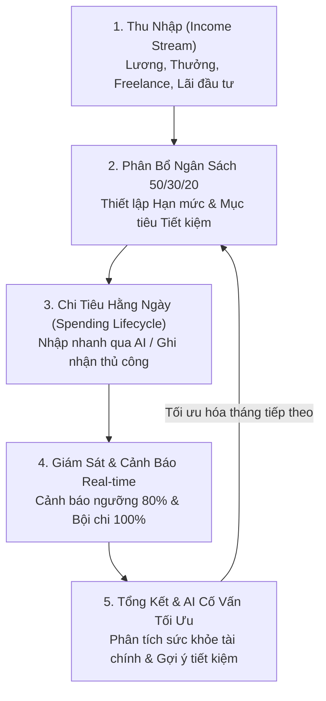

# 01. PHÂN TÍCH NGHIỆP VỤ & QUY TRÌNH QUẢN LÝ DÒNG TIỀN CÁ NHÂN

## 1. Bối Cảnh & Vấn Đề Thực Tiễn
Trong nền kinh tế hiện đại với sự bùng nổ của thanh toán không dùng tiền mặt (QR Code, thẻ tín dụng, ví điện tử MoMo/ZaloPay, chuyển khoản ngân hàng), việc kiểm soát dòng tiền cá nhân trở nên phức tạp hơn bao giờ hết:
- **Phân mảnh tài khoản**: Tiền nằm rải rác ở nhiều ngân hàng, ví điện tử, tiền mặt, khiến người dùng khó có cái nhìn toàn cảnh về tổng tài sản thực tế.
- **Chi tiêu không cảm xúc (Invisible Spending)**: Thanh toán chạm và quét mã làm giảm cảm giác mất tiền, dẫn đến các khoản chi lắt nhắt ("cà phê 40k", "trà sữa 55k", "đặt đồ ăn online") tích tụ thành số tiền khổng lồ vào cuối tháng.
- **Rào cản ghi chép thủ công**: Ghi sổ tay hoặc excel đòi hỏi nhiều thao tác, dễ quên, dẫn đến việc bỏ dở chỉ sau vài ngày.
- **Thiếu cảnh báo & Cố vấn thông minh**: Người dùng chỉ nhận ra mình "cháy túi" khi tài khoản hết tiền, không có cơ chế cảnh báo sớm khi chạm 80% hạn mức hoặc tư vấn cách phân bổ tối ưu.

**FinTrack AI** ra đời nhằm tự động hóa quy trình quản lý tài chính cá nhân với sự trợ giúp của Trí tuệ nhân tạo (Generative AI & Smart NLP), biến việc quản lý chi tiêu trở nên đơn giản, nhanh chóng và có tính định hướng dài hạn.

---

## 2. Quy Trình Quản Lý Dòng Tiền Cá Nhân Chuẩn (Cash Flow Lifecycle)

Quy trình quản lý tài chính cá nhân trong hệ thống FinTrack AI được chuẩn hóa theo vòng tròn 5 bước khép kín:

### Chi tiết các bước nghiệp vụ:
1. **Giai đoạn 1: Tiếp nhận Thu nhập (Income Allocation)**
   - Khi có dòng tiền vào (Lương, Thưởng, Bán hàng), hệ thống ghi nhận vào Ví chỉ định và cập nhật tức thì Tổng tài sản ròng.
2. **Giai đoạn 2: Lập Ngân sách & Mục tiêu Tiết kiệm (Budgeting & Saving Target)**
   - Người dùng thiết lập hạn mức chi tiêu cho từng danh mục trong tháng.
   - Trích lập tự động một phần vào Mục tiêu tiết kiệm (Quỹ khẩn cấp, Mua sắm lớn).
3. **Giai đoạn 3: Thực thi Chi tiêu (Transaction Execution)**
   - Người dùng nhập giao dịch bằng ngôn ngữ tự nhiên (Ví dụ: *"Ăn trưa 45k bằng MoMo"*).
   - AI tự động bóc tách và ghi nhận vào đúng ví và danh mục. Số dư ví tự động giảm tương ứng.
4. **Giai đoạn 4: Kiểm soát Hạn mức Thời gian Thực (Real-time Budget Monitoring)**
   - Mỗi khi có khoản chi mới, hệ thống tự động tính lũy kế chi tiêu của danh mục so với hạn mức đặt ra.
   - Khi đạt **80%**: Hệ thống chuyển màu cảnh báo vàng cam (Warning).
   - Khi đạt **>= 100%**: Hệ thống chuyển màu đỏ và phát cảnh báo bội chi (Overspend Alert).
5. **Giai đoạn 5: Đánh giá & Cố vấn Tài chính AI (AI Health Audit & Feedback)**
   - Cuối tháng (hoặc theo nhu cầu), AI quét toàn bộ dữ liệu, phân tích cơ cấu 50/30/20, phát hiện chi tiêu bất thường và đưa ra 2-3 lời khuyên hành động thực tế.

---

## 3. Phân Loại Danh Mục Thu - Chi Chuẩn (50/30/20 Framework)

Hệ thống FinTrack AI áp dụng quy tắc phân bổ tài chính quốc tế **50/30/20** của Elizabeth Warren kết hợp đặc thù sinh hoạt tại Việt Nam:

### 3.1. Nhóm 1: Nhu Cầu Thiết Yếu (Needs - Mục tiêu <= 50% Thu nhập)
Các khoản chi bắt buộc để duy trì cuộc sống và công việc:
| Mã Danh Mục | Tên Danh Mục | Biểu Tượng | Màu Sắc | Mô Tả & Ví Dụ |
|---|---|---|---|---|
| `FOOD_DINING` | Ăn uống & Thực phẩm | 🍲 `utensils` | `#EF4444` | Đi chợ, siêu thị, ăn sáng, cơm trưa văn phòng |
| `HOUSING` | Nhà ở & Tiền thuê | 🏠 `home` | `#F97316` | Tiền thuê trọ, tiền trả góp chung cư, phí quản lý |
| `UTILITIES` | Hóa đơn & Tiện ích | 💡 `bolt` | `#EAB308` | Tiền điện, nước, internet, rác, nạp tiền điện thoại |
| `TRANSPORTATION` | Đi lại & Xăng xe | 🛵 `car` | `#3B82F6` | Đổ xăng, gửi xe, bảo dưỡng xe, Grab/Be, vé xe buýt |
| `HEALTHCARE` | Y tế & Sức khỏe | 💊 `heart-pulse` | `#EC4899` | Thuốc men, khám bệnh, bảo hiểm y tế, nha khoa |
| `EDUCATION` | Giáo dục & Phát triển | 📚 `book` | `#8B5CF6` | Học phí, mua sách chuyên ngành, khóa học kỹ năng |

### 3.2. Nhóm 2: Mong Muốn & Phong Cách Sống (Wants - Mục tiêu <= 30% Thu nhập)
Các khoản chi nâng cao chất lượng cuộc sống, có thể cắt giảm khi cần thắt chặt:
| Mã Danh Mục | Tên Danh Mục | Biểu Tượng | Màu Sắc | Mô Tả & Ví Dụ |
|---|---|---|---|---|
| `SHOPPING` | Mua sắm cá nhân | 🛍 `bag` | `#06B6D4` | Quần áo, giày dép, mỹ phẩm, đồ công nghệ |
| `ENTERTAINMENT` | Giải trí & Thư giãn | 🎬 `film` | `#14B8A6` | Xem phim rạp, Netflix, Spotify, game, du lịch |
| `CAFE_MEETING` | Cà phê & Gặp gỡ | ☕ `coffee` | `#A855F7` | Gặp bạn bè cuối tuần, cà phê làm việc |
| `BEAUTY_SPA` | Làm đẹp & Chăm sóc | ✂ `scissors` | `#F43F5E` | Cắt tóc, spa, skincare |
| `GIFTS_DONATIONS` | Quà tặng & Hiếu hỷ | 🎁 `gift` | `#6366F1` | Tiền mừng cưới, sinh nhật, biếu bố mẹ |

### 3.3. Nhóm 3: Tiết Kiệm & Đầu Tư (Savings & Debt - Mục tiêu >= 20% Thu nhập)
Dành cho sự an toàn tài chính tương lai và tự do tài chính:
| Mã Danh Mục | Tên Danh Mục | Biểu Tượng | Màu Sắc | Mô Tả & Ví Dụ |
|---|---|---|---|---|
| `EMERGENCY_FUND` | Quỹ khẩn cấp | 🛡 `shield` | `#10B981` | Dự phòng 3-6 tháng sinh hoạt phí khi biến cố |
| `INVESTMENT` | Đầu tư sinh lời | 📈 `trending-up` | `#059669` | Chứng khoán, vàng, chứng chỉ quỹ, bất động sản |
| `SAVINGS_GOAL` | Tích lũy mục tiêu | 🎯 `bullseye` | `#047857` | Tiết kiệm mua xe, mua nhà, kết hôn |
| `DEBT_REDUCTION` | Trả nợ gốc | 💳 `credit-card` | `#64748B` | Trả nợ vay sinh viên, trả dư nợ tín dụng |

### 3.4. Nhóm Thu Nhập (Income Sources)
| Mã Danh Mục | Tên Danh Mục | Biểu Tượng | Màu Sắc | Mô Tả & Ví Dụ |
|---|---|---|---|---|
| `SALARY` | Lương chính thức | 💵 `wallet` | `#10B981` | Lương chuyển khoản hàng tháng từ công ty |
| `BONUS` | Thưởng & Hoa hồng | 🏆 `award` | `#3B82F6` | Thưởng KPI, thưởng lễ tết, hoa hồng doanh số |
| `FREELANCE` | Thu nhập phụ & Nghề tay trái | 💻 `laptop` | `#8B5CF6` | Dự án ngoài, viết lách, kinh doanh online |
| `INVESTMENT_RETURN` | Lãi suất & Cổ tức | 📊 `line-chart` | `#06B6D4` | Lãi tiền gửi tiết kiệm, cổ tức cổ phiếu |
| `OTHER_INCOME` | Thu nhập khác | ➕ `plus-circle` | `#6B7280` | Được tặng, hoàn tiền mua sắm, thanh lý đồ cũ |
