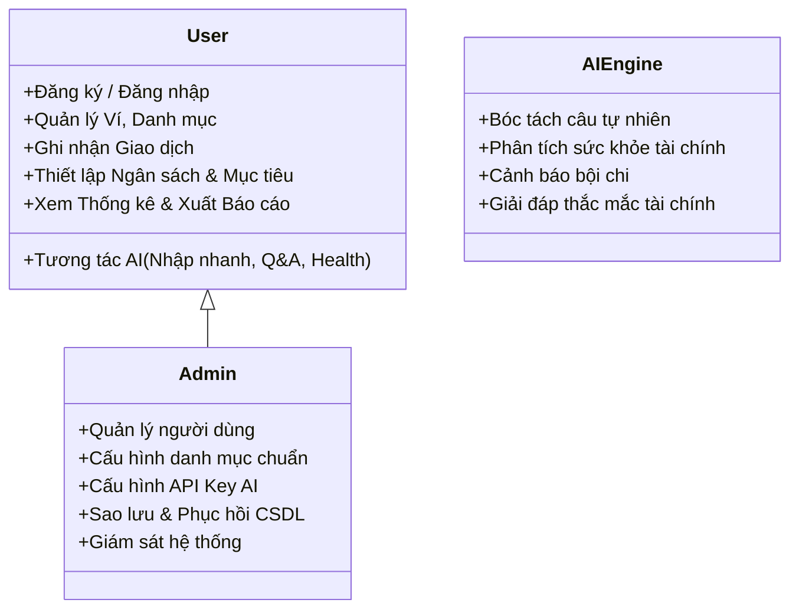
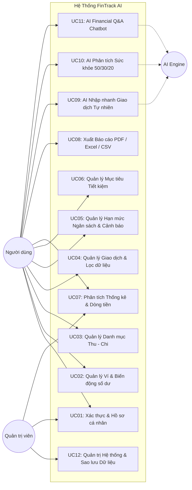

# 02. ĐẶC TẢ YÊU CẦU HỆ THỐNG (SYSTEM REQUIREMENTS SPECIFICATION)

## 1. Xác Định Các Tác Nhân (Actors) & Phân Quyền (RBAC)

Hệ thống **FinTrack AI** bao gồm 3 tác nhân chính:

---

## 2. Sơ Đồ Use Case Tổng Quan (Use Case Diagram)

---

## 3. Phân Rã & Đặc Tả Chi Tiết Use Case Nghiệp Vụ

### UC01: Xác thực & Quản lý Tài khoản (Authentication & Profile)
- **Actor**: User, Admin.
- **Đầu vào (Input)**: Email, mật khẩu, họ tên, đơn vị tiền tệ (VND/USD), avatar.
- **Xử lý (Process)**:
  - Kiểm tra định dạng email và độ mạnh mật khẩu (tối thiểu 6 ký tự).
  - Băm mật khẩu bằng thuật toán Bcrypt an toàn.
  - Sinh mã JSON Web Token (JWT) có thời hạn sử dụng.
  - Khởi tạo danh mục và ví mẫu mặc định cho người dùng mới.
- **Đầu ra (Output)**: Token xác thực Bearer, thông tin phiên làm việc, giao diện Dashboard.

### UC02: Quản lý Ví & Tài khoản Thanh toán (Wallet Management)
- **Actor**: User.
- **Đầu vào (Input)**: Tên ví, loại ví (`CASH`, `BANK`, `EWALLET`, `SAVINGS`), số dư ban đầu, icon, màu sắc thẻ.
- **Xử lý (Process)**:
  - Tạo/sửa/xóa ví. Kiểm tra ràng buộc không được xóa ví nếu đã phát sinh giao dịch (hoặc cảnh báo).
  - Nghiệp vụ chuyển tiền nội bộ giữa 2 ví (Transfer): Tự động trừ số dư ví nguồn, cộng số dư ví đích và tạo 1 cặp giao dịch transfer ghi vết.
- **Đầu ra (Output)**: Danh sách thẻ ví hiển thị số dư trực quan, biến động tổng tài sản ròng.

### UC03: Quản lý Danh mục Thu - Chi (Category Management)
- **Actor**: User, Admin.
- **Đầu vào (Input)**: Tên danh mục, loại (`INCOME` / `EXPENSE`), nhóm phân bổ (`NEEDS` / `WANTS` / `SAVINGS`), icon, mã màu hex.
- **Xử lý (Process)**:
  - Thêm danh mục tùy chỉnh hoặc kế thừa 18+ danh mục chuẩn của hệ thống.
  - Phân loại trực tiếp vào nhóm 50/30/20 phục vụ phân tích tự động.
- **Đầu ra (Output)**: Cây danh mục phân theo nhóm rõ ràng, bảng màu trực quan.

### UC04: Quản lý Giao dịch Thu - Chi (Transaction Lifecycle)
- **Actor**: User.
- **Đầu vào (Input)**: Loại giao dịch (`INCOME`, `EXPENSE`, `TRANSFER`), số tiền, ngày giờ, danh mục, ví thanh toán, ghi chú, hóa đơn đính kèm (ảnh/pdf).
- **Xử lý (Process)**:
  - Tạo giao dịch mới -> Kiểm tra tính hợp lệ số tiền (> 0).
  - Cập nhật số dư ví tương ứng ngay lập tức trong Database Transaction.
  - Kiểm tra xem giao dịch chi tiêu có chạm hoặc vượt hạn mức ngân sách của danh mục đó không -> gắn cờ thông báo.
  - Bộ lọc đa tiêu chí: Lọc theo khoảng ngày (From-To), lọc danh mục, lọc ví, khoảng tiền (Min-Max), tìm kiếm từ khóa ghi chú.
- **Đầu ra (Output)**: Bảng lịch sử giao dịch phân trang, số dư ví cập nhật, thông báo cảnh báo ngân sách (nếu có).

### UC05: Quản lý Hạn mức Ngân sách & Cảnh Báo (Budget & Threshold Alert)
- **Actor**: User.
- **Đầu vào (Input)**: Danh mục, số tiền hạn mức, kỳ hạn (Tháng / Tuần), tháng áp dụng (YYYY-MM).
- **Xử lý (Process)**:
  - Hệ thống tự động tính lũy kế chi tiêu thực tế của danh mục trong kỳ:
    $$\text{Tỷ lệ chi tiêu (\%)} = \frac{\text{Tổng chi thực tế}}{\text{Hạn mức đặt ra}} \times 100\%$$
  - Ngưỡng **< 80%**: Trạng thái Xanh (An toàn).
  - Ngưỡng **80% - 99%**: Trạng thái Vàng cam (Cảnh báo: Đã dùng {{%}} ngân sách).
  - Ngưỡng **>= 100%**: Trạng thái Đỏ (Bội chi: Đã vượt {} ngân sách).
- **Đầu ra (Output)**: Thanh tiến độ trực quan trên Dashboard và thông báo badge cảnh báo.

### UC06: Quản lý Mục tiêu Tiết kiệm (Saving Goals)
- **Actor**: User.
- **Đầu vào (Input)**: Tên mục tiêu (ví dụ: *Mua xe máy mới*, *Quỹ khẩn cấp*), số tiền cần đạt, ngày đến hạn, ghi chú.
- **Xử lý (Process)**:
  - Tính % tiến độ hoàn thành.
  - Chức năng "Nạp tiền vào mục tiêu": Người dùng chọn ví nguồn và số tiền nạp -> Hệ thống trừ tiền ví nguồn, cộng tiền vào mục tiêu tiết kiệm.
  - Khi đạt 100%: Kích hoạt huy hiệu chúc mừng (Confetti effect).
- **Đầu ra (Output)**: Thẻ mục tiêu với vòng tròn tiến độ và số ngày còn lại.

### UC07: Phân tích Thống kê & Dòng tiền (Financial Analytics)
- **Actor**: User.
- **Đầu vào (Input)**: Kỳ báo cáo (Tháng này, Tháng trước, Quý này, Năm nay).
- **Xử lý (Process)**:
  - Tổng hợp Thu nhập, Chi tiêu, Dòng tiền ròng (Net Flow = Thu - Chi).
  - Biểu đồ tròn (Donut Chart) cơ cấu chi tiêu theo từng danh mục.
  - Biểu đồ cột/đường (Bar/Line Chart) xu hướng 6 tháng liên tiếp.
  - Đánh giá cơ cấu chi tiêu thực tế so với tiêu chuẩn **50/30/20**.
- **Đầu ra (Output)**: Bộ KPI cards, biểu đồ tương tác Chart.js.

### UC08: Xuất Báo cáo Tài chính (Export Reports)
- **Actor**: User.
- **Đầu vào (Input)**: Tùy chọn định dạng: Excel (`.xlsx`), CSV (`.csv`), hoặc PDF (`.pdf`), khoảng thời gian lọc.
- **Xử lý (Process)**:
  - Format số liệu, tính tổng theo từng nhóm, kẻ bảng, định dạng font chữ tiếng Việt Unicode.
  - Xuất file tải về trực tiếp từ browser.
- **Đầu ra (Output)**: File báo cáo tài chính chuyên nghiệp.

### UC09: AI Tự Động Phân Loại & Bóc Tách Giao Dịch (Natural Language Parser)
- **Actor**: User, AIEngine.
- **Đầu vào (Input)**: Câu nói tiếng Việt tự nhiên (VD: *"Ăn bún chả 50k ví Tiền mặt"*).
- **Xử lý (Process)**:
  - Làm sạch câu nhập, chuẩn hóa từ viết tắt (k, tr, củ, lít).
  - Gọi Prompt Template `transaction_parser.prompt.md` qua Gemini/OpenAI API hoặc Rule-based NLP fallback nội bộ.
  - Bóc tách `type`, `amount`, `category`, `wallet`, `date`, `note`.
- **Đầu ra (Output)**: Form xác nhận nhanh giao dịch điền sẵn thông tin để người dùng duyệt trong 1 click.

### UC10: AI Phân Tích Sức Khỏe Tài Chính & Gợi Ý Tiết Kiệm (Financial Health Advisor)
- **Actor**: User, AIEngine.
- **Đầu vào (Input)**: Dữ liệu thu chi tổng hợp tháng, bảng hạn mức, tỷ lệ 50/30/20 đã được ẩn danh PII.
- **Xử lý (Process)**:
  - AI phân tích thói quen chi tiêu, đối chiếu chuẩn 50/30/20, phát hiện điểm bất hợp lý hoặc nguy cơ vượt hạn mức.
  - Đưa ra điểm Sức khỏe Tài chính (0-100) và 3 hành động cụ thể để tiết kiệm.
- **Đầu ra (Output)**: Báo cáo nhận xét Markdown có icon và số liệu trực quan.

### UC11: AI Cố Vấn & Hỏi Đáp Tài Chính (Financial Q&A Chatbot)
- **Actor**: User, AIEngine.
- **Đầu vào (Input)**: Câu hỏi bất kỳ của người dùng (VD: *"Tháng này tôi đã chi bao nhiêu tiền cho ăn ngoài?", "Làm sao để tiết kiệm 20 triệu?"*).
- **Xử lý (Process)**:
  - Khởi tạo ngữ cảnh tài chính của người dùng (Tổng thu, tổng chi các nhóm, giao dịch gần nhất).
  - AI suy luận và trích xuất câu trả lời chính xác, ngắn gọn, dễ hiểu.
- **Đầu ra (Output)**: Câu trả lời Markdown mượt mà trong giao diện Chat Assistant.

---

## 4. Yêu Cầu Phi Chức Năng (Non-Functional Requirements)

1. **Hiệu năng (Performance)**:
   - Thời gian phản hồi API CRUD < 100ms.
   - Thời gian phân tích câu bóc tách AI < 1.5s (hoặc < 200ms với NLP Rule Engine).
2. **Bảo mật & Quyền riêng tư (Security & Privacy)**:
   - Mật khẩu mã hóa 1 chiều bằng Bcrypt.
   - Xác thực API qua JWT Bearer Token theo chuẩn OAuth2.
   - Bảo mật PII: Không gửi số tài khoản ngân hàng thực, email hoặc mật khẩu vào LLM context.
3. **Tính sẵn sàng & Khả năng chịu lỗi (Reliability & Fallback)**:
   - Cơ chế Dual-Engine AI: Khi không có kết nối internet hoặc API Key hết hạn, hệ thống tự động fallback về Smart Rule Engine, đảm bảo 100% tính năng ứng dụng hoạt động bình thường.
4. **Trải nghiệm người dùng (Usability & Responsiveness)**:
   - Giao diện tương thích hoàn hảo trên Desktop, Tablet và Mobile.
   - Thiết kế chuẩn Fintech hiện đại (Dark/Light mode accents, Micro-interactions).
