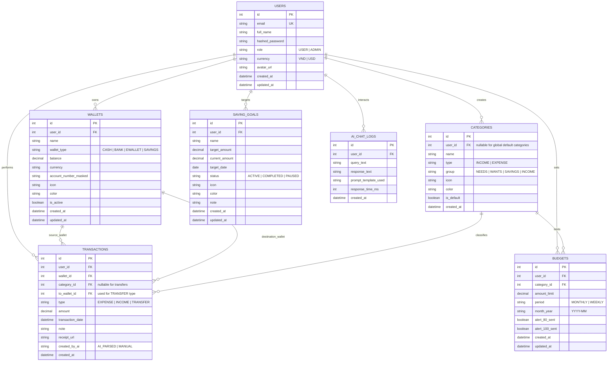

# 03. THIẾT KẾ CƠ SỞ DỮ LIỆU & ERD (DATABASE DESIGN SPECIFICATION)

## 1. Sơ Đồ Thực Thể Quan Hệ (Entity Relationship Diagram - ERD)

---

## 2. Từ Điển Dữ Liệu Chi Tiết (Data Dictionary)

### 2.1. Bảng `users` (Thông tin tài khoản & Người dùng)
| Tên Cột | Kiểu Dữ Liệu | Ràng Buộc | Mô Tả |
|---|---|---|---|
| `id` | `INTEGER` | `PRIMARY KEY AUTOINCREMENT` | Khóa chính |
| `email` | `VARCHAR(255)` | `UNIQUE, NOT NULL` | Email đăng nhập |
| `full_name` | `VARCHAR(150)` | `NOT NULL` | Họ tên hiển thị của người dùng |
| `hashed_password` | `VARCHAR(255)` | `NOT NULL` | Mật khẩu đã băm (Bcrypt) |
| `role` | `VARCHAR(20)` | `DEFAULT 'USER'` | Vai trò: `USER` hoặc `ADMIN` |
| `currency` | `VARCHAR(10)` | `DEFAULT 'VND'` | Đơn vị tiền tệ hiển thị |
| `avatar_url` | `VARCHAR(255)` | `NULLABLE` | Đường dẫn ảnh đại diện |
| `created_at` | `DATETIME` | `DEFAULT CURRENT_TIMESTAMP` | Thời gian tạo tài khoản |
| `updated_at` | `DATETIME` | `DEFAULT CURRENT_TIMESTAMP` | Thời gian cập nhật gần nhất |

### 2.2. Bảng `wallets` (Tài khoản / Ví thanh toán)
| Tên Cột | Kiểu Dữ Liệu | Ràng Buộc | Mô Tả |
|---|---|---|---|
| `id` | `INTEGER` | `PRIMARY KEY AUTOINCREMENT` | Khóa chính |
| `user_id` | `INTEGER` | `FOREIGN KEY (users.id) ON DELETE CASCADE` | Chủ sở hữu ví |
| `name` | `VARCHAR(100)` | `NOT NULL` | Tên ví (VD: *Techcombank*, *MoMo*, *Tiền mặt*) |
| `wallet_type` | `VARCHAR(20)` | `NOT NULL` | `CASH`, `BANK`, `EWALLET`, `SAVINGS` |
| `balance` | `DECIMAL(15,2)`| `DEFAULT 0` | Số dư hiện tại |
| `currency` | `VARCHAR(10)` | `DEFAULT 'VND'` | Loại tiền tệ của ví |
| `account_number_masked` | `VARCHAR(50)` | `NULLABLE` | Số tài khoản ẩn danh (VD: `****8888`) |
| `icon` | `VARCHAR(50)` | `DEFAULT 'wallet'` | Biểu tượng icon FontAwesome |
| `color` | `VARCHAR(30)` | `DEFAULT '#3B82F6'` | Mã màu hiển thị trên thẻ |
| `is_active` | `BOOLEAN` | `DEFAULT TRUE` | Trạng thái hoạt động |

### 2.3. Bảng `categories` (Danh mục Thu & Chi)
| Tên Cột | Kiểu Dữ Liệu | Ràng Buộc | Mô Tả |
|---|---|---|---|
| `id` | `INTEGER` | `PRIMARY KEY AUTOINCREMENT` | Khóa chính |
| `user_id` | `INTEGER` | `FOREIGN KEY (users.id) ON DELETE CASCADE, NULLABLE` | Người tạo (NULL = Danh mục hệ thống) |
| `name` | `VARCHAR(100)` | `NOT NULL` | Tên danh mục (VD: *Ăn uống*, *Lương*) |
| `type` | `VARCHAR(20)` | `NOT NULL` | `EXPENSE` (Chi tiêu) hoặc `INCOME` (Thu nhập) |
| `group` | `VARCHAR(30)` | `NOT NULL` | Nhóm 50/30/20: `NEEDS`, `WANTS`, `SAVINGS`, `INCOME` |
| `icon` | `VARCHAR(50)` | `DEFAULT 'tag'` | Biểu tượng icon |
| `color` | `VARCHAR(30)` | `DEFAULT '#10B981'` | Màu đại diện |
| `is_default` | `BOOLEAN` | `DEFAULT FALSE` | Cờ danh mục hệ thống mặc định |

### 2.4. Bảng `transactions` (Giao dịch Thu - Chi - Chuyển khoản)
| Tên Cột | Kiểu Dữ Liệu | Ràng Buộc | Mô Tả |
|---|---|---|---|
| `id` | `INTEGER` | `PRIMARY KEY AUTOINCREMENT` | Khóa chính |
| `user_id` | `INTEGER` | `FOREIGN KEY (users.id) ON DELETE CASCADE` | Người thực hiện giao dịch |
| `wallet_id` | `INTEGER` | `FOREIGN KEY (wallets.id) ON DELETE RESTRICT` | Ví thanh toán / Ví nguồn |
| `category_id` | `INTEGER` | `FOREIGN KEY (categories.id) ON DELETE RESTRICT, NULLABLE` | Danh mục (NULL nếu là chuyển tiền) |
| `to_wallet_id` | `INTEGER`| `FOREIGN KEY (wallets.id) ON DELETE RESTRICT, NULLABLE` | Ví đích (chỉ dùng cho `TRANSFER`) |
| `type` | `VARCHAR(20)` | `NOT NULL` | `EXPENSE`, `INCOME`, `TRANSFER` |
| `amount` | `DECIMAL(15,2)`| `NOT NULL, CHECK (amount > 0)` | Số tiền giao dịch |
| `transaction_date` | `DATETIME` | `NOT NULL` | Ngày giờ phát sinh giao dịch |
| `note` | `TEXT` | `NULLABLE` | Ghi chú / Diễn giải giao dịch |
| `receipt_url` | `VARCHAR(255)` | `NULLABLE` | Đường dẫn ảnh hóa đơn đính kèm |
| `created_by_ai` | `VARCHAR(20)` | `DEFAULT 'MANUAL'` | Nguồn gốc tạo: `AI_PARSED` hoặc `MANUAL` |
| `created_at` | `DATETIME` | `DEFAULT CURRENT_TIMESTAMP` | Thời điểm tạo bản ghi |

### 2.5. Bảng `budgets` (Hạn mức Ngân sách)
| Tên Cột | Kiểu Dữ Liệu | Ràng Buộc | Mô Tả |
|---|---|---|---|
| `id` | `INTEGER` | `PRIMARY KEY AUTOINCREMENT` | Khóa chính |
| `user_id` | `INTEGER` | `FOREIGN KEY (users.id) ON DELETE CASCADE` | Người sở hữu ngân sách |
| `category_id` | `INTEGER` | `FOREIGN KEY (categories.id) ON DELETE CASCADE` | Danh mục áp dụng hạn mức |
| `amount_limit` | `DECIMAL(15,2)`| `NOT NULL, CHECK (amount_limit > 0)` | Hạn mức chi tiêu tối đa |
| `period` | `VARCHAR(20)` | `DEFAULT 'MONTHLY'` | Kỳ hạn: `MONTHLY`, `WEEKLY` |
| `month_year` | `VARCHAR(7)` | `NOT NULL` | Tháng áp dụng (định dạng `YYYY-MM`) |
| `alert_80_sent` | `BOOLEAN` | `DEFAULT FALSE` | Cờ đã cảnh báo ngưỡng 80% |
| `alert_100_sent` | `BOOLEAN` | `DEFAULT FALSE` | Cờ đã cảnh báo ngưỡng 100% |

### 2.6. Bảng `saving_goals` (Mục tiêu Tiết kiệm)
| Tên Cột | Kiểu Dữ Liệu | Ràng Buộc | Mô Tả |
|---|---|---|---|
| `id` | `INTEGER` | `PRIMARY KEY AUTOINCREMENT` | Khóa chính |
| `user_id` | `INTEGER` | `FOREIGN KEY (users.id) ON DELETE CASCADE` | Người sở hữu mục tiêu |
| `name` | `VARCHAR(150)` | `NOT NULL` | Tên mục tiêu (VD: *Mua iPhone 16*, *Học Thạc Sĩ*) |
| `target_amount` | `DECIMAL(15,2)`| `NOT NULL` | Số tiền mục tiêu cần đạt |
| `current_amount`| `DECIMAL(15,2)`| `DEFAULT 0` | Số tiền hiện đã tích lũy được |
| `target_date` | `DATE` | `NULLABLE` | Hạn định hoàn thành |
| `status` | `VARCHAR(20)` | `DEFAULT 'ACTIVE'` | `ACTIVE`, `COMPLETED`, `PAUSED` |
| `icon` | `VARCHAR(50)` | `DEFAULT 'bullseye'` | Biểu tượng |
| `color` | `VARCHAR(30)` | `DEFAULT '#10B981'` | Màu đại diện |
| `note` | `TEXT` | `NULLABLE` | Ghi chú thêm |

---

## 3. Chỉ Mục (Indexes) Tối Ưu Hóa Truy Vấn

Để đảm bảo hiệu năng truy vấn nhanh chóng (<50ms) ngay cả khi có hàng triệu bản ghi giao dịch:
1. `idx_transactions_user_date`: `(user_id, transaction_date DESC)` -> Tối ưu hiển thị lịch sử và lọc ngày.
2. `idx_transactions_user_cat`: `(user_id, category_id, transaction_date)` -> Tối ưu tính toán tổng chi theo danh mục & ngân sách.
3. `idx_budgets_user_month`: `(user_id, month_year, category_id)` -> Tối ưu truy vấn bảng hạn mức ngân sách tháng.
4. `idx_wallets_user`: `(user_id, is_active)` -> Tối ưu tải danh sách ví của người dùng.

---

## 4. Chiến Lược Sao Lưu & Phục Hồi Dữ Liệu (Backup & Restore)

1. **Sao lưu trực tuyến (JSON / SQLite Dump)**:
   - Endpoint `/api/v1/backup/export`: Xuất toàn bộ dữ liệu người dùng (Ví, Danh mục, Giao dịch, Ngân sách, Mục tiêu) dưới định dạng tệp JSON có mã hóa kiểm tra checksum.
2. **Khôi phục (Restore)**:
   - Endpoint `/api/v1/backup/import`: Đọc file JSON đã sao lưu, kiểm tra tính toàn vẹn và nạp lại vào CSDL an toàn.
