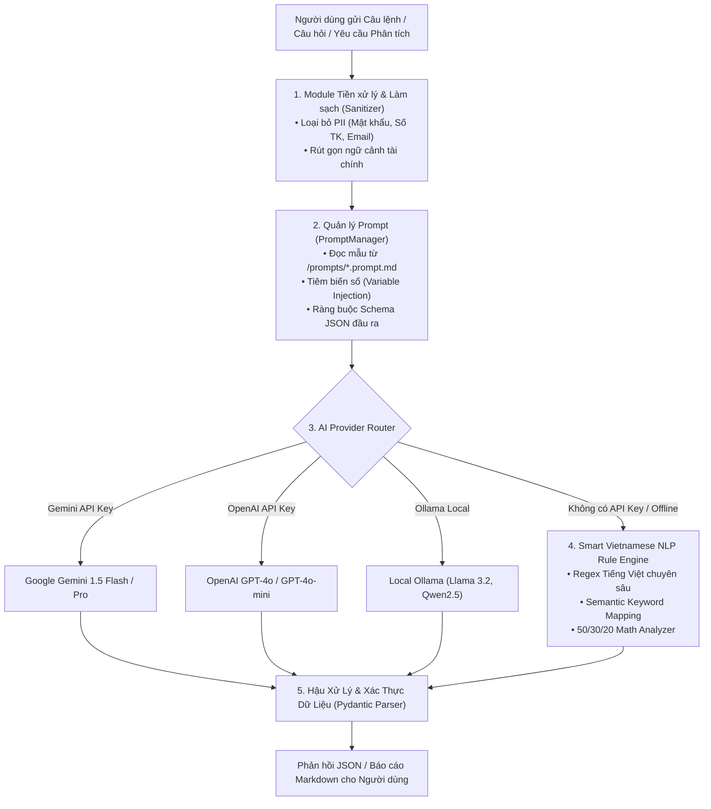

# 05. KIẾN TRÚC AI & HỆ THỐNG PROMPT TEMPLATES (AI ARCHITECTURE SPECIFICATION)

## 1. Kiến Trúc Tích Hợp AI Tổng Thể (Multi-Provider AI Engine)

Hệ thống **FinTrack AI** được thiết kế theo mô hình **Provider Agnostic & Offline-First**:

---

## 2. Tiêu Chuẩn Bảo Vệ Dữ Liệu Riêng Tư (Privacy by Design)

Để đảm bảo tính tuân thủ và quyền riêng tư tài chính của người dùng theo quy định bảo mật:
1. **Không bao giờ gửi số tài khoản thật**: Số tài khoản ngân hàng được hàm `anonymize_financial_context` tự động che `****1234` hoặc lược bỏ.
2. **Không gửi danh tính thực nhạy cảm**: Không gửi CCCD, Số điện thoại cá nhân, Địa chỉ nhà vào prompt context.
3. **Mã hóa truyền tải**: Mọi kết nối API gọi đến Gemini/OpenAI đều qua HTTPS TLS 1.3.
4. **Local Fallback**: Người dùng có thể hoàn toàn không cần nhập API Key mà hệ thống vẫn chạy trơn tru với Smart Fallback Engine.

---

## 3. Bộ Quy Tắc Phân Tích NLP Tiếng Việt (Smart Fallback Engine)

Bộ phân tích nội bộ nhận diện các mẫu câu tiếng Việt phong phú:
- **Đơn vị tiền tệ**: `k`, `nghìn`, `k vnđ`, `tr`, `triệu`, `củ`, `lít`, `lốp`, `chai`.
- **Nhận diện loại giao dịch**:
  - Thu: `lương`, `thưởng`, `nhận`, `thu`, `bán`, `được cho`, `cộng tiền`.
  - Chi: `ăn`, `uống`, `mua`, `trả`, `đóng`, `đổ xăng`, `chi`, `trừ tiền`, `hóa đơn`.
  - Chuyển: `chuyển sang`, `nạp vào`, `rút từ`, `chuyển khoản`.
- **Ánh xạ danh mục tự động**:
  - Ăn uống: `phở`, `bún`, `cơm`, `trà sữa`, `cà phê`, `nhậu`, `siêu thị`, `chợ`.
  - Đi lại: `xăng`, `grab`, `be`, `gửi xe`, `vé xe`, `bảo dưỡng`.
  - Nhà ở / Tiện ích: `tiền phòng`, `tiền nhà`, `điện`, `nước`, `internet`, `wifi`.
  - Sức khỏe: `thuốc`, `khám`, `gym`, `bệnh viện`, `bác sĩ`.
  - Mua sắm: `quần áo`, `shopee`, `lazada`, `giày`, `mỹ phẩm`.
