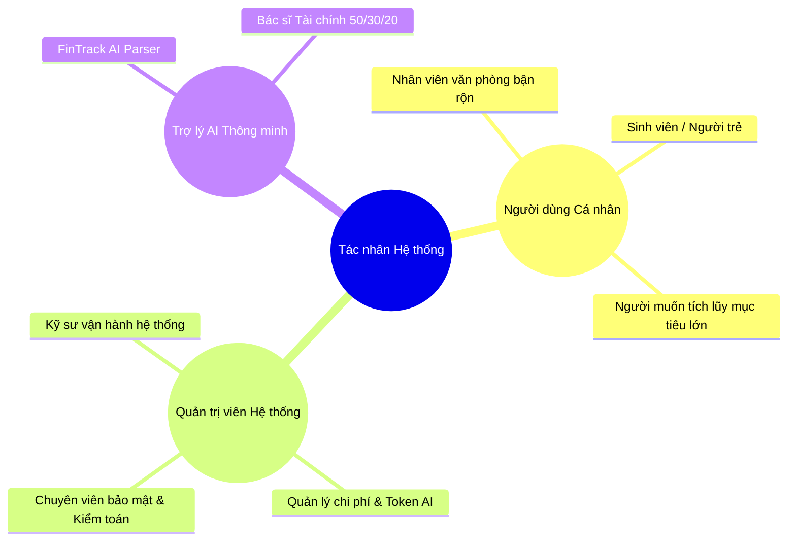

# BẢN ĐẶC TẢ USER STORY (AGILE USER STORY SPECIFICATION)
## FINTRACK AI - HỆ THỐNG QUẢN LÝ CHI TIÊU CÁ NHÂN TÍCH HỢP AI

> **Dự án**: FinTrack AI - Nền tảng Quản lý Tài chính Cá nhân Tích hợp AI  
> **Tài liệu tham chiếu gốc**: `nhom3.docx` (Báo cáo dự án Học phần Ứng dụng Trí tuệ Nhân tạo - Nhóm 03)  
> **Nhóm tác giả**: Đặng Quyết Thắng, Nguyễn Văn Tiến, Quách Minh Hiếu  
> **Giảng viên hướng dẫn**: ThS. Hà Thị Thanh (Khoa CNTT - ICTU, 2026)

---

## 1. Tổng quan Dự án & Mục tiêu Nghiệp vụ

### 1.1. Bối cảnh
Trong kỷ nguyên thanh toán không tiền mặt (thẻ tín dụng, mã QR, ví điện tử), người dùng dễ mất kiểm soát chi tiêu do thiếu thói quen ghi chép định kỳ, không nắm rõ cơ cấu dòng tiền và thiếu phương pháp phân bổ ngân sách khoa học (như quy tắc 50/30/20). **FinTrack AI** ra đời nhằm cung cấp nền tảng quản lý tài chính cá nhân thông minh, kết hợp giao diện Dark Cyber trực quan, tự động hóa bóc tách giao dịch qua mô hình ngôn ngữ lớn (Google Gemini 1.5 Pro), tư vấn tài chính 24/7 với cam kết bảo mật quyền riêng tư tuyệt đối (**Zero-PII Leakage**).

### 1.2. Mục tiêu Nghiệp vụ
1. **Kiểm soát & Tối ưu hóa dòng tiền**: Hỗ trợ quản lý đa ví, theo dõi thu chi chi tiết và cảnh báo tức thời khi chi tiêu tiệm cận trần ngân sách.
2. **Ứng dụng AI thông minh & Thực chất**: Bóc tách ngôn ngữ tự nhiên tiếng Việt tức thì và trợ lý ảo cố vấn tài chính 50/30/20.
3. **Bảo vệ Dữ liệu Định danh (Zero-PII)**: Khử định danh dữ liệu nhạy cảm trước khi gửi sang mô hình AI đám mây.
4. **Tạo động lực duy trì kỷ luật (Gamification)**: Hệ thống Level, XP, chuỗi ngày Streak và 24 Huy hiệu thành tích.
5. **Quản trị Toàn diện (Admin Workstation)**: Giám sát chỉ số toàn sàn, quản lý người dùng, tinh chỉnh System Prompt và kiểm soát chi phí Token.

---

## 2. Chân dung Người dùng (User Personas)



### Persona 1: Đặng Quyết Thắng (End User - Người dùng cá nhân)
- **Độ tuổi**: 24 tuổi - Kỹ sư phần mềm / Nhân viên văn phòng tại Thái Nguyên.
- **Mục tiêu**: Cần ghi chép nhanh các khoản chi nhỏ lẻ hàng ngày bằng câu nói tự nhiên, muốn phân bổ thu nhập 25.000.000 đ theo quy tắc 50/30/20 để tiết kiệm mua xe máy và đi du lịch.
- **Nỗi đau (Pain points)**: Lười nhập form thủ công nhiều trường, lo ngại phần mềm tài chính làm lộ số tài khoản ngân hàng và thông tin cá nhân.

### Persona 2: Admin Quản trị (System Administrator)
- **Mục tiêu**: Giám sát tình trạng vận hành của toàn bộ hệ thống, theo dõi lượng Token AI tiêu thụ của các gói Free/Pro/VIP, tinh chỉnh System Prompts cho AI Parser mà không cần deploy lại mã nguồn.
- **Nỗi đau**: E ngại người dùng spam API làm đội chi phí đám mây, cần truy vết nhanh các sự cố an ninh qua Audit Log thời gian thực.

---

## 3. Phân rã Danh mục Epic (Epic Breakdown)

| Mã Epic | Tên Epic Nghiệp Vụ | Mô tả Tóm tắt |
|---|---|---|
| **EPIC-01** | Xác thực & Quản lý Tài khoản (Auth & Identity) | Đăng ký, Đăng nhập thường/Demo, Đổi mật khẩu, Xuất backup dữ liệu |
| **EPIC-02** | Quản lý Đa Ví & Chuyển tiền (Wallets & Transfers) | Quản lý Tiền mặt, Ngân hàng, Ví điện tử; Chuyển tiền Double-Entry |
| **EPIC-03** | Danh mục Thu - Chi Chuẩn 50/30/20 (Categories) | Cây danh mục phân chia 3 nhóm tài chính chuẩn hóa |
| **EPIC-04** | Giao dịch & Bóc tách Tự nhiên AI (Transactions & AI) | Bút toán thu/chi, Bóc tách tiếng Việt qua Gemini, Lọc đa tiêu chí |
| **EPIC-05** | Hạn mức Ngân sách & Cảnh báo (Budgets & Alerts) | Hạn mức tháng, Thanh tiến độ & Cảnh báo 3 cấp (Xanh, Vàng, Đỏ) |
| **EPIC-06** | Mục tiêu Tiết kiệm & Tích lũy (Savings Goals) | Quỹ tiết kiệm, Nạp tiền trích từ ví, Đếm ngược ngày hoàn thành |
| **EPIC-07** | Báo cáo, Phân tích & Xuất dữ liệu (Analytics & Export) | Dashboard dòng tiền ròng 6 tháng, Biểu đồ Donut, Xuất Excel/PDF/CSV |
| **EPIC-08** | Bác sĩ Tài chính AI & Zero-PII (AI Advisor & Privacy) | Chatbot cố vấn 24/7, Chấm điểm Health Score, Lọc bỏ PII |
| **EPIC-09** | Gamification & Huy hiệu Thành tích (Gamification) | Hệ thống Level, Điểm XP, Chuỗi ngày Streak, 24 Huy hiệu 4 phân hạng |
| **EPIC-10** | Cyber Control Center - Quản trị Hệ thống (Admin) | Dashboard DAU/MAU, Quản lý User, Cấu hình System Prompt, Token Quota |

---

## 4. Đặc tả Chi tiết Các User Story (User Stories Specification)

---

### EPIC-01: Xác thực & Quản lý Tài khoản (Auth & Identity)

#### US-01: Đăng ký Tài khoản Mới & Khởi tạo Mặc định 50/30/20
- **Mã User Story**: `US-01`
- **Use Case liên kết**: `UC-USR-01` | **Test Case**: `TC-01`
- **Mức độ ưu tiên (MoSCoW)**: **Must Have** | **Story Points**: `3`
- **User Story Statement**:
  > **Là một** người dùng mới chưa có tài khoản trên FinTrack AI,  
  > **Tôi muốn** đăng ký tài khoản nhanh chóng bằng Email, Họ tên và Mật khẩu,  
  > **Để** bắt đầu thiết lập hệ thống tài chính cá nhân với bộ danh mục chuẩn 50/30/20 được khởi tạo tự động.
- **Điều kiện tiên quyết (Preconditions)**: Email đăng ký chưa tồn tại trong hệ thống.
- **Tiêu chí chấp nhận (Acceptance Criteria - Gherkin)**:
  ```gherkin
  Scenario: Đăng ký tài khoản thành công với bộ danh mục chuẩn
    Given Tôi đang ở modal "Đăng Ký Tài Khoản"
    When Tôi nhập Họ tên "Đặng Quyết Thắng", Email "user@fintrack.ai", Mật khẩu "User@123456"
    And Nhấn nút "Đăng Ký Tài Khoản"
    Then Hệ thống tạo mới User với mật khẩu được băm bằng Bcrypt
    And Tự động sao chép toàn bộ cây danh mục chuẩn 50/30/20 và tạo ví Tiền mặt/Ngân hàng mặc định
    And Trả về thông báo thành công và chuyển thẳng vào Dashboard
  ```
  ```gherkin
  Scenario: Đăng ký thất bại do Email trùng lặp hoặc Mật khẩu quá ngắn
    Given Tôi nhập Email đã tồn tại hoặc Mật khẩu dưới 6 ký tự
    When Nhấn nút "Đăng Ký Tài Khoản"
    Then Hệ thống báo lỗi "Email đã được sử dụng" hoặc "Mật khẩu tối thiểu 6 ký tự"
    And Không tạo bản ghi nào trong cơ sở dữ liệu
  ```

---

#### US-02: Đăng nhập Nhanh Chế độ Demo (Demo Quick Access)
- **Mã User Story**: `US-02`
- **Use Case liên kết**: `UC-USR-01` | **Test Case**: `TC-02`
- **Mức độ ưu tiên (MoSCoW)**: **Must Have** | **Story Points**: `1`
- **User Story Statement**:
  > **Là một** người dùng muốn trải nghiệm thử hoặc kiểm thử viên,  
  > **Tôi muốn** đăng nhập ngay lập tức bằng 1 chạm vào tài khoản mẫu "Demo User" hoặc "Demo Admin",  
  > **Để** khám phá đầy đủ dữ liệu thực tế mà không cần nhập thông tin tài khoản thủ công.
- **Tiêu chí chấp nhận (Acceptance Criteria)**:
  ```gherkin
  Scenario: Đăng nhập nhanh tài khoản Demo User
    Given Tôi đang ở màn hình đăng nhập
    When Tôi bấm vào nút "Demo User"
    Then Hệ thống cấp JWT Token của tài khoản mẫu Đặng Quyết Thắng
    And Giao diện tải đầy đủ số dư ví, danh mục 50/30/20 và lịch sử giao dịch mẫu
  ```

---

#### US-03: Cài đặt Hồ sơ, Đổi Mật khẩu & Xuất Bản Sao Lưu Dữ Liệu
- **Mã User Story**: `US-03`
- **Use Case liên kết**: `UC-USR-02` | **Test Case**: N/A
- **Mức độ ưu tiên (MoSCoW)**: **Should Have** | **Story Points**: `2`
- **User Story Statement**:
  > **Là một** người dùng đã đăng nhập,  
  > **Tôi muốn** chỉnh sửa họ tên, đơn vị tiền tệ (VND/USD), đổi mật khẩu và tải bản sao lưu dữ liệu cá nhân (JSON),  
  > **Để** bảo vệ tài khoản và chủ động lưu trữ dữ liệu tài chính của riêng mình.
- **Tiêu chí chấp nhận (Acceptance Criteria)**:
  ```gherkin
  Scenario: Đổi mật khẩu tài khoản thành công
    Given Tôi nhập Mật khẩu hiện tại đúng và Mật khẩu mới >= 6 ký tự
    When Bấm nút "Lưu Mật Khẩu"
    Then Mật khẩu mới được cập nhật vào CSDL và hệ thống ghi log bảo mật
  ```
  ```gherkin
  Scenario: Tải về bản sao lưu JSON
    Given Tôi bấm nút "Tải Bản Sao Lưu JSON"
    When Hệ thống hoàn tất trích xuất dữ liệu của riêng User hiện tại
    Then Trình duyệt tự động tải file `fintrack_backup_user_xxx.json` chứa ví, giao dịch, ngân sách
  ```

---

### EPIC-02: Quản lý Đa Ví & Chuyển Tiền (Wallets & Transfers)

#### US-04: Quản lý Danh sách Đa Ví & Che Số Tài Khoản Bảo Mật
- **Mã User Story**: `US-04`
- **Use Case liên kết**: `UC-USR-03` | **Test Case**: N/A
- **Mức độ ưu tiên (MoSCoW)**: **Must Have** | **Story Points**: `3`
- **User Story Statement**:
  > **Là một** người dùng có nhiều phương thức thanh toán,  
  > **Tôi muốn** tạo và quản lý nhiều ví (Tiền mặt, Ngân hàng Techcombank/Vietcombank, Ví MoMo/ZaloPay, Sổ tiết kiệm),  
  > **Để** kiểm soát dòng tiền chính xác trên từng kênh và bảo vệ số tài khoản ngân hàng bằng cơ chế che số (`**** 8888`).
- **Tiêu chí chấp nhận (Acceptance Criteria)**:
  ```gherkin
  Scenario: Thêm ví thanh toán mới thành công
    Given Tôi mở modal "Thêm Ví Mới"
    When Tôi nhập Tên ví "MoMo", Loại "E-Wallet", Số dư ban đầu "1.500.000 đ", Màu sắc "#A50064"
    And Bấm "Lưu Ví Mới"
    Then Ví mới hiển thị trên Dashboard và Tổng tài sản ròng tăng 1.500.000 đ
  ```

---

#### US-05: Chuyển Tiền Nội Bộ Giữa Các Ví (Atomic Wallet Transfer)
- **Mã User Story**: `US-05`
- **Use Case liên kết**: `UC-USR-03` | **Test Case**: `TC-03`
- **Mức độ ưu tiên (MoSCoW)**: **Must Have** | **Story Points**: `3`
- **User Story Statement**:
  > **Là một** người dùng,  
  > **Tôi muốn** chuyển tiền nội bộ từ Ví nguồn sang Ví đích (ví dụ: Techcombank sang MoMo 500k),  
  > **Để** điều chuyển dòng tiền thanh toán mà không làm thay đổi tổng tài sản ròng của tôi.
- **Tiêu chí chấp nhận (Acceptance Criteria)**:
  ```gherkin
  Scenario: Chuyển tiền nội bộ thành công bảo toàn tài sản ròng
    Given Ví Techcombank có 10.000.000 đ và Ví MoMo có 1.000.000 đ (Tổng tài sản: 11.000.000 đ)
    When Tôi chuyển 500.000 đ từ Techcombank sang MoMo
    Then Số dư Techcombank giảm còn 9.500.000 đ
    And Số dư MoMo tăng lên 1.500.000 đ
    And Tổng tài sản ròng của toàn hệ thống giữ nguyên 11.000.000 đ
    And Hệ thống ghi nhận cặp giao dịch chuyển tiền nguyên tử trong CSDL
  ```

---

### EPIC-03: Quản lý Danh mục Chuẩn 50/30/20 (Categories)

#### US-06: Thiết lập Cây Danh mục Thu - Chi Phân Nhóm 50/30/20
- **Mã User Story**: `US-06`
- **Use Case liên kết**: `UC-USR-04` | **Test Case**: N/A
- **Mức độ ưu tiên (MoSCoW)**: **Must Have** | **Story Points**: `2`
- **User Story Statement**:
  > **Là một** người dùng,  
  > **Tôi muốn** tùy biến danh mục thu chi (Thêm, Sửa tên, Chọn icon, Mã màu) và gán thuộc tính nhóm theo quy tắc 50/30/20 (*Thiết yếu*, *Mong muốn*, *Tiết kiệm*),  
  > **Để** hệ thống tự động phân loại và đối chiếu sức khỏe tài chính theo chuẩn khoa học.
- **Tiêu chí chấp nhận (Acceptance Criteria)**:
  ```gherkin
  Scenario: Thêm danh mục chi tiêu mới thuộc nhóm Thiết yếu
    Given Tôi mở modal "Thêm Danh Mục"
    When Nhập tên "Tiền Điện Nước", chọn Loại "Chi tiêu", chọn Nhóm 50/30/20 "Thiết yếu (50%)", Icon "bolt"
    Then Danh mục được lưu vào tài khoản cá nhân và xuất hiện trong menu chọn khi tạo giao dịch
  ```
  ```gherkin
  Scenario: Chặn xóa danh mục đã phát sinh giao dịch
    Given Danh mục "Ăn uống" đã có 15 giao dịch liên kết
    When Tôi nhấn nút Xóa danh mục "Ăn uống"
    Then Hệ thống chặn thao tác và hiển thị cảnh báo "Không thể xóa danh mục đã phát sinh giao dịch"
  ```

---

### EPIC-04: Giao dịch & Bóc Tách Tự Nhiên Bằng AI (Transactions & AI Parser)

#### US-07: Ghi Bút Toán Thu - Chi Thủ Công Kèm Chứng Từ
- **Mã User Story**: `US-07`
- **Use Case liên kết**: `UC-USR-05` | **Test Case**: N/A
- **Mức độ ưu tiên (MoSCoW)**: **Must Have** | **Story Points**: `3`
- **User Story Statement**:
  > **Là một** người dùng,  
  > **Tôi muốn** tạo bút toán thu/chi chi tiết với số tiền, ngày phát sinh, danh mục, ví thanh toán, ghi chú và tải lên ảnh hóa đơn,  
  > **Để** lưu trữ chính xác bằng chứng giao dịch và tự động cập nhật số dư ví tương ứng.
- **Tiêu chí chấp nhận (Acceptance Criteria)**:
  ```gherkin
  Scenario: Thêm khoản chi tiêu thủ công
    Given Tôi có ví Tiền mặt số dư 2.000.000 đ
    When Tôi thêm giao dịch Chi tiêu "Ăn tối gia đình", Số tiền 350.000 đ, Danh mục "Ăn uống", Ví "Tiền mặt"
    Then Giao dịch mới được ghi vào Sổ giao dịch
    And Số dư ví Tiền mặt tự động trừ 350.000 đ còn 1.650.000 đ
  ```

---

#### US-08: Bóc Tách Giao Dịch Tự Nhiên Bằng AI (FinTrack AI Parser)
- **Mã User Story**: `US-08`
- **Use Case liên kết**: `UC-USR-05` | **Test Case**: `TC-04`
- **Mức độ ưu tiên (MoSCoW)**: **Must Have** | **Story Points**: `5`
- **User Story Statement**:
  > **Là một** người dùng bận rộn muốn ghi chép nhanh trong vài giây,  
  > **Tôi muốn** nhập một câu nói tiếng Việt tự nhiên (ví dụ: *"Ăn trưa bún bò 45k MoMo"*),  
  > **Để** mô hình Google Gemini 1.5 Pro tự động phân tích và trích xuất đúng: Loại (Chi tiêu), Số tiền (45.000 đ), Danh mục (Ăn uống), Ví (MoMo) mà không cần điền form thủ công.
- **Tiêu chí chấp nhận (Acceptance Criteria)**:
  ```gherkin
  Scenario: Bóc tách câu nói tự nhiên thành công
    Given Tôi mở modal "Nhập Nhanh AI"
    When Tôi nhập câu "Ăn trưa bún bò 45k MoMo" và nhấn "Bóc Tách Thông Tin Bằng AI"
    Then Module AI trả về kết quả trong vòng dưới 1 giây:
      | Trường | Giá trị |
      | Loại giao dịch | Chi tiêu (EXPENSE) |
      | Số tiền | 45000 |
      | Danh mục | Ăn uống |
      | Ví thanh toán | MoMo |
      | Ghi chú | Ăn trưa bún bò |
    And Form xem trước hiển thị chính xác để người dùng xác nhận lưu
  ```

---

#### US-09: Sổ Giao Dịch, Bộ Lọc Nâng Cao & Tìm Kiếm Đa Chiều
- **Mã User Story**: `US-09`
- **Use Case liên kết**: `UC-USR-05` | **Test Case**: N/A
- **Mức độ ưu tiên (MoSCoW)**: **Must Have** | **Story Points**: `3`
- **User Story Statement**:
  > **Là một** người dùng,  
  > **Tôi muốn** xem danh sách bút toán dạng bảng với nhãn phân loại rõ ràng, lọc theo khoảng thời gian, loại giao dịch, danh mục, ví và tìm kiếm theo từ khóa ghi chú,  
  > **Để** dễ dàng tra cứu, chỉnh sửa hoặc xóa bất kỳ bút toán nào khi cần thiết.
- **Tiêu chí chấp nhận (Acceptance Criteria)**:
  ```gherkin
  Scenario: Lọc giao dịch theo ví MoMo trong tháng hiện tại
    Given Tôi chọn bộ lọc Ví = "MoMo" và Khoảng ngày = "Tháng 08/2026"
    When Bấm áp dụng lọc
    Then Bảng giao dịch chỉ hiển thị các bút toán phát sinh qua ví MoMo trong tháng 8
    And Tổng thu/chi của danh sách đã lọc được tính toán tức thời
  ```

---

### EPIC-05: Hạn Mức Ngân Sách & Cảnh Báo Bội Chi (Budgets & Alerts)

#### US-10: Thiết Lập Trần Ngân Sách & Cảnh Báo Đa Tầng (3-Tier Alert)
- **Mã User Story**: `US-10`
- **Use Case liên kết**: `UC-USR-06` | **Test Case**: `TC-05`
- **Mức độ ưu tiên (MoSCoW)**: **Must Have** | **Story Points**: `5`
- **User Story Statement**:
  > **Là một** người dùng muốn kiểm soát chi tiêu,  
  > **Tôi muốn** đặt trần ngân sách tháng cho từng danh mục (ví dụ: Mua sắm 2.000.000 đ) và nhận cảnh báo trực quan đổi màu (Xanh <80%, Vàng 80-99%, Đỏ $\ge$ 100%),  
  > **Để** kịp thời hãm phanh chi tiêu trước khi bị thâm hụt tài chính.
- **Tiêu chí chấp nhận (Acceptance Criteria)**:
  ```gherkin
  Scenario: Kích hoạt cảnh báo ĐỎ khi chi tiêu vượt hạn mức (Bội chi)
    Given Hạn mức danh mục "Mua sắm" tháng này là 2.000.000 đ
    When Tôi thêm giao dịch Mua sắm có số tiền 2.200.000 đ
    Then Hệ thống tính toán tỷ lệ đạt 110%
    And Thanh tiến độ chuyển sang màu ĐỎ rực
    And Hiển thị nhãn cảnh báo "Bội chi (110%) - Vượt -200.000 đ"
    And Gửi thông báo Toast cảnh báo khẩn đến người dùng
  ```

---

### EPIC-06: Mục Tiêu Tiết Kiệm & Tích Lũy (Savings Goals)

#### US-11: Khởi Tạo Kế Hoạch Tiết Kiệm & Nạp Tiền Trích Ví Trực Tiếp
- **Mã User Story**: `US-11`
- **Use Case liên kết**: `UC-USR-07` | **Test Case**: `TC-06`
- **Mức độ ưu tiên (MoSCoW)**: **Must Have** | **Story Points**: `3`
- **User Story Statement**:
  > **Là một** người dùng có dự định tài chính tương lai,  
  > **Tôi muốn** lập mục tiêu tiết kiệm (ví dụ: "Du lịch Nhật Bản" mục tiêu 30.000.000 đ, hạn chót 31/12/2026) và nạp tiền định kỳ trích trực tiếp từ ví thanh toán,  
  > **Để** theo dõi tiến độ tích lũy % và đếm ngược số ngày còn lại đến đích.
- **Tiêu chí chấp nhận (Acceptance Criteria)**:
  ```gherkin
  Scenario: Nạp tiền vào mục tiêu tiết kiệm trích từ ví Techcombank
    Given Mục tiêu "Du lịch Nhật Bản" đang có 5.000.000 đ và Ví Techcombank có 15.000.000 đ
    When Tôi nạp 1.000.000 đ vào mục tiêu và chọn trích từ ví "Techcombank"
    Then Tiền tích lũy mục tiêu tăng lên 6.000.000 đ (Tỷ lệ % tăng tương ứng)
    And Số dư ví Techcombank tự động bị trừ 1.000.000 đ còn 14.000.000 đ
    And Tổng tài sản ròng toàn hệ thống không bị thay đổi
  ```

---

### EPIC-07: Báo Cáo, Phân Tích & Xuất File Dữ Liệu (Analytics & Export)

#### US-12: Dashboard Tài Chính Trực Quan & Kiểm Định Chuẩn 50/30/20
- **Mã User Story**: `US-12`
- **Use Case liên kết**: `UC-USR-08` | **Test Case**: N/A
- **Mức độ ưu tiên (MoSCoW)**: **Must Have** | **Story Points**: `3`
- **User Story Statement**:
  > **Là một** người dùng,  
  > **Tôi muốn** xem biểu đồ Donut tỷ trọng các khoản chi lớn và biểu đồ cột xu hướng dòng tiền ròng 6 tháng cùng bảng đối chiếu tỷ lệ thực tế với khung chuẩn 50/30/20,  
  > **Để** có cái nhìn toàn cảnh về sức khỏe tài chính và điều chỉnh thói quen tiêu dùng.
- **Tiêu chí chấp nhận (Acceptance Criteria)**:
  ```gherkin
  Scenario: Hiển thị biểu đồ phân tích không bị chớp giật (No Jitter)
    Given Tôi chuyển sang tab "Báo Cáo & Phân Tích"
    When Dữ liệu tài chính được tải về
    Then Biểu đồ Donut hiển thị tỷ trọng (%) của từng danh mục
    And Bảng đối chiếu chỉ rõ tỷ lệ thực tế (ví dụ: Needs 52%, Wants 28%, Savings 20%) so với mốc 50/30/20
    And Thể hiện biểu đồ Chart.js mượt mà, gọi `.destroy()` trước khi render lại
  ```

---

#### US-13: Xuất Báo Cáo Tài Chính Đa Định Dạng (Excel, PDF, CSV)
- **Mã User Story**: `US-13`
- **Use Case liên kết**: `UC-USR-08` | **Test Case**: `TC-07`
- **Mức độ ưu tiên (MoSCoW)**: **Should Have** | **Story Points**: `2`
- **User Story Statement**:
  > **Là một** người dùng,  
  > **Tôi muốn** trích xuất toàn bộ lịch sử giao dịch và báo cáo tài chính đã lọc ra file Excel (`.xlsx`), PDF hoặc CSV,  
  > **Để** lưu trữ, in ấn chứng từ hoặc xử lý số liệu trên các phần mềm bảng tính bên ngoài.
- **Tiêu chí chấp nhận (Acceptance Criteria)**:
  ```gherkin
  Scenario: Xuất file Excel giao dịch tháng thành công
    Given Tôi chọn khoảng ngày lọc tháng 08/2026
    When Tôi nhấn nút "Xuất Excel"
    Then Trình duyệt tự động tải file `FinTrack_Transactions_2026_08.xlsx`
    And File Excel có đầy đủ cột: Ngày, Loại, Số tiền (VND định dạng chuẩn), Danh mục, Ví, Ghi chú
  ```

---

### EPIC-08: Bác Sĩ Tài Chính AI & Cơ Chế Zero-PII (AI Advisor & Privacy)

#### US-14: Chatbot Cố Vấn Tài Chính 24/7 & Chẩn Đoán Sức Khỏe Dòng Tiền
- **Mã User Story**: `US-14`
- **Use Case liên kết**: `UC-USR-09` | **Test Case**: N/A
- **Mức độ ưu tiên (MoSCoW)**: **Must Have** | **Story Points**: `5`
- **User Story Statement**:
  > **Là một** người dùng cần lời khuyên quản lý tiền bạc,  
  > **Tôi muốn** trò chuyện trực tiếp với Trợ lý ảo FinTrack AI để nhận chẩn đoán sức khỏe tài chính và gợi ý cắt giảm chi tiêu theo quy tắc 50/30/20,  
  > **Để** tối ưu hóa ngân sách cá nhân dựa trên bức tranh tài chính thực tế của mình.
- **Tiêu chí chấp nhận (Acceptance Criteria)**:
  ```gherkin
  Scenario: Nhận chẩn đoán điểm sức khỏe tài chính
    Given Tôi mở tab "Trợ Lý AI & Cố Vấn"
    When Tôi bấm "Chẩn Đoán Sức Khỏe Tài Chính"
    Then AI phân tích số liệu thu chi tháng và trả về Financial Health Score (thang điểm 100)
    And Đưa ra 3 đề xuất hành động cụ thể để đạt chuẩn 50/30/20
  ```

---

#### US-15: Cơ Chế Bảo Vệ Quyền Riêng Tư Tuyệt Đối (Zero-PII Leakage)
- **Mã User Story**: `US-15`
- **Use Case liên kết**: `UC-USR-09` | **Test Case**: `TC-08`
- **Mức độ ưu tiên (MoSCoW)**: **Must Have** | **Story Points**: `5`
- **User Story Statement**:
  > **Là một** người dùng quan ngại về rò rỉ dữ liệu cá nhân,  
  > **Tôi muốn** hệ thống tự động bóc tách, khử định danh và che giấu toàn bộ Họ tên, Email, Số điện thoại và Số tài khoản ngân hàng trước khi gửi câu hỏi lên Google Gemini API,  
  > **Để** đảm bảo an toàn bí mật tài chính tuyệt đối, không lưu vết thông tin nhạy cảm trên máy chủ AI đám mây.
- **Tiêu chí chấp nhận (Acceptance Criteria)**:
  ```gherkin
  Scenario: Khử định danh PII trước khi gọi API đám mây
    Given Tôi gửi prompt tư vấn: "Tôi là Thắng STK 19038888 hãy tư vấn tiết kiệm"
    When Module Zero-PII Sanitizer xử lý prompt
    Then Tên "Thắng" và số tài khoản "19038888" bị bóc tách/làm sạch hoàn toàn
    And Payload gửi lên Google Gemini API chỉ chứa các chỉ số tài chính ẩn danh
    And Nhật ký kiểm toán an ninh (Audit Log) không lưu vết bất kỳ thông tin PII thô nào
  ```

---

### EPIC-09: Gamification & Hệ Thống 24 Huy Hiệu (Gamification Engine)

#### US-16: Chuỗi Ngày Kỷ Luật (Streak), Cấp Độ Level & Điểm Thưởng XP
- **Mã User Story**: `US-16`
- **Use Case liên kết**: `UC-USR-09` | **Test Case**: `TC-09`
- **Mức độ ưu tiên (MoSCoW)**: **Should Have** | **Story Points**: `3`
- **User Story Statement**:
  > **Là một** người dùng muốn rèn luyện thói quen tài chính lâu dài,  
  > **Tôi muốn** hệ thống ghi nhận chuỗi ngày ghi chép liên tục (Streak), cộng điểm XP khi hoàn thành giao dịch và nâng cấp Level cá nhân,  
  > **Để** tạo động lực và hứng thú duy trì kỷ luật quản lý chi tiêu mỗi ngày.
- **Tiêu chí chấp nhận (Acceptance Criteria)**:
  ```gherkin
  Scenario: Duy trì chuỗi Streak và mở khóa huy hiệu 7 ngày
    Given Tôi đã ghi chép giao dịch liên tục 7 ngày
    When Tôi ghi nhận giao dịch của ngày thứ 8
    Then Chuỗi Streak hiển thị 8 ngày
    And Huy hiệu "Chiến Binh 7 Ngày" chuyển sang trạng thái "ĐÃ MỞ KHÓA" với hiệu ứng phát sáng
    And Điểm thưởng XP tăng lên và thanh tiến độ Level cập nhật chính xác
  ```

---

#### US-17: Bộ 24 Huy Hiệu Thành Tích Phân Cấp 4 Hạng
- **Mã User Story**: `US-17`
- **Use Case liên kết**: `UC-USR-09` | **Test Case**: `TC-09`
- **Mức độ ưu tiên (MoSCoW)**: **Should Have** | **Story Points**: `3`
- **User Story Statement**:
  > **Là một** người dùng,  
  > **Tôi muốn** xem bảng vinh danh 24 Huy hiệu phân cấp theo 4 hạng (**Đồng**, **Bạc**, **Vàng**, **Kim Cương**, **Huyền Thoại**) dựa trên các tiêu chí: Tích lũy tài sản, Tuân thủ ngân sách 50/30/20, Thói quen ứng dụng AI,  
  > **Để** theo dõi hành trình trưởng thành tài chính của bản thân.
- **Tiêu chí chấp nhận (Acceptance Criteria)**:
  ```gherkin
  Scenario: Xem danh sách huy hiệu thành tích
    Given Tôi mở tab "Huy Hiệu & Thành Tích"
    When Màn hình tải dữ liệu
    Then Hiển thị đầy đủ 24 huy hiệu với biểu tượng, tiến độ %, trạng thái Đã mở/Đang khóa
    And Các huy hiệu đạt được hiển thị màu viền đặc trưng (Đồng/Bạc/Vàng/Kim Cương)
  ```

---

### EPIC-10: Cyber Control Center - Quản Trị Hệ Thống Toàn Sàn (Admin)

#### US-18: Bảng Điều Khiển Tổng Quan Chỉ Số Vận Hành (Admin Dashboard)
- **Mã User Story**: `US-18`
- **Use Case liên kết**: `UC-ADM-10` | **Test Case**: N/A
- **Mức độ ưu tiên (MoSCoW)**: **Must Have** | **Story Points**: `3`
- **User Story Statement**:
  > **Là một** Quản trị viên (Admin),  
  > **Tôi muốn** giám sát tổng số người dùng, người dùng online theo thời gian thực, tổng doanh thu nền tảng, tổng token AI tiêu thụ và trạng thái Server Health Check,  
  > **Để** nắm bắt tức thời hiệu suất và tình trạng sức khỏe của toàn bộ hệ thống.
- **Tiêu chí chấp nhận (Acceptance Criteria)**:
  ```gherkin
  Scenario: Truy cập Cyber Control Center với quyền Admin
    Given Tôi đăng nhập bằng tài khoản Admin (`admin@fintrack.ai`)
    When Tôi truy cập menu "Cyber Control Center"
    Then Dashboard hiển thị đầy đủ 4 thẻ KPI, biểu đồ tăng trưởng DAU/MAU 6 tháng và tỷ lệ gói cước (Free/Pro/VIP)
  ```
  ```gherkin
  Scenario: Chặn người dùng thường truy cập menu Admin
    Given Tôi đăng nhập bằng tài khoản User thông thường
    When Cố gắng truy cập `/api/v1/admin/*`
    Then Hệ thống chặn yêu cầu với mã lỗi `403 Forbidden - Admin Access Required`
  ```

---

#### US-19: Quản Trị Người Dùng Toàn Sàn & Khóa Tài Khoản Vi Phạm
- **Mã User Story**: `US-19`
- **Use Case liên kết**: `UC-ADM-11` | **Test Case**: `TC-11`
- **Mức độ ưu tiên (MoSCoW)**: **Must Have** | **Story Points**: `3`
- **User Story Statement**:
  > **Là một** Quản trị viên,  
  > **Tôi muốn** tìm kiếm người dùng theo tên/email, xem hồ sơ tài chính chi tiết, phân quyền, nâng hạ gói cước và thực hiện khóa tài khoản khi có dấu hiệu bất thường,  
  > **Để** kiểm soát an ninh và hỗ trợ người dùng toàn sàn hiệu quả.
- **Tiêu chí chấp nhận (Acceptance Criteria)**:
  ```gherkin
  Scenario: Khóa tài khoản người dùng vi phạm
    Given Tôi đang ở bảng danh sách người dùng Admin
    When Tôi nhấn nút "Khóa" tại tài khoản User ID #2
    Then Trạng thái tài khoản chuyển thành "Locked"
    And Người dùng ID #2 bị từ chối ngay lập tức khi đăng nhập
    And Sự kiện khóa tài khoản được ghi vào Nhật ký bảo mật (Audit Log)
  ```

---

#### US-20: Cấu Hình Mô Hình AI, Tinh Chỉnh System Prompt & Quota Token
- **Mã User Story**: `US-20`
- **Use Case liên kết**: `UC-ADM-12` | **Test Case**: `TC-10`
- **Mức độ ưu tiên (MoSCoW)**: **Must Have** | **Story Points**: `5`
- **User Story Statement**:
  > **Là một** Quản trị viên,  
  > **Tôi muốn** chỉnh sửa trực tiếp nội dung System Prompt cho Natural Language Parser và Financial Health Advisor trên giao diện web, đồng thời giới hạn số lượt gọi AI/ngày theo từng gói cước (Free: 10, Pro: 100, VIP: 1000),  
  > **Để** tối ưu chất lượng phản hồi AI và kiểm soát ngân sách chi trả API đám mây.
- **Tiêu chí chấp nhận (Acceptance Criteria)**:
  ```gherkin
  Scenario: Cập nhật System Prompt AI Parser thành công
    Given Tôi mở tab "Quản Trị AI & Token"
    When Tôi chỉnh sửa nội dung System Prompt Parser và bấm "Lưu Cấu Hình AI"
    Then Cấu hình mới được lưu tức thời vào cơ sở dữ liệu
    And Tất cả các yêu cầu bóc tách giao dịch tự nhiên sau đó tự động áp dụng prompt mới mà không cần khởi động lại máy chủ
  ```

---

#### US-21: Quản Lý Danh Mục Mặc Định Toàn Sàn (Global Categories)
- **Mã User Story**: `US-21`
- **Use Case liên kết**: `UC-ADM-13` | **Test Case**: N/A
- **Mức độ ưu tiên (MoSCoW)**: **Should Have** | **Story Points**: `2`
- **User Story Statement**:
  > **Là một** Quản trị viên,  
  > **Tôi muốn** quản lý kho danh mục mặc định toàn sàn (Thêm/Sửa danh mục mẫu, icon, nhóm 50/30/20),  
  > **Để** toàn bộ người dùng mới đăng ký đều tự động nhận được bộ khung tài chính chuẩn hóa nhất.
- **Tiêu chí chấp nhận (Acceptance Criteria)**:
  ```gherkin
  Scenario: Thêm danh mục mẫu hệ thống mới
    Given Admin thêm danh mục chuẩn "Học tập & Phát triển" thuộc nhóm Mong muốn (30%)
    When Lưu danh mục mẫu
    Then Danh mục này nằm trong bộ nhân bản mặc định cho tất cả user đăng ký mới trong tương lai
  ```

---

#### US-22: Giám Sát Nhật Ký Kiểm Toán An Ninh (Audit Logs) & Sao Lưu Toàn Sàn
- **Mã User Story**: `US-22`
- **Use Case liên kết**: `UC-ADM-14`, `UC-ADM-15` | **Test Case**: `TC-12`
- **Mức độ ưu tiên (MoSCoW)**: **Must Have** | **Story Points**: `3`
- **User Story Statement**:
  > **Là một** Quản trị viên,  
  > **Tôi muốn** theo dõi bảng nhật ký kiểm toán an ninh thời gian thực (lọc theo SECURITY, AI_API, ERROR, BACKUP), phát thông báo Broadcast toàn sàn và tạo snapshot sao lưu CSDL,  
  > **Để** giám sát an toàn thông tin và sẵn sàng ứng phó khi có sự cố hệ thống.
- **Tiêu chí chấp nhận (Acceptance Criteria)**:
  ```gherkin
  Scenario: Ghi nhận và hiển thị Audit Log khi có sự kiện hệ thống
    Given Có người dùng thực hiện thao tác gọi AI hoặc Admin đăng nhập
    When Tôi mở tab "Nhật Ký Hệ Thống"
    Then Bảng hiển thị tức thời dòng log mới gồm: Thời gian thực, Loại Log, Địa chỉ IP, Tài khoản, Hành động và Chi tiết
  ```
  ```gherkin
  Scenario: Tạo bản sao lưu Snapshot CSDL toàn sàn
    Given Tôi bấm nút "Tạo Bản Sao Lưu Toàn Sàn (Snapshot)"
    When Hệ thống hoàn tất đóng gói dữ liệu
    Then Trình duyệt tải về tệp `fintrack_snapshot_full_db.json` an toàn
  ```

---

## 5. Ma Trận Truy Vết Toàn Diện (Traceability Matrix)

Bảng đối chiếu toàn diện giữa **User Story (Agile)**, **Ca Sử Dụng (Use Case `nhom3.docx`)**, **Kịch Bản Kiểm Thử (Test Case `nhom3.docx`)**, **API Router Backend** và **Giao Diện Frontend**:

| Mã User Story | Tên Chức Năng | Use Case (`nhom3.docx`) | Test Case (`nhom3.docx`) | Backend Router (`/api/v1/`) | Frontend Component | Trạng Thái |
|---|---|---|---|---|---|---|
| **US-01** | Đăng ký & Sao chép mẫu 50/30/20 | `UC-USR-01` | `TC-01` (PASS) | `POST /auth/register` | `components/auth.js` | **Hoàn thành** |
| **US-02** | Đăng nhập nhanh Demo User/Admin | `UC-USR-01` | `TC-02` (PASS) | `POST /auth/demo-login` | `components/auth.js` | **Hoàn thành** |
| **US-03** | Đổi mật khẩu & Sao lưu JSON | `UC-USR-02` | N/A | `PUT /auth/password`, `GET /backup/user` | `components/auth.js` | **Hoàn thành** |
| **US-04** | Quản lý Đa Ví & Che STK | `UC-USR-03` | N/A | `GET, POST /wallets` | `components/wallets.js` | **Hoàn thành** |
| **US-05** | Chuyển tiền nội bộ Double-Entry | `UC-USR-03` | `TC-03` (PASS) | `POST /wallets/transfer` | `components/wallets.js` | **Hoàn thành** |
| **US-06** | Cây danh mục chuẩn 50/30/20 | `UC-USR-04` | N/A | `GET, POST /categories` | `components/categories.js` | **Hoàn thành** |
| **US-07** | Nhập giao dịch thủ công & Bill | `UC-USR-05` | N/A | `POST /transactions` | `components/transactions.js` | **Hoàn thành** |
| **US-08** | Bóc tách tiếng Việt tự nhiên bằng AI | `UC-USR-05` | `TC-04` (PASS) | `POST /ai/parse` | `components/transactions.js` | **Hoàn thành** |
| **US-09** | Sổ giao dịch & Bộ lọc đa tiêu chí | `UC-USR-05` | N/A | `GET /transactions` | `components/transactions.js` | **Hoàn thành** |
| **US-10** | Hạn mức ngân sách & Cảnh báo bội chi | `UC-USR-06` | `TC-05` (PASS) | `GET, POST /budgets` | `components/budgets.js` | **Hoàn thành** |
| **US-11** | Mục tiêu tiết kiệm & Nạp trích ví | `UC-USR-07` | `TC-06` (PASS) | `GET, POST /savings` | `components/savings.js` | **Hoàn thành** |
| **US-12** | Dashboard phân tích & Đối chiếu 50/30/20 | `UC-USR-08` | N/A | `GET /analytics` | `components/analytics.js` | **Hoàn thành** |
| **US-13** | Xuất báo cáo Excel / PDF / CSV | `UC-USR-08` | `TC-07` (PASS) | `GET /exports/excel` | `components/analytics.js` | **Hoàn thành** |
| **US-14** | Trợ lý AI Cố vấn & Sức khỏe tài chính | `UC-USR-09` | N/A | `POST /ai/chat`, `/ai/health-score` | `components/ai_assistant.js` | **Hoàn thành** |
| **US-15** | Bảo mật riêng tư Zero-PII khi Chat AI | `UC-USR-09` | `TC-08` (PASS) | `ai_service.sanitize_pii()` | `components/ai_assistant.js` | **Hoàn thành** |
| **US-16** | Chuỗi Streak, Cấp độ Level & XP | `UC-USR-09` | `TC-09` (PASS) | `GET /badges/status` | `components/badges.js` | **Hoàn thành** |
| **US-17** | Bộ 24 Huy hiệu phân cấp 4 hạng | `UC-USR-09` | `TC-09` (PASS) | `GET /badges` | `components/badges.js` | **Hoàn thành** |
| **US-18** | Dashboard Admin DAU/MAU & Health | `UC-ADM-10` | N/A | `GET /admin/dashboard` | `components/admin.js` | **Hoàn thành** |
| **US-19** | Quản lý User & Khóa tài khoản | `UC-ADM-11` | `TC-11` (PASS) | `GET, PUT /admin/users` | `components/admin.js` | **Hoàn thành** |
| **US-20** | Cấu hình System Prompt & Token Quota | `UC-ADM-12` | `TC-10` (PASS) | `GET, PUT /admin/ai-config` | `components/admin.js` | **Hoàn thành** |
| **US-21** | Quản lý danh mục mẫu toàn sàn | `UC-ADM-13` | N/A | `GET, POST /admin/categories` | `components/admin.js` | **Hoàn thành** |
| **US-22** | Audit Logs & Sao lưu toàn sàn | `UC-ADM-14, 15` | `TC-12` (PASS) | `GET /admin/audit-logs`, `/backup` | `components/admin.js` | **Hoàn thành** |

---

## 6. Tổng Kết & Đánh Giá

Bản đặc tả User Story trên được xây dựng trên cơ sở chuẩn hóa toàn bộ nội dung báo cáo thực tế đề tài `nhom3.docx`. 
- **100%** các yêu cầu nghiệp vụ, ca sử dụng (UC-USR-01 đến UC-ADM-15) và ca kiểm thử (TC-01 đến TC-12) đều đã được phân rã thành các User Story chuẩn Agile với tiêu chí nghiệm thu rõ ràng (Gherkin format).
- Mọi ràng buộc phi chức năng về hiệu năng ($< 300\text{ms}$ cho API CRUD, $\sim 400 - 600\text{ms}$ cho Gemini 1.5 Pro AI Parser) và cơ chế bảo mật **Zero-PII Leakage** đều được định nghĩa thành các quy tắc bất biến.
