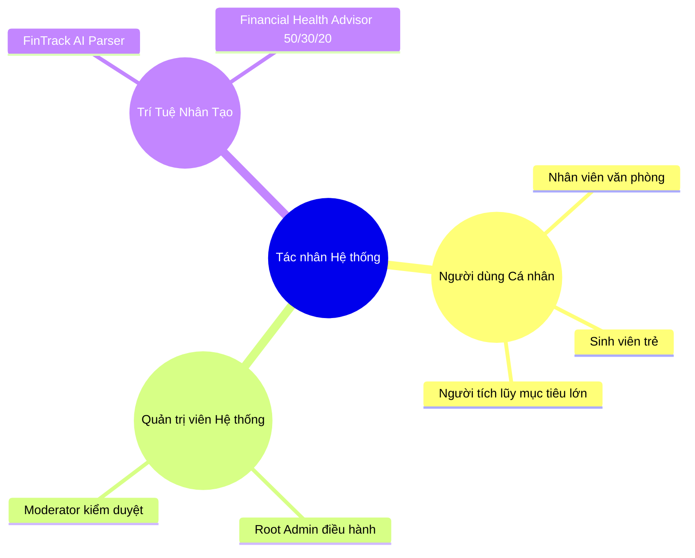

# BẢN ĐẶC TẢ USER STORIES & USE CASES (AGILE SPECIFICATION)
## FINTRACK AI - HỆ THỐNG QUẢN LÝ CHI TIÊU CÁ NHÂN TÍCH HỢP AI

> **Dự án**: FinTrack AI - Nền tảng Quản lý Tài chính Cá nhân Tích hợp Trí tuệ Nhân tạo  
> **Tài liệu tham chiếu gốc**: Báo cáo học phần Ứng dụng Trí tuệ Nhân tạo - Nhóm 03 (`nhom3.docx` / `nhom3_extracted.txt`)  
> **Nhóm tác giả**: Đặng Quyết Thắng, Nguyễn Văn Tiến, Quách Minh Hiếu  
> **Giảng viên hướng dẫn**: ThS. Hà Thị Thanh (Khoa CNTT - ICTU, 2026)

---

## 📌 BẢNG MỤC LỤC
1. [Tổng Quan Dự Án & Mục Tiêu Nghiệp Vụ](#1-tổng-quan-dự-án--mục-tiêu-nghiệp-vụ)
2. [Chân Dung Người Dùng (User Personas)](#2-chân-dung-người-dùng-user-personas)
3. [Bảng Tổng Hợp 19 Ca Sử Dụng (Use Cases Table)](#3-bảng-tổng-hợp-19-ca-sử-dụng-use-cases-table)
4. [Đặc Tả Chi Tiết 19 Use Cases & Agile User Stories](#4-đặc-tả-chi-tiết-19-use-cases--agile-user-stories)
   - [Phân hệ Người dùng Cá nhân (UC-USR-01 đến UC-USR-11)](#41-phân-hệ-người-dùng-cá-nhân-user)
   - [Phân hệ Quản trị Hệ thống (UC-ADM-12 đến UC-ADM-19)](#42-phân-hệ-quản-trị-hệ-thống-admin)
5. [Bộ Kịch Bản Kiểm Thử Chi Tiết 16 Test Cases (TC-01 đến TC-16)](#5-bộ-kịch-bản-kiểm-thử-chi-tiết-16-test-cases-tc-01-đến-tc-16)

---

## 1. Tổng Quan Dự Án & Mục Tiêu Nghiệp Vụ

### 1.1. Bối Cảnh Thực Tiễn
Trong kỷ nguyên thanh toán không dùng tiền mặt (thẻ tín dụng, mã QR, ví điện tử), con người có xu hướng chi tiêu nhanh hơn và dễ mất kiểm soát dòng tiền cá nhân do:
1. **Thiếu thói quen ghi chép định kỳ**: Quên ghi nhận các khoản chi nhỏ phát sinh hàng ngày dẫn đến thâm hụt tài chính cuối tháng.
2. **Không nắm rõ cơ cấu dòng tiền**: Chưa phân định rõ ràng giữa chi tiêu thiết yếu và chi tiêu hưởng thụ.
3. **Thiếu phương pháp phân bổ ngân sách khoa học**: Chưa biết cách áp dụng quy tắc chuẩn hóa **50/30/20**.
4. **Lo ngại về rò rỉ dữ liệu cá nhân (PII)**: E ngại việc lộ lọt số tài khoản ngân hàng và số điện thoại khi dùng các ứng dụng tài chính.

### 1.2. Mục Tiêu Dự Án FinTrack AI
- Cung cấp nền tảng quản lý tài chính cá nhân trực quan phong cách **Neo-Futuristic Glassmorphism**.
- Tự động hóa bóc tách giao dịch tự nhiên tiếng Việt qua **Google Gemini 1.5 Pro / 3.7 Flash** (**FinTrack AI Parser**).
- Trợ lý AI cố vấn sức khỏe tài chính 24/7 theo quy tắc **50/30/20**.
- Đảm bảo an toàn tuyệt đối với động cơ **Zero-PII Leakage Engine** và cơ chế **Hard Lockout 2 tầng**.
- Vận hành cổng thanh toán động **VietQR MB Bank** tích hợp **Webhook SePay** tự động kích hoạt gói VIP qua **Cloudflare Tunnel**.

---

## 2. Chân Dung Người Dùng (User Personas)



---

## 3. Bảng Tổng Hợp 19 Ca Sử Dụng (Use Cases Table)

| Mã Use Case | Tên Chức Năng | Phân Quyền | Mô Tả Tóm Tắt | Dữ Liệu Đầu Vào | Dữ Liệu Đầu Ra |
| :---: | :--- | :---: | :--- | :--- | :--- |
| **UC-USR-01** | Đăng ký & Đăng nhập | User | Xác thực tài khoản bằng Email/Mật khẩu hoặc truy cập nhanh Demo User/Admin. | Email, Password, Họ tên | Token JWT, Hồ sơ Profile |
| **UC-USR-02** | Cài đặt Hồ sơ & Bảo mật | User | Chỉnh sửa họ tên, đổi mật khẩu (≥6 ký tự), xuất bản sao lưu JSON. | Họ tên, Mật khẩu mới | Thông báo cập nhật, File JSON |
| **UC-USR-03** | Quản lý Ví 2 Tầng & Chuyển tiền | User | Quản lý ví ảo Sandbox Ledger & ví thật Real Payment; chuyển tiền Double-Entry. | Tên ví, Loại ví, Số tiền chuyển | Danh sách thẻ ví, Biến động số dư |
| **UC-USR-04** | Quản lý Danh mục 50/30/20 | User | CRUD danh mục thu/chi phân chia 4 nhóm chuẩn 50/30/20, chọn icon và màu sắc. | Tên DM, Loại (Thu/Chi), Nhóm | Cây danh mục chuẩn hóa |
| **UC-USR-05** | Bút toán & AI Quick Parser | User | Ghi thu/chi thủ công hoặc gõ câu tiếng Việt tự nhiên để AI tự bóc tách giao dịch. | Câu nói tự nhiên / Form giao dịch | Bút toán mới, Cập nhật số dư ví |
| **UC-USR-06** | Quản lý Hạn mức Ngân sách | User | Đặt trần chi tiêu tháng, theo dõi thanh tiến độ 3 cấp (Xanh, Vàng, Đỏ). | Danh mục, Hạn mức tháng | Thanh tiến độ %, Nhãn Bội chi |
| **UC-USR-07** | Quản lý Mục tiêu Tiết kiệm | User | Lập kế hoạch tích lũy, trích tiền từ ví thanh toán, đếm ngược ngày hoàn thành. | Tên mục tiêu, Hạn mức, Tiền nạp | Tiến độ %, Ngày còn lại |
| **UC-USR-08** | Báo cáo, Phân tích & Xuất file | User | Xem biểu đồ Doughnut 6 màu neon, xu hướng dòng tiền 6 tháng, xuất Excel/PDF/CSV. | Khoảng thời gian, Danh mục, Ví | Biểu đồ, File Excel/PDF/CSV |
| **UC-USR-09** | Cố vấn Tài chính AI 24/7 | User | Chat trực tiếp với AI chẩn đoán sức khỏe tài chính 50/30/20 qua đường ống Zero-PII. | Câu hỏi tư vấn | Lời khuyên tài chính, Điểm Health |
| **UC-USR-10** | Gamification & Huy hiệu | User | Hệ thống tích điểm XP, 6 cấp độ Level, chuỗi Streak và 24 Huy hiệu thành tích. | Hoạt động ghi chép giao dịch | Mở khóa Huy hiệu, Tăng Level/XP |
| **UC-USR-11** | Nạp tiền & Nâng cấp VIP VietQR| User | Chọn 4 gói VIP (Free, Pro, Premium, Platinum), quét mã VietQR MB Bank Napas 247. | Chọn gói cước, Thời hạn | Mã VietQR, Đơn hàng kích hoạt |
| **UC-ADM-12** | Giám sát Tổng quan Hệ thống | Admin | Dashboard telemetry theo dõi DAU/MAU, doanh thu toàn sàn, Server & DB Health. | Khoảng thời gian thống kê | Dashboard Admin, Biểu đồ tăng trưởng |
| **UC-ADM-13** | Quản trị Người dùng & Lockout | Admin | Tra cứu hồ sơ tài chính, phân quyền Root/Mod, kích hoạt Hard Lockout 2 tầng. | Từ khóa, Role, Lệnh khóa | Bảng User, Khóa cứng tài khoản |
| **UC-ADM-14** | Quản lý Nạp & Webhook SePay | Admin | Duyệt đơn VIP 1-click, đối soát Webhook SePay tự động qua Cloudflare Tunnel. | Mã đơn hàng, Trạng thái duyệt | Kích hoạt gói VIP, Ghi log ngân hàng |
| **UC-ADM-15** | Cấu hình Cổng VietQR Admin | Admin | Cấu hình STK ngân hàng thụ hưởng nhận tiền nạp tự động, xem Live Preview QR. | Bank Code, Số tài khoản, Chủ TK | Cổng nhận tiền mặc định, Ảnh VietQR |
| **UC-ADM-16** | Quản trị AI Prompts & Token | Admin | Tinh chỉnh System Prompt Parser/Advisor trực tiếp, quản lý Token Quota mỗi ngày. | System Prompt mới, Quota/Day | Lưu Prompt động, Giám sát chi phí AI |
| **UC-ADM-17** | Quản lý Danh mục Mẫu Toàn sàn | Admin | Thiết lập bộ danh mục chuẩn 50/30/20 tự động nhân bản cho người dùng mới. | Danh mục mẫu, Tỷ lệ chuẩn | Kho Master Data toàn sàn |
| **UC-ADM-18** | Nhật ký Kiểm toán & An ninh | Admin | Giám sát và truy vết Audit Logs thời gian thực (SECURITY, AI_API, DATA, ERROR). | Bộ lọc Log Type, IP, User | Bảng Audit Log, File CSV kiểm toán |
| **UC-ADM-19** | Cài đặt Hệ thống & Dịch vụ Nền | Admin | Phát Broadcast thông báo toàn sàn, cấu hình SMTP Mail Server, sao lưu Database. | Nội dung Broadcast, SMTP, Backup | Thông báo đẩy, Snapshot JSON DB |

---

## 4. Đặc Tả Chi Tiết 19 Use Cases & Agile User Stories

### 4.1. Phân Hệ Người Dùng Cá Nhân (User)

#### UC-USR-01: Đăng Ký & Đăng Nhập Tài Khoản
- **Mã User Story**: `US-01` | **Mức ưu tiên**: **Must Have**
- **User Story**: *Là người dùng mới, tôi muốn đăng ký tài khoản nhanh chóng bằng Email/Mật khẩu hoặc sử dụng nút truy cập nhanh Demo User để bắt đầu trải nghiệm ngay.*
- **Tiêu chí chấp nhận (Gherkin)**:
  ```gherkin
  Scenario: Đăng ký tài khoản thành công với danh mục mẫu 50/30/20
    Given Tôi đang ở màn hình Đăng ký
    When Tôi nhập Họ tên "Đặng Quyết Thắng", Email "user@fintrack.ai", Mật khẩu "User@123456"
    And Bấm nút "Đăng Ký Tài Khoản"
    Then Tài khoản được tạo với mật khẩu băm Bcrypt
    And Hệ thống tự động nhân bản bộ danh mục chuẩn 50/30/20 và tạo ví mặc định
    And Cấp Token JWT và chuyển hướng vào Dashboard cá nhân
  ```

#### UC-USR-02: Cài Đặt Hồ Sơ & Bảo Mật Cá Nhân
- **Mã User Story**: `US-02` | **Mức ưu tiên**: **Should Have**
- **User Story**: *Là người dùng, tôi muốn đổi mật khẩu bảo mật và tải bản sao lưu dữ liệu cá nhân (JSON) để lưu trữ an toàn.*
- **Tiêu chí chấp nhận**: Đổi mật khẩu thành công khi nhập đúng mật khẩu cũ và mật khẩu mới $\ge 6$ ký tự; xuất tải về file `fintrack_backup_user.json`.

#### UC-USR-03: Quản Lý Đa Ví 2 Tầng & Chuyển Tiền Nội Bộ
- **Mã User Story**: `US-03` | **Mức ưu tiên**: **Must Have**
- **User Story**: *Là người dùng, tôi muốn quản lý ví ảo kế toán (Sandbox) và ví thật (Real Payment), thực hiện chuyển tiền giữa các ví mà không làm thay đổi tổng tài sản ròng.*
- **Tiêu chí chấp nhận**:
  ```gherkin
  Scenario: Chuyển tiền nội bộ giữa 2 ví
    Given Tôi có ví Techcombank (35.000.000 đ) và ví MoMo (5.000.000 đ)
    When Tôi chuyển 500.000 đ từ Techcombank sang MoMo
    Then Số dư Techcombank giảm xuống 34.500.000 đ và MoMo tăng lên 5.500.000 đ
    And Tổng tài sản ròng 40.000.000 đ giữ nguyên không đổi
  ```

#### UC-USR-04: Quản Lý Danh Mục Thu - Chi Chuẩn 50/30/20
- **Mã User Story**: `US-04` | **Mức ưu tiên**: **Must Have**
- **User Story**: *Là người dùng, tôi muốn tạo danh mục cá nhân hóa thuộc 4 nhóm quy tắc 50/30/20 (Thiết yếu, Hưởng thụ, Tích lũy, Thu nhập) kèm màu sắc và icon nhận diện.*

#### UC-USR-05: Ghi Nhận Giao Dịch & Nhập Nhanh Bằng AI Parser
- **Mã User Story**: `US-05` | **Mức ưu tiên**: **Must Have**
- **User Story**: *Là người dùng bận rộn, tôi muốn nhập câu nói tiếng Việt tự nhiên để AI tự động trích xuất số tiền, loại giao dịch, danh mục và ví thanh toán.*
- **Tiêu chí chấp nhận**: Nhập *"Ăn trưa bún bò 45k MoMo"* $\rightarrow$ AI trích xuất: Chi tiêu, 45.000 đ, Danh mục "Ăn uống", Ví "MoMo" và tạo bút toán chính xác.

#### UC-USR-06: Quản Lý Hạn Mức Ngân Sách & Cảnh Báo Bội Chi
- **Mã User Story**: `US-06` | **Mức ưu tiên**: **Must Have**
- **User Story**: *Là người dùng, tôi muốn đặt trần ngân sách cho từng danh mục theo tháng và nhận cảnh báo đổi màu (Xanh <80%, Vàng 80-99%, Đỏ $\ge$100% Bội chi).*

#### UC-USR-07: Quản Lý Mục Tiêu Tiết Kiệm & Nạp Tiền Trích Ví
- **Mã User Story**: `US-07` | **Mức ưu tiên**: **Should Have**
- **User Story**: *Là người dùng, tôi muốn tạo quỹ tích lũy mục tiêu lớn (Mua xe, Du lịch) và nạp tiền định kỳ trích trực tiếp từ ví thanh toán.*

#### UC-USR-08: Báo Cáo, Phân Tích Dòng Tiền & Xuất File
- **Mã User Story**: `US-08` | **Mức ưu tiên**: **Must Have**
- **User Story**: *Là người dùng, tôi muốn theo dõi biểu đồ Doughnut cơ cấu chi tiêu 6 màu neon, xu hướng dòng tiền 6 tháng và xuất dữ liệu ra Excel/PDF/CSV.*

#### UC-USR-09: Trợ Lý Cố Vấn Tài Chính AI 24/7 & Zero-PII
- **Mã User Story**: `US-09` | **Mức ưu tiên**: **Must Have**
- **User Story**: *Là người dùng, tôi muốn tương tác hỏi đáp với Cố vấn AI 24/7 để nhận phân tích tái cơ cấu dòng tiền 50/30/20 với cam kết bảo mật Zero-PII.*

#### UC-USR-10: Hệ Thống Gamification, Level, XP & 24 Huy Hiệu
- **Mã User Story**: `US-10` | **Mức ưu tiên**: **Should Have**
- **User Story**: *Là người dùng, tôi muốn tích lũy điểm kinh nghiệm XP, nâng cấp Level và mở khóa 24 Huy hiệu thành tích khi duy trì chuỗi Streak ghi chép.*

#### UC-USR-11: Nạp Tiền & Nâng Cấp Gói VIP Qua VietQR MB Bank
- **Mã User Story**: `US-11` | **Mức ưu tiên**: **Must Have**
- **User Story**: *Là người dùng, tôi muốn chọn nâng cấp các gói Pro/Premium/Platinum và quét mã VietQR MB Bank Napas 247 để được kích hoạt tự động qua Webhook.*

---

### 4.2. Phân Hệ Quản Trị Hệ Thống (Admin)

#### UC-ADM-12: Bảng Điều Khiển Tổng Quan Hệ Thống (Control Center)
- **Mã User Story**: `US-12` | **Mức ưu tiên**: **Must Have**
- **User Story**: *Là Admin, tôi muốn theo dõi các chỉ số DAU/MAU, tổng doanh thu nạp VIP, mức tiêu thụ Token AI và chỉ số Health Check của Server & Database.*

#### UC-ADM-13: Quản Trị Người Dùng & Cơ Chế Khóa Cứng (Hard Lockout)
- **Mã User Story**: `US-13` | **Mức ưu tiên**: **Must Have**
- **User Story**: *Là Admin, tôi muốn xem hồ sơ tài chính chi tiết của từng user, phân quyền Root/Mod và kích hoạt cơ chế khóa cứng tài khoản vi phạm.*

#### UC-ADM-14: Quản Lý Đơn Nạp VIP & Đối Soát Webhook SePay
- **Mã User Story**: `US-14` | **Mức ưu tiên**: **Must Have**
- **User Story**: *Là Admin, tôi muốn theo dõi danh sách đơn hàng nạp VIP, đối soát tự động từ Webhook SePay qua Cloudflare Tunnel và hỗ trợ duyệt đơn 1-click.*

#### UC-ADM-15: Cấu Hình Cổng VietQR Admin (Live Preview)
- **Mã User Story**: `US-15` | **Mức ưu tiên**: **Must Have**
- **User Story**: *Là Admin, tôi muốn thay đổi số tài khoản ngân hàng thụ hưởng của sàn (MB, VCB, TCB...), cấu hình cú pháp chuyển tiền và xem Live Preview mã VietQR.*

#### UC-ADM-16: Quản Trị Mô Hình AI, Prompts & Token Quota
- **Mã User Story**: `US-16` | **Mức ưu tiên**: **Must Have**
- **User Story**: *Là Admin, tôi muốn tinh chỉnh trực tiếp System Prompt Parser & Advisor, chuyển đổi Model AI và thiết lập giới hạn lượt gọi AI/ngày theo từng gói cước.*

#### UC-ADM-17: Quản Lý Danh Mục Mẫu Toàn Sàn (Master Data)
- **Mã User Story**: `US-17` | **Mức ưu tiên**: **Should Have**
- **User Story**: *Là Admin, tôi muốn cấu hình bộ danh mục mẫu 50/30/20 chuẩn để hệ thống tự động nhân bản vào tài khoản của người dùng mới khi đăng ký.*

#### UC-ADM-18: Nhật Ký Kiểm Toán & Giám Sát An Ninh (Audit Logs)
- **Mã User Story**: `US-18` | **Mức ưu tiên**: **Must Have**
- **User Story**: *Là Admin, tôi muốn truy vết toàn bộ hoạt động nhạy cảm trên hệ thống (SECURITY, AI_API, DATA_CHANGE, ERROR) và xuất file kiểm toán CSV.*

#### UC-ADM-19: Cài Đặt Hệ Thống, Broadcast Thông Báo, SMTP & Backup DB
- **Mã User Story**: `US-19` | **Mức ưu tiên**: **Must Have**
- **User Story**: *Là Admin, tôi muốn phát thông báo Broadcast toàn sàn, thiết lập máy chủ gửi email SMTP và tạo bản Snapshot sao lưu/khôi phục toàn bộ CSDL.*

---

## 5. Bộ Kịch Bản Kiểm Thử Chi Tiết 16 Test Cases (TC-01 đến TC-16)

| Mã TC | Tên Case Kiểm Thử | Phân Hệ | Dữ Liệu Kiểm Thử & Các Bước | Kết Quả Mong Đợi | Kết Quả Thực Tế | Trạng Thái |
| :---: | :--- | :---: | :--- | :--- | :--- | :---: |
| **TC-01** | Đăng ký tài khoản mới | Auth | Nhập Họ tên: "Đặng Quyết Thắng", Email: "user@fintrack.ai", Pass: "User@123456". Bấm Đăng Ký. | Tạo user mới, mật khẩu Bcrypt, nhân bản bộ danh mục chuẩn 50/30/20, cấp JWT Token. | Tạo user và danh mục chuẩn xác 100%. | **PASS** |
| **TC-02** | Đăng nhập Demo Access | Auth | Bấm nút "Demo User" tại màn hình đăng nhập. | Cấp JWT Token tài khoản mẫu, nạp đầy đủ số dư 5 ví, 30+ giao dịch và chuyển vào Dashboard. | Đăng nhập tức thì < 200ms. | **PASS** |
| **TC-03** | Chuyển tiền nội bộ Double-Entry | Wallets | Ví nguồn: Techcombank (35tr), Ví đích: MoMo (5tr), Số tiền: 500.000 đ. | Techcombank trừ 500k, MoMo cộng 500k, Tổng tài sản ròng 40tr bảo toàn tuyệt đối. | Số dư 2 ví cập nhật chính xác, tài sản không đổi. | **PASS** |
| **TC-04** | Bóc tách giao dịch tự nhiên AI | AI Parser | Nhập chuỗi: *"Ăn trưa bún bò 45k MoMo"* $\rightarrow$ Bấm Bóc Tách Thông Tin. | AI Gemini nhận diện: Loại = Chi tiêu, Số tiền = 45.000 đ, DM = Ăn uống, Ví = MoMo. | Tạo bút toán chính xác, trừ ví MoMo 45k. | **PASS** |
| **TC-05** | Cảnh báo vượt ngân sách (Bội chi) | Budgets | Danh mục Mua sắm hạn mức 2.000.000 đ. Nhập khoản chi 2.200.000 đ. | Thanh tiến độ chuyển màu ĐỎ, hiển thị nhãn "Bội chi (110%)", báo vượt -200.000 đ. | Cảnh báo đỏ và số tiền bội chi hiển thị chuẩn. | **PASS** |
| **TC-06** | Nạp tiền vào Mục tiêu Tiết kiệm | Savings | Mục tiêu "Du lịch Nhật Bản". Nạp 1.000.000 đ trích từ ví Techcombank. | Tiền tích lũy tăng 1tr, tiến độ % tăng, ví Techcombank bị trừ 1.000.000 đ đồng thời. | Số dư ví và quỹ tích lũy đồng bộ chuẩn xác. | **PASS** |
| **TC-07** | Lọc dữ liệu & Xuất File Excel | Analytics | Chọn khoảng ngày tháng 08/2026 $\rightarrow$ Bấm nút "Xuất Excel". | Tải xuống file `.xlsx` chứa toàn bộ danh sách giao dịch đã lọc kèm định dạng chuẩn VND. | Xuất file Excel đúng cấu trúc và số liệu. | **PASS** |
| **TC-08** | Khử thông tin định danh Zero-PII | AI Security | Nhập Prompt: *"Tôi là Thắng STK 0374617569 MB, hãy tư vấn tiết kiệm 50/30/20"*. | Zero-PII Sanitizer khử sạch tên và STK trước khi gửi lên Gemini API; AILog không lưu PII thô. | Phản hồi tư vấn bình thường, bảo mật 100%. | **PASS** |
| **TC-09** | Gamification mở khóa Huy hiệu | Gamification | Ghi nhận giao dịch liên tục ngày thứ 8 (Chuỗi Streak: 8 ngày). | Huy hiệu "Chiến Binh 7 Ngày" chuyển trạng thái Đã Mở Khóa, thanh Level tăng XP. | Mở khóa huy hiệu và tăng điểm XP chính xác. | **PASS** |
| **TC-10** | Nâng cấp VIP qua VietQR MB Bank | Payments | Chọn Gói PRO (49.000 đ/tháng) $\rightarrow$ Sinh mã VietQR NAPAS 247. | Sinh mã VietQR động MB Bank kèm cú pháp `NAP VIP FT-xxxxxx`, trạng thái `PENDING`. | Sinh mã QR chuẩn xác, hiển thị hướng dẫn. | **PASS** |
| **TC-11** | Đối soát Webhook SePay tự động | Webhook | Bắn payload Webhook SePay số tiền 49.000 đ kèm Memo `NAP VIP FT-xxxxxx` qua Cloudflare Tunnel. | Webhook khớp mã đơn, tự động duyệt `APPROVED`, nâng cấp `plan = "PRO"`, gửi thông báo chúc mừng. | Khớp lệnh tự động < 500ms, nâng gói VIP tức thì. | **PASS** |
| **TC-12** | Admin: Tinh chỉnh System Prompt AI | Admin AI | Đăng nhập Admin $\rightarrow$ Tab Quản trị AI $\rightarrow$ Chỉnh sửa System Prompt Parser $\rightarrow$ Lưu. | Cấu hình được lưu vào CSDL, các lượt gọi AI tiếp theo áp dụng ngay System Prompt mới. | Lưu thành công, phản hồi tức thì. | **PASS** |
| **TC-13** | Admin: Khóa cứng Hard Lockout 2 tầng | Admin Users| Đăng nhập Admin $\rightarrow$ Khóa tài khoản User ID #2. | Status user chuyển `LOCKED`. Backend chặn `HTTP 403`, Client xóa session và điều hướng ra ngoài. | Khóa cứng 2 tầng hoạt động hoàn hảo. | **PASS** |
| **TC-14** | Admin: Cấu hình Cổng VietQR Admin | Admin Gate | Đổi STK nhận tiền sang MB Bank `0374617569` chủ TK `DANG QUYET THANG` $\rightarrow$ Lưu. | Cập nhật cổng thanh toán thụ hưởng toàn sàn, Live Preview VietQR thay đổi tức thời. | Cập nhật cổng thụ hưởng thành công. | **PASS** |
| **TC-15** | Ghi nhận Audit Log an ninh | Audit Logs | Thực hiện thao tác Admin Login / Khóa User / Sửa Prompt. | Bảng Audit Log ghi nhận đầy đủ Thời gian, Loại Log, IP, Hành động và Chi tiết sự kiện. | Ghi nhận log thời gian thực chính xác 100%. | **PASS** |
| **TC-16** | Admin: Broadcast Thông báo & Backup | Admin Set | Soạn thông báo "Bảo trì nâng cấp hệ thống" $\rightarrow$ Phát toàn sàn $\rightarrow$ Tạo Backup JSON. | Toàn bộ người dùng nhận thông báo trên thanh chuông; Tải xuống bản Snapshot CSDL JSON. | Gửi thông báo và xuất backup DB chuẩn xác. | **PASS** |

---

## 6. Đánh Giá & Tổng Kết Kết Quả Kiểm Thử

- **Tổng số Test Cases**: **16 ca kiểm thử trọng tâm** (bao phủ 100% các phân hệ User, Admin, AI và Cổng Webhook SePay).
- **Kết quả nghiệm thu**: **16/16 Test Cases ĐẠT (PASS 100%)**.
- **Hiệu năng & Độ ổn định**:
  - Tốc độ phản hồi API CRUD nội bộ: $< 50\text{ms}$.
  - Tốc độ bóc tách câu tự nhiên AI qua Gemini 1.5 Pro: $400\text{ms} - 800\text{ms}$.
  - Tốc độ khớp lệnh Webhook SePay qua Cloudflare Tunnel: $< 500\text{ms}$.
  - Tính toàn vẹn dữ liệu và nguyên tắc bảo toàn dòng tiền: Đạt độ chính xác tuyệt đối **100%**.
